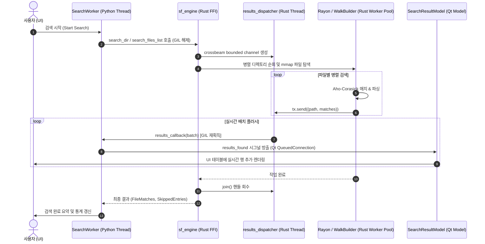

# StringFinder 개발자 가이드 (Developer Guide)

- **문서 버전:** 1.11 (StringFinder v5.9.23 기준)
- **최종 수정일:** 2026-09-26
- **대상 독자:** 코어 검색 엔진 및 UI/UX 개발자, 기여자(Maintainers & Contributors)

> Documentation baseline: **StringFinder 5.9.23** · Updated: **2026-09-26**

---

## 1. 프로젝트 개요 및 기술 스택

**StringFinder**는 대규모 파일 시스템에서 문자열 검색 및 정밀한 데이터 탐색을 제공하는 데스크톱 애플리케이션입니다. 공식 배포본과 현재 릴리스 빌드 절차는 Windows를 기준으로 하며, 일부 파일·프로세스 처리 코드는 Linux/macOS도 고려합니다. **Python(PySide6)**의 UI/이벤트 오케스트레이션과 **Rust(PyO3)**의 고성능 검색 엔진을 결합한 하이브리드 아키텍처로 구축되었습니다.

### 🛠️ 기술 스택 (Tech Stack)

```
┌────────────────────────────────────────────────────────────────────────┐
│                        StringFinder 기술 스택                          │
├───────────────────┬────────────────────────────────────────────────────┤
│ UI Framework      │ Python 3.12+, PySide6 (Qt for Python 6.6+)         │
│ Theme / Styling   │ PyDataTheme (qdarktheme), Custom QSS               │
│ Native Core       │ Rust 1.80+ (2021 Edition), PyO3 0.23               │
│ Matching Engine   │ aho-corasick 1.1, memmap2 0.9, simdutf8 0.1       │
│ Structured Parsers│ serde_json 1.0 (Visitor Streaming), quick-xml 0.31 │
│ Spreadsheet Parser│ calamine 0.33 (Excel xlsx, xlsm, xlsb, xls)        │
│ Concurrency & I/O │ rayon 1.8, ignore 0.4, crossbeam-channel 0.5, fs2  │
│ Testing & Linting │ pytest, pytest-qt, cargo test, ruff, clippy        │
└───────────────────┴────────────────────────────────────────────────────┘
```

---

## 2. 시스템 아키텍처 및 데이터 흐름 (Architecture)

StringFinder는 검색 옵션에 따라 **이원화된 검색 엔진 파이프라인**을 제공합니다:
- **기본 검색 (Default Path):** Rust 네이티브 엔진(`sf_engine`)을 호출하여 GIL을 해제하고 Rayon 병렬 파일 순회 및 Aho-Corasick SIMD 매칭, crossbeam 채널 기반 생산자-소비자 스트리밍을 수행합니다. Python callback을 호출할 때만 GIL을 다시 획득합니다.
- **누락 방지 검색 (Complex/Deep Search Path):** `use_complex_search=True` 플래그 활성화 시, Python의 `GlobalExecutor(ProcessPoolExecutor)` 멀티프로세싱 워커 풀을 구동하여 줄 단위 완전 유니코드 정규화(`unicodedata.normalize('NFC')`), 표준 `casefold()`, 손상 인코딩 복구(`errors="replace"`)를 수행합니다.

### 📊 기본 검색 데이터 흐름 다이어그램 (Rust Engine Path)



---

## 3. 디렉토리 구조 및 핵심 모듈 맵

```
StringFinder/
├── src/
│   ├── sf_main.py                 # 애플리케이션 진입점, 싱글톤 잠금, 경고 필터
│   ├── core/                      # Python 코어 계층
│   │   ├── search_engine.py       # Rust FFI 연동 래퍼, 검색 디스패치 및 폴백 로직
│   │   ├── skip_reason_codes.py   # 검색 경로 공통 스킵 코드 계약
│   │   ├── skip_reason_formatter.py # 내부 스킵 사유를 사용자 언어로 변환
│   │   ├── worker.py              # 백그라운드 SearchWorker, 풀 관리 및 시그널
│   │   ├── system_manager.py      # 애플리케이션 로그 보관·정리 정책
│   │   └── doctor.py              # 시스템 자가 진단 및 진단 리포트
│   ├── rust_engine/               # Rust 네이티브 크레이트 (sf_engine)
│   │   ├── Cargo.toml             # Rust 의존성 및 cdylib 라이브러리 설정
│   │   ├── sf_engine.pyd          # 컴파일된 단일 SSOT 네이티브 바이너리
│   │   └── src/
│   │       ├── lib.rs             # FFI 진입점, mmap 검색기, 결과 디스패처
│   │       ├── types.rs           # SearchMatch, SearchOptions, 비트플래그 정의
│   │       ├── utils.rs           # 인코딩 감지, 유니코드 정규화, 패턴 생성
│   │       ├── json_search.rs     # serde_json Visitor 기반 스트리밍 탐색기
│   │       ├── xml_search.rs      # quick-xml 기반 계층 경로 탐색기
│   │       └── excel_search.rs    # calamine 기반 셀/시트 탐색 및 패닉 격리
│   ├── ui/                        # PySide6 GUI 계층
│   │   ├── main_window.py         # 메인 윈도우, 다중 탭 관리, 상태 표시줄 버튼
│   │   ├── search_tab.py          # 검색 탭 위젯, 도크 패널 배치, 세션 연동
│   │   ├── result_view.py         # 결과 테이블, 문맥 미리보기, 구문 강조
│   │   ├── models.py              # SearchResultModel, MatchDetailModel, 비동기 정렬
│   │   ├── panels.py              # 폴더, 확장자, 파일명, 검색 조건 도크 패널
│   │   ├── settings_dialog.py     # 일반/고급 설정과 성능 진단 UI
│   │   ├── proxies.py             # 결과 테이블 정렬·필터 프록시
│   │   ├── widgets.py             # 공통 Qt 위젯
│   │   ├── styles.py              # 앱 QSS 및 상태 색상
│   │   └── syntax_highlighter.py  # 미리보기 구문 강조
│   └── sf_utils/                  # 설정, 공통 자원, 로깅, 현지화 유틸리티
│       ├── settings_defaults.py   # 설정 스키마/기본값/기본값 버전
│       ├── constants.py           # 설정 키와 검색 모드·한도 계약
│       ├── config_manager.py      # 설정/세션 JSON 입출력 및 검증
│       ├── resource_guard.py      # 장치·프로세스 메모리 가드
│       ├── resource_helper.py     # 패키징 자원 경로 조회
│       ├── single_instance.py     # 단일 실행 인스턴스 잠금
│       ├── logger.py              # 로그 초기화 및 공통 로거
│       ├── file_helper.py         # 외부 편집기·파일 열기 헬퍼
│       ├── app_strings.py         # 한국어 문자열 카탈로그
│       ├── english_strings.py     # 영어 문자열 카탈로그
│       └── localization.py        # UI import 전 언어 선택과 문자열 적용
├── tests/                         # pytest 단위·통합·GUI·회귀 테스트
├── tools/                         # 벤치마크, 진단, 환경 검사 도구
├── scripts/                       # 벤치마크 이력 등 보조 스크립트
├── build.py                       # Rust + PyInstaller 릴리스 빌드/스모크 테스트
├── build_rust.py                  # Rust 확장 모듈 빌드 및 안전 교체
├── build_support.py               # 배포 런타임 검증 지원
├── pyproject.toml                 # Python 메타데이터, 의존성, 도구 설정
├── README.md                      # 프로젝트 개요
└── run.py                         # 로컬 개발 실행 진입점
```

### 3.1 계층 책임과 의존 방향

변경은 가능한 한 아래 방향으로 흐르게 합니다. UI는 코어 내부 구현이나 Rust 확장 모듈을 직접 호출하지 않고 `SearchWorker`와 `core.search_engine`의 래퍼를 사용합니다.

```text
UI (src/ui)
  └─ SearchWorker / core.search_engine
       ├─ 일반 검색 ───────────────> Rust 확장 (src/rust_engine)
       └─ 누락 방지 검색 ──────────> Python 검색기 + 프로세스 풀
  └─ sf_utils (설정, 리소스, 문자열, 로깅)
```

- **UI 계층**은 검색 입력·표시·사용자 동작을 책임집니다. `SearchTab`은 탭 상태와 검색 패널을 연결하고, `ResultView`는 결과 표시·미리보기·내보내기를, `models.py`는 테이블 데이터 모델을 담당합니다. UI에서 파일 탐색이나 문서 파싱을 직접 하지 않습니다.
- **작업 오케스트레이션**은 `core/worker.py`의 `SearchWorker`가 맡습니다. 진행·결과·스킵·오류·완료를 Qt 시그널로 전달하고, 중지와 전체 결과 제한을 조정합니다. 프로세스 풀에는 GUI 객체가 아니라 경로·문자열·숫자·플래그 등 직렬화 가능한 인자만 전달합니다.
- **검색 정책/어댑터**는 `core/search_engine.py`가 맡습니다. 검색 옵션 정규화, Rust 모드 비트 변환, Rust 결과의 Python 계약 변환, 공통 파일 크기 검사, Python 검색기 및 스킵 프로토콜 연결이 여기에 모입니다. 검색 모드 분기 변경 시 Rust/Python 경로를 함께 확인해야 합니다.
- **Rust 엔진**은 파일 순회와 기본 검색 구현을 담당합니다. PyO3 진입점은 `lib.rs`, 공통 데이터 형식은 `types.rs`, 인코딩·패턴 처리는 `utils.rs`, 구조화 파서는 `json_search.rs`, `xml_search.rs`, `excel_search.rs`에 둡니다.
- **공통 유틸리티**는 UI와 코어 간 순환 의존을 만들지 않습니다. `settings_defaults.py`는 기본값과 버전, `constants.py`는 설정 키와 모드 계약, `config_manager.py`는 저장·검증·마이그레이션을 담당합니다. 현지화 카탈로그는 UI 모듈보다 먼저 적용되어야 합니다.
- **테스트**는 사용자 데이터나 실제 저장소 상태에 의존하지 않아야 합니다. 임시 경로·fixture를 사용하고, 임시 산출물이 Git에 들어가지 않는지 확인합니다.

### 3.2 검색 경로 선택과 공통 계약

| 모드 | 주 실행 경로 | 설계상 의미 |
| --- | --- | --- |
| 일반 검색 | Rust 확장 | 기본 고성능 경로. 병렬 파일 순회와 배치 결과 전달을 사용합니다. |
| 누락 방지 검색 | Python 스캐너·배치 프로세스 풀·Python 검색기 | Unicode/인코딩 처리의 보수성을 우선합니다. 별도 취소·메모리·동시성 관리가 필요합니다. |
| 존재만 확인 | 선택된 검색 경로에 존재 확인 플래그 추가 | 파일에서 첫 매치를 확인하면 그 파일의 추가 매칭은 중단합니다. Excel 셀 수 상한은 두지 않습니다. |
| JSON/XML/Excel | 선택된 경로 안의 형식별 파서 | 문서가 손상된 경우, 앞부분에서 찾은 매치도 폐기하고 파일을 스킵해야 합니다. |

두 검색 경로는 구현이 같다는 뜻이 아니라 **후보 파일 집합과 사용자에게 보이는 검색 의미가 일치해야 한다**는 뜻입니다. 도트로 시작하는 파일, 숨김 옵션, `.gitignore`/`.ignore`, 겹치는 루트, 심볼릭 링크, 빈 확장자 필터, 휴지통, 파일 크기 상한을 양쪽에서 회귀 검증합니다. 정책 변경 시 같은 fixture를 각 경로에 적용하고 의도한 차이만 허용합니다.

---

## 4. Rust-Python FFI 인터페이스 & 데이터 계약 (Data Contract)

### 4.1 `SearchOptions` (Named Configuration)
파라미터 폭증을 방지하고 Python과 Rust 간 옵션을 이름으로 전달하기 위해 [`src/rust_engine/src/types.rs`](../src/rust_engine/src/types.rs)에 `SearchOptions` pyclass가 정의되어 있습니다. 이 객체는 현재 Rust 확장 모듈의 선택적 저수준 API이며, 일반 애플리케이션 코드는 `core.search_engine` 래퍼를 우선 사용해야 합니다.

```python
# Python에서의 사용 예시
from core.search_engine import sf_engine

options = sf_engine.SearchOptions(
    mode_bits=1,                    # JSON 비트플래그 (Constants.RUST_MODE_JSON 권장)
    extensions=["py", "rs"],        # 확장자 필터
    filename_filter=["*test*"],     # 파일명 글로브 필터
    exclude_hidden=True,            # 숨김 파일 제외
    stop_event=stop_event,          # 취소 감시용 threading.Event
    results_callback=callback_fn,   # 실시간 배치 수신 콜백
    batch_size=100,                 # 디스패치 배치 크기
    flush_ms=20,                    # 플러시 주기 (ms)
    max_per_file=10000,             # 파일당 최대 검색 결과 수
    max_check_cells=500000,         # 구버전 호출 호환용(현재 Excel 검색에서 무시)
    max_json_depth=20000,           # JSON 탐색 깊이 제한
    max_json_size=1073741824,       # 공통 검색 파일 크기 제한 (1GB; legacy API 이름)
)
```

`results_callback`을 사용하는 디렉터리/파일 목록 검색에서는 callback이 결과의 단일 전달 경로입니다. callback에는 `(path, matches)` 배치가 전달되고, 동기 반환 목록은 중복 메모리 보관을 피하기 위해 비워질 수 있습니다. callback 없이 호출하면 동기 반환 목록을 사용할 수 있습니다. callback 예외는 Rust 검색 오류로 호출자에게 전파됩니다.

파일 단위 결과 제한은 `__SF_TRUNCATED__`, JSON 깊이 제한은 `__SF_JSON_DEPTH_LIMIT__|<limit>` 메타데이터로 전달합니다. 이 신호들은 치명적 오류가 아니므로 정상 매치를 제거하지 않습니다. Python 계층은 같은 파일에서 발생한 부분 검색 사유를 하나로 합쳐 `skipped` 스트림에도 전달하며, UI는 기존 **건너뛴 파일 수** 패널과 목록 팝업을 재사용합니다. 제한만 발생해 정상 매치가 없어도 해당 파일은 `skipped` 안내에 포함되어야 합니다. Excel 존재 확인에는 셀 수 상한이 없으므로 해당 부분 검색 메타데이터를 새로 만들지 않습니다. 구버전 엔진이 남긴 `__SF_EXCEL_CELL_LIMIT__|<limit>`은 호환 파싱만 유지합니다.

### 4.2 `SearchMatch` (Structured Match Object)
검색 매치 결과를 튜플 및 속성(Property) 양방향으로 읽을 수 있는 통합 구조체입니다.

| 필드명 | 타입 | 설명 |
| :--- | :---: | :--- |
| `line` | `usize` | 1-based 라인 번호 (내부 메타데이터 마커는 0) |
| `content` | `String` | 매칭 라인 텍스트 또는 포맷된 결과 (`path\tvalue`) |
| `offset` | `Option<usize>` | 매치 시작 바이트 오프셋 |
| `length` | `Option<usize>` | 매치 바이트 길이 |
| `kind` | `String` | `"match"`, `"partial"`, `"binary"`, `"long_line"`, `"truncated"`, `"sheet_error"`, `"error"` |
| `code` | `Option<String>` | 에러/안내 코드 (`ERR_MMAP`, `ERR_JSON_SIZE_LIMIT`, `JSON_DEPTH_LIMIT` 등; `EXCEL_CELL_LIMIT`은 구버전 바이너리 호환용) |
| `detail` | `Option<String>` | 상세 메시지 |

구조 검색의 `content` 직렬화 형식은 JSON/XML의 경우 `path\tvalue`, Excel의 경우 `sheet\tcell\tvalue`입니다. Python의 `_normalize_rust_matches()`가 이 값을 UI 모델용 튜플로 변환하므로 필드 구분자를 변경할 때는 Rust 생성부, Python 정규화 계층, UI 모델과 세션 회귀 테스트를 함께 수정해야 합니다. 구버전 세션·확장 모듈이 사용한 Excel `sheet | cell | value` 형식도 계속 읽으며, 시트 이름에 ` | `가 들어갈 수 있으므로 오른쪽의 셀·값 필드부터 분리합니다.

메모리 매핑 실패의 프로토콜 코드는 `ERR_MMAP`입니다. 정의되지 않은 코드나 잘못 표기된 코드는 다른 코드로 추정 변환하지 않습니다. 저장 세션 복원 시 형식·코드 검증에 실패한 스킵 항목과 오염된 로그 레코드는 제외하며, JSON 자체가 손상되었거나 루트 객체 형식이 아닌 세션 파일은 제거합니다.

---

## 5. 안정성 및 고성능 설계 원칙 (Resilience & Safety)

### 1) mmap 동시 수정 크래시 방어 (`FileSnapshot`)
- **위치:** [`src/rust_engine/src/lib.rs`](../src/rust_engine/src/lib.rs)
- Windows 환경에서 타 프로세스에 의해 파일이 Truncate될 때 발생하는 `STATUS_IN_PAGE_ERROR(0xC0000006)` OS 크래시를 방지합니다.
- `fs2::FileExt::try_lock_shared`로 공유 락을 획득하고 파일 메타데이터(크기 및 수정 시간)가 일치할 때만 `FileSnapshot::Mapped`를 사용하며, 잠금 실패 시 `FileSnapshot::Owned(Vec<u8>)` 인메모리 버퍼로 자동 격리합니다.

### 2) `serde_json Visitor` 기반 스트리밍 파싱
- **위치:** [`src/rust_engine/src/json_search.rs`](../src/rust_engine/src/json_search.rs)
- 거대한 AST 트리를 생성하지 않고 `DeserializeSeed`와 `Visitor`를 통해 JSON 스칼라 값이 들어오는 즉시 Aho-Corasick으로 검사합니다.
- `max_json_depth`를 초과하는 하위 트리는 `serde::de::IgnoredAny`로 파싱 비용을 즉시 차단하여 OOM을 방지합니다.

### 3) XML 문서 상태 검증과 DTD 정책
- **위치:** [`src/rust_engine/src/xml_search.rs`](../src/rust_engine/src/xml_search.rs), [`src/core/search_engine.py`](../src/core/search_engine.py)
- Rust XML 파서는 문서를 `Prolog → Root → Epilog` 상태로 추적합니다. XML 선언은 UTF-8 BOM을 제외한 문서 시작 위치에 한 번만 허용하고, 단일 루트 요소와 루트 밖 텍스트·CDATA 금지 규칙을 문서 끝까지 검증합니다.
- 검색어가 앞부분에서 발견되어도 파싱을 조기 종료하지 않습니다. 손상된 XML은 단일 파일, 디렉터리, 파일 목록, 스마트 스캔, 존재 여부 검색 모두에서 결과가 아니라 `ERR_XML_PARSE` 스킵으로 전달되어야 합니다.
- DTD 선언과 사용자 정의 엔터티 확장은 수행하지 않습니다. Rust 경로는 `ERR_XML_UNSUPPORTED_DTD`로, Python 누락 방지 검색 경로는 동일한 사용자 메시지로 명시적으로 스킵합니다. DTD 지원을 추가하려면 엔터티 확장량·재귀 깊이·외부 엔터티 접근을 별도의 제한과 테스트로 먼저 통제해야 합니다.

### 4) 엑셀 파싱 라이브러리 패닉 격리
- **위치:** [`src/rust_engine/src/excel_search.rs`](../src/rust_engine/src/excel_search.rs)
- 손상된 `.xlsx`, `.xlsb` 파일 파싱 시 `calamine` 내부에서 패닉이 발생하더라도 `std::panic::catch_unwind`로 포획하여 GUI 프로세스의 비정상 종료를 방지하고 `__SF_EXCEL_SHEET_ERR__|` 스킵 결과로 안전하게 변환합니다.
- Excel 존재 확인은 셀 수 상한 없이 시트를 순회하고, 첫 매치를 찾으면 해당 파일의 검사를 즉시 끝냅니다. 과거 Rust 호출 호환을 위해 `max_check_cells` 인자는 남아 있지만 현재 검색 결과에는 영향을 주지 않습니다.
- `python-calamine`의 `total_height`/`total_width`는 0 기반 마지막 인덱스이므로 값이 0이라고 빈 시트로 판단하지 않습니다. `start is None`을 우선 사용하여 실제 빈 시트의 `iter_rows()` 패닉만 회피합니다.

### 5) 파일 크기 제한과 시스템 메모리 압력의 분리

- 공통 파일 크기 상한 초과는 Rust에서 `ERR_TOO_LARGE|<actual bytes>`로 전달하며, 해당 파일만 `skipped`에 추가합니다. 포맷별 파서에 진입하기 전에 검사하고, 이 사유로 전체 검색을 중단하거나 메모리 부족 팝업을 표시해서는 안 됩니다. `ERR_JSON_SIZE_LIMIT`은 구버전 엔진/로그 해석을 위한 레거시 사유입니다.
- `resource_guard.py`의 장치별 한도는 `reserve = clamp(total RAM × 5%, 512MB, 2GB)`, `process_limit = min(total RAM × 60%, 8GB)`로 계산합니다. 단순 시스템 사용률(`system_percent`)은 로그 진단값일 뿐 판정 조건이 아닙니다.
- 현재 `available < reserve`이거나 StringFinder 프로세스 트리 `RSS >= process_limit`이면 실제 시스템 압력으로 간주하여 전체 검색을 한 번만 중단합니다. 메모리 계측값이 없거나 유효하지 않으면 가드 자체가 검색 실패를 만들지 않도록 계속 진행합니다.
- 개별 구조 문서 파싱 전에는 파일 크기를 기준으로 추가 작업 메모리를 보수적으로 예상합니다. Rust JSON/XML은 `2.5 × size + 64MB`, Python XML은 `4 × size + 64MB`, Python JSON은 `6 × size + 128MB`를 사용합니다. 예상 사용 후 `reserve` 또는 `process_limit`을 침범하면 `ERR_RESOURCE_BUDGET` 파일 스킵으로 반환하고 전체 검색은 유지합니다.
- Rust 디렉터리·파일 목록·스마트 스캔은 `SearchOptions.structured_memory_budget`으로 한 호출 안의 구조 파일 예산을 공유합니다. 8MiB 이상 구조 파일은 `StructuredMemoryLimiter`에서 예상량을 예약하고, 합계가 예산을 넘으면 취소 가능한 대기를 수행합니다. 개별 예상량 자체가 예산보다 크면 해당 파일을 스킵하며, permit 해제 시 대기 작업을 깨웁니다. Rust JSON/XML 예상량은 `2.5 × size + 64MiB`, Excel은 `8 × size + 128MiB`입니다.
- 이 예약은 원본 파일 크기에 기초한 추정이지 실제 할당량의 하드 캡이 아닙니다. 특히 압축 XLSX는 디스크 크기가 8MiB 미만이어도 펼친 셀 데이터가 클 수 있어 예약 대상에서 제외될 수 있습니다. 여러 독립 검색 호출 사이의 전역 예약도 아니며, 부모 워커의 실제 RSS 감시는 계속 필요합니다.
- `SearchWorker._is_memory_skip()`의 판정 범위를 넓힐 때는 파일 단위 제한 코드가 섞이지 않도록 반드시 혼합 파일 회귀 테스트를 추가합니다.

### 6) 정밀 일반 텍스트 검색의 무결성과 상한

- `max_small_file_size` 기준의 양쪽 경로는 모두 `search_engine._search_text_stream()`을 사용합니다. 파일 크기에 따라 인코딩 감지와 준비 경로는 달라질 수 있지만, 각 줄의 Unicode NFC 정규화·casefold·정확히 일치 판단은 동일해야 합니다.
- ASCII 줄은 이미 NFC이므로 정규화 할당을 생략하고, 검색 모드 분기는 줄 반복문 밖에서 결정합니다. 설정값은 파일마다 한 번만 읽으며 매치 반복문 안에서 `ConfigManager`를 다시 호출하지 않습니다.
- 일반 텍스트는 `max_per_file + 1`번째 매치를 확인해 truncation 마커를 추가한 즉시 나머지 입력 소비를 중단합니다. 반환 카운트와 사용자 표시 결과는 상한과 마커 계약을 유지합니다.
- JSON/XML은 결과 상한이나 존재 확인 매치가 발생해도 후반부 구문 오류를 놓치지 않도록 문서 검증을 끝까지 수행합니다. 일반 텍스트의 조기 중단 최적화를 구조 파서에 그대로 적용해서는 안 됩니다.

---

## 6. 개발 환경 설정 및 빌드/테스트 가이드

### 6.1 필수 요구사항
- Python 3.12 이상
- Rust 1.80 이상 (`rustc`, `cargo`)
- 공식 릴리스·패키징 검증: Windows 10/11 64-bit
- 소스 실행: Python/Rust 의존성과 플랫폼별 빌드 조정이 필요하며, Linux/macOS는 별도 CI 검증이 필요

### 6.2 환경 구성 및 의존성 설치
```bash
# 가상환경 생성 및 활성화
python -m venv .venv
source .venv/bin/activate  # Windows: .venv\Scripts\activate

# Python 런타임 및 개발 의존성 설치
python -m pip install -e ".[dev]"
```

### 6.3 Rust 엔진 릴리스 빌드
Windows 환경에서 `.pyd`를 단일 경로에 배포하는 통합 스크립트를 사용합니다. 새 바이너리를 대상 폴더의 임시 파일에 복사한 뒤 교체하며, 잠금으로 교체에 실패하면 기존 파일을 보존하고 오류로 종료합니다. 다른 프로세스를 강제 종료하지 않으므로 엔진을 사용 중인 앱을 직접 닫은 후 재시도하세요.
```bash
python build_rust.py
```

### 6.4 전체 테스트 실행
```bash
# 1. Rust 엔진 네이티브 단위 테스트
cargo test --manifest-path src/rust_engine/Cargo.toml

# 2. Python 통합 및 UI 테스트
pytest

# 3. 정적 코드 분석
ruff check src tests tools
```

XML 파서 변경 시에는 최소한 다음 회귀 조건도 확인합니다.

- `"<root><v>needle</root>"`처럼 매치 뒤에 구문 오류가 있는 문서는 `results=[]`, `skipped=[...]`이어야 합니다.
- 루트 뒤 DOCTYPE, 중복 DOCTYPE, 루트 뒤 XML 선언은 모두 스킵되어야 합니다.
- 내부 DTD 엔터티가 있는 문서는 엔터티를 확장하지 않고 `ERR_XML_UNSUPPORTED_DTD`로 스킵되어야 합니다.
- XML 선언·주석·처리 지시문이 올바른 위치에 있는 정상 문서는 기존과 같이 검색되어야 합니다.

### 6.5 성능 벤치마크 실행
```bash
python tools/benchmark_engine.py
```

개발 환경을 처음 구성했거나 빌드 오류 원인을 확인할 때는 다음 사전 점검을 실행합니다.

```bash
python tools/check_dev_environment.py
```

Python 3.12 이상, Cargo/Rustc, PySide6, PyInstaller가 모두 `[OK]`여야 로컬 배포 빌드를 진행할 수 있습니다.

### 6.6 Windows 배포본 빌드

`build.py`는 `pyproject.toml`의 버전을 읽고 Rust 엔진을 다시 빌드한 뒤 PyInstaller 단일 실행 파일을 생성합니다. 결과물은 `dist/StringFinder.exe`입니다. 현재 이 절차는 Windows 배포를 기준으로 합니다.

실행 파일은 먼저 `build/release`에 생성한 뒤 성공 시 `dist/StringFinder.exe`를 교체합니다. 빌드·복사·교체 실패 시 기존 배포 실행 파일을 먼저 삭제하지 않습니다. Rust 개발용 `.pyd`는 앞 단계에서 갱신될 수 있으므로 EXE 빌드 실패가 소스와 개발 엔진까지 되돌린다는 의미는 아닙니다.

패키징 단계의 PATH는 Windows 및 현재 Python 경로로 제한합니다. 외부 도구(예: Poppler)의 동명 ICU DLL이 Qt 의존성으로 포함되는 것을 방지하기 위한 조치입니다. 배포 교체 전 `build_support.py`가 포함된 ICU의 Qt 요구 심볼을 검사하고, 완성된 EXE의 `--smoke-test`를 실행합니다. 이 모드는 사용자 세션을 열지 않고 Qt 플랫폼·테마·UI 모듈 로드 및 Python/Rust 버전 일치를 확인한 뒤 종료합니다. 실패 또는 45초 초과 시 배포 파일을 교체하지 않습니다. 이는 수동 UI 흐름이나 Python 미설치 장비 검증을 대체하지 않습니다.

```powershell
python build.py
```

---

## 7. 코딩 컨벤션 및 기여 가이드

1. **에러 핸들링:** Rust 내부의 파일 접근·메타데이터·매핑·크기 제한 오류는 `SkippedEntries`로 기록하고, 검색 파이프라인 전체가 중단되지 않도록 작성합니다. 숨김·바이너리·빈 파일처럼 의도적으로 제외한 항목은 오류 스킵으로 보고되지 않을 수 있습니다.
2. **사용자 대면 문자열:** 기본 문자열은 `src/sf_utils/app_strings.py`, 영어 번역은 `src/sf_utils/english_strings.py`에 같은 상수명으로 추가합니다. 두 언어의 `{}` 자리표시자 이름·순서·서식은 반드시 같아야 합니다. 코드 내부 식별자와 기술 주석은 기존 모듈의 언어·스타일을 일관되게 따릅니다.
3. **버전 관리:** `pyproject.toml`을 Python 프로젝트 버전의 기준으로 삼습니다. `build.py`가 이 값을 읽어 `src/sf_utils/_version.py`를 생성하며, Rust의 `CARGO_PKG_VERSION`은 `src/rust_engine/Cargo.toml`의 버전에서 나오므로 릴리스 시 두 선언을 함께 확인해야 합니다.

### 7.1 변경 시 함께 확인할 계약

- Rust 결과 형식을 바꾸면 `src/core/search_engine.py`의 정규화 로직과 `src/ui/models.py`의 표시 로직을 함께 수정합니다.
- 비동기 정렬 결과는 요청 번호와 데이터 리비전이 현재 상태와 일치할 때만 적용합니다. 검색 초기화·결과 추가 이후의 오래된 스냅샷이나 정렬 실패로 현재 결과를 덮어쓰지 않습니다. 정렬 중 접수된 최신 정렬 요청은 현재 데이터로 다시 실행합니다.
- XML은 결과 상한 도달 또는 존재 확인 성공 이후에도 모든 속성의 구문·엔터티 검증을 계속합니다. 경로는 시작/빈 요소 진입 시 추가하고 종료 시 이전 길이로 복원하며, 동일 이름 및 비ASCII 태그의 경로를 유지합니다.
- XML 속성 위치는 해당 속성 값의 원본 바이트 범위에서 계산합니다. 엔터티 변환으로 원본과 값이 달라지면 바이트 위치를 생략하며, UTF-16 등 디코딩된 XML의 위치를 원본 오프셋으로 반환하지 않습니다. 행 번호와 구조 경로는 별도로 유지합니다.
- 비UTF-8 텍스트의 개행 검색은 새로 디코딩한 구간부터 재개하고 처리한 접두부는 청크당 한 번 제거합니다. 취소는 입력 청크마다 확인하되 이미 수집한 결과를 보존합니다. 긴 한 줄 자체의 버퍼링과 파일 스냅샷 I/O까지 즉시 중단되는 것은 아닙니다.
- 새 사용자 문자열을 추가하면 한국어·영어 카탈로그와 현지화 계약 테스트를 함께 갱신합니다. 저장된 언어는 UI 모듈 import 전에 적용해야 클래스 수준 문자열 캐시가 한 언어로 일관됩니다.
- 운영체제·파서·Rust/Calamine의 원본 오류는 로그에 보존하고, 건너뛴 파일 팝업에는 `search_engine.py`의 `format_skip_reason()`과 `localize_skip_reason_for_display()`로 정규화한 현재 언어의 사용자용 사유만 전달합니다. 세션에서 복원한 사유도 표시 전에 다시 현지화합니다.
- 메모리 가드의 비율·절대 상한·예상 사용량 계수를 변경할 때는 4/8/16/32/64/128GB 장치별 한도, 정확한 경계값, 유효하지 않은 계측값, 파일 단위 스킵과 전체 중단의 분리를 모두 테스트합니다. `system_percent`를 판정 조건으로 다시 사용하지 않습니다.
- 검색 결과 상한(`max_per_file`, 전체 결과 상한), JSON 깊이·크기 제한은 안전장치이므로 기본값과 UI 범위를 함께 검토합니다. Excel 존재 확인은 첫 매치 전 셀 상한을 두지 않아 결과 누락을 방지합니다.
- 고급 설정의 기본값·최솟값·최댓값은 `Constants.ADVANCED_SETTING_SPECS`가 단일 계약입니다. `ConfigManager`와 설정 UI가 이 스키마를 함께 사용해야 하며, 새 키를 추가할 때 숫자 범위를 UI에 중복 선언하지 않습니다. 설정 키/형식 마이그레이션은 현재 `CONFIG_SCHEMA_VERSION`과 `_migrate_config()`의 구현을 기준으로 추가하고, 문서에 특정 과거 스키마 번호를 현재 규칙처럼 고정해 적지 않습니다. 수동 편집값도 동일 범위로 정규화하며, 고급 설정 초기화는 메모리 변경 후 저장을 예약해야 합니다.

### 7.1 설정 기본값 및 버전 관리

설정 기본값은 `src/sf_utils/settings_defaults.py`에서 관리합니다. 고급 설정의 키별 기본값은 `DEFAULTS`, 각 기본값의 변경 이력은 `DEFAULT_VERSIONS`에 기록하며, 전체 설정 구조 버전은 `CONFIG_SCHEMA_VERSION`으로 관리합니다. `Constants.ADVANCED_SETTING_SPECS`는 이 값을 UI 입력 범위와 검색 엔진에 연결하는 단일 계약입니다.

기본값을 변경할 때는 다음 순서를 지킵니다.

1. `settings_defaults.py`의 해당 `DEFAULTS` 값을 변경합니다.
2. 실제 출하 기본값이 변경된 항목의 `DEFAULT_VERSIONS` 숫자를 1 증가시킵니다.
3. 설정 구조·키 자체가 변경된 경우 `CONFIG_SCHEMA_VERSION`을 증가시키고 `_migrate_config()`에 구조 마이그레이션을 추가합니다.
4. `ConfigManager` 테스트에 기존 설정 파일의 갱신·보존 동작을 추가합니다.
5. 사용자 가이드의 기본값과 설정 UI 설명을 함께 갱신합니다.

앱 시작 시 저장된 항목별 기본값 버전이 현재 버전보다 낮으면 해당 설정만 새 기본값으로 재설정합니다. 사용자가 변경한 다른 설정은 유지합니다. 버전 메타데이터가 없는 기존 설정은 버전 1로 간주하므로, 이후 버전에서 변경된 기본값만 자동 갱신됩니다. 고급 숫자 설정과 로그 보관 숫자 설정은 JSON 정수형과 항목별 허용 범위를 검증하며, 타입이 잘못되거나 범위를 벗어나면 경계값으로 자르지 않고 해당 항목의 기본값으로 복구합니다. 언어·불리언·문맥 줄 수·표 열 너비 등 UI 입력 전 필요한 저장값도 로딩 시 검증해 손상 항목만 기본값으로 되돌립니다.

각 `SearchWorker`는 검색을 시작할 때 고급 검색 설정을 한 번 읽어 해당 작업의 스냅샷으로 보관합니다. 파일별 처리와 배치 작업은 이 스냅샷을 사용하므로 검색 도중 설정을 바꿔도 현재 검색의 제한·정책이 중간에 바뀌지 않고, 변경값은 다음 검색부터 적용됩니다. 새 설정을 사용할 때는 UI·Rust 경로·누락 방지 배치 경로가 같은 스냅샷을 참조하는지 확인하고, 파일별 반복에서 설정 파일을 다시 읽지 않는 회귀 테스트를 추가합니다.

### 7.2 일회성 실무 성능 진단

검색 결과는 `SearchTab`의 결과 영역에 직접 배치하며 별도 결과 탭을 만들지 않습니다. 로그는 `QDialog` 독립 창으로 분리하고 `MainWindow` 상태 표시줄의 로그 버튼으로 엽니다. 상태 표시줄에는 스킵 건수를 표시하지 않고, 스킵 상세는 결과 요약과 파일 목록 팝업에서 제공합니다. 설정 버튼은 상태 표시줄의 가장 오른쪽에 둡니다.

실무 환경의 성능 병목을 한 번에 수집할 때 GUI의 **성능 진단** 또는 `python tools/diagnostic_benchmark.py <폴더> --repeats 5`를 사용합니다. 네 가지 조합(일반/누락 방지 × 전체 검색/존재만 확인)을 측정하며 JSON 상세 리포트와 해설형 Markdown 리포트를 만듭니다. 시간 예산은 네 시나리오에 나누어 배정하므로 앞선 시나리오가 오래 걸려도 뒤의 시나리오가 측정 기회를 얻습니다. 파일 순서는 보고서마다 무작위화하되 네 시나리오와 반복에서 동일하게 사용합니다. 검색어는 보고서 실행마다 새로 만드는 192비트 난수 토큰이며 원문은 저장하지 않습니다. 우연히라도 결과가 나오면 해당 시나리오는 검토 대상으로 판정됩니다. 리포트에는 유효 검색 설정, 시나리오별 표본 커버리지, 30초 간격 자원 표본, 파일 형식·크기 구간별 통계, `ERR_UNKNOWN`에서 안전하게 식별 가능한 원인 범주, 1GiB 초과 파일 수가 포함됩니다. 상세 원문 대신 범주만 기록하므로 원인 단서가 없는 항목은 `unclassified`로 남습니다. 파일 경로·이름·본문·검색어 원문 및 난수 시드는 포함하지 않지만 환경 정보와 정확한 파일 크기·자원량은 포함될 수 있으므로 공유 전 내용을 검토합니다.

진단 해석 시 다음 제약을 지킵니다. 난수 검색어는 리포트 간 검색 내용을 동일하게 보장하지 않지만 음성 검색 반복의 자체 매칭 가능성을 극도로 낮춥니다. 우연한 매치가 보고되면 해당 시나리오를 성능 기준 판정에 사용하지 않습니다. 파일 단위 순차 `search_in_file` 측정은 앱의 병렬 폴더 검색 전체 시간과 다릅니다. `nominal_mb_per_second`는 입력 파일 크기 총합으로 계산한 명목치로 실제 읽은 바이트 수가 아니며, 조기 종료·캐시·존재 확인·스킵이 있는 경우 특히 주의합니다. 스킵/예외가 한 건이라도 있으면 우선 원인 코드를 분석하고 해당 시나리오의 속도를 무결한 결과와 직접 비교하지 않습니다. 시나리오별 표본 커버리지가 100% 미만이면 완료된 반복 통계만으로 전체 실행시간을 추정하지 말고 형식별 표본 수와 시간 예산을 함께 봅니다. 자원 표본은 파일 처리 호출이 반환된 뒤 수집되므로 하나의 장기 처리 중 발생한 짧은 순간 피크는 놓칠 수 있습니다. 시간 예산과 취소도 파일 호출 경계에서 확인하므로 단일 파일 처리 중에는 즉시 중단을 보장하지 않습니다. 시작 시 시스템 가용 메모리가 낮을 때는 보고서의 환경 경고를 성능 해석에 반영합니다.
- `max_small_file_size`, `json_mmap_threshold`, `timeout_worker_hang`는 **누락 방지 검색의 Python 처리 경로 전용**입니다. 앞의 두 값은 각각 일반 텍스트의 소형 파일 처리 경로와 JSON mmap 읽기 전환 크기입니다. 소형 파일 기준 양쪽은 동일한 `_search_text_stream()` 매칭 정책을 사용해야 하며, 임계값 변경으로 검색 결과가 달라져서는 안 됩니다. mmap 경로도 최종 JSON 분석은 전체 문서를 대상으로 하므로 스트리밍 파서라고 설명하지 않습니다. 타임아웃은 파일별 실행 시간이 아니라 완료된 배치가 없는 대기 시간이며, 초과 시 전체 Python 작업 풀을 종료합니다. 세 값은 Rust 기본 검색 옵션으로 전달하지 않습니다.
- 설정 UI의 검색 파일 크기 제한은 모든 파일 형식과 검색 방식에 적용되는 입력 파일 크기 상한이며 최대 1GiB입니다. 저장된 `max_json_dom_size` 키와 Rust API의 `max_json_size` 인자는 기존 설정·확장 모듈 호환성을 위해 이름을 유지하지만, 현재 의미는 공통 파일 크기 상한입니다. 이 값은 메모리 사용량 추정치가 아니며, 별도의 메모리 가드와 함께 동작합니다. 의미가 JSON/XML 전용에서 전체 파일 공통으로 확대되었으므로 설정 기본값 버전을 올려 기존 사용자 지정값은 새 기본값으로 한 번 초기화합니다.
- `__SF_TRUNCATED__`, `__SF_JSON_DEPTH_LIMIT__|<limit>`는 현재 부분 검색 안내입니다. 과거 바이너리의 `__SF_EXCEL_CELL_LIMIT__|<limit>`은 호환을 위해 읽을 수 있지만 새 엔진은 생성하지 않습니다. 정규화 시 사용자 결과 행에서는 메타데이터를 제거하되, 해당 파일을 현지화된 `skipped` 안내에 추가하고 기존 정상 결과는 보존합니다. 여러 제한이 같은 파일에서 발생하면 파일 수가 중복 증가하지 않도록 사유를 한 항목으로 병합합니다.
- 오류 코드는 `ERR_*|detail` 형식을 사용하며 메모리 매핑 실패는 `ERR_MMAP`으로 생성해야 합니다. 저장 세션의 미등록 오류 코드는 호환 별칭으로 해석하지 않고 해당 항목을 폐기합니다. Excel 직렬화는 탭 구분 형식을 생성하고, Python 정규화 계층은 구버전 파이프 구분 형식까지 읽어야 합니다.
- 결과 callback은 검색 중 UI로 전달되는 스트림입니다. callback을 추가·변경할 때는 중복 전달, callback 예외 전파, 중지 시 이미 큐에 들어온 배치 처리 여부를 테스트합니다.
- Excel 미리보기는 검색 결과에 포함된 시트·셀·값만 사용하고 원본 통합 문서를 다시 열지 않습니다. Excel 모드에서는 위·아래 문맥 설정을 숨깁니다. Excel 내보내기 경로는 모든 셀을 `_append_excel_row()`로 전달하여 수식 접두 문자가 있는 사용자 데이터를 일반 텍스트로 저장해야 합니다.
- Rust 취소·진행 감시 스레드는 100ms 폴링 주기로 실행 중 취소를 확인하되, 검색 완료 시 완료 채널로 즉시 깨워야 합니다. 완료 경로에서 단순 `sleep` 종료를 기다리면 짧은 검색마다 약 100ms의 지연이 추가되므로 다시 도입하지 않습니다.
- Python 취소 이벤트를 확인하는 감시 스레드의 `join()`은 반드시 `py.allow_threads` 내부(GIL 해제 상태)에서 수행합니다. GIL을 재획득한 뒤 종료를 기다리면 감시 스레드의 GIL 획득과 교착될 수 있습니다. 정상 반환과 오류 반환 모두 이 규칙을 지키며, `tests/test_rust_single_file_shutdown.py`에서 별도 프로세스와 제한 시간으로 회귀를 검증합니다.
- 여러 검색 루트의 존재 여부 확인은 모든 루트를 하나의 `WalkBuilder`에 등록해 단일 병렬 워커 풀로 순회합니다. 루트 바깥쪽에 Rayon 병렬 반복을 다시 추가하면 루트 수만큼 파일 워커 풀이 중첩되므로 금지합니다.
- Rust 파일 순회의 `WalkBuilder`는 `.gitignore` 및 `.ignore` 규칙을 검색 제외 조건으로 적용하지 않습니다. 두 ignore 파일 자체도 일반 파일 후보로 취급하며, 숨김 파일/폴더 제외는 별도 설정으로만 제어합니다. Python 누락 방지 경로와 Rust 일반 검색의 후보 집합이 이 동작에서 일치해야 합니다.
- 검색 루트 목록에서 중복·하위 루트는 Rust 호출 전에 실제 경로 기준으로 제거합니다. 검색 루트가 겹쳐도 같은 파일 결과가 중복되지 않아야 합니다. Python `FileScanner`는 루트 내부의 심볼릭 링크를 따라가지 않으며, 확장자 필터가 비어 있으면 확장자 유무와 관계없이 파일을 후보로 취급합니다.
- Python과 Rust 경로는 설정된 공통 파일 크기 상한(최대 1GiB)을 모든 파일 형식에 적용합니다. 상한 초과는 포맷별 파서에 전달하기 전에 동일한 `ERR_TOO_LARGE` 스킵 사유로 보고합니다.
- 전체 결과 상한에 도달한 경우 Worker는 파일 단위 건너뛰기와 구분되는 전용 제한 이벤트를 전달합니다. UI는 검색 종료 후 설정 상한 건수를 별도 안내 상자에 표시하며, 이 안내와 건너뛴 파일 안내는 동시에 나타날 수 있습니다. 일반 검색 요약에 중복·모호한 “일부 상세 결과 제한” 문구를 추가하지 않습니다.
- 검색 결과의 실행 가능 파일은 UI에서 사용자 확인을 거친 뒤 시스템 연결 프로그램으로 전달합니다. 명시적으로 선택한 외부 텍스트 편집기가 실패한 경우 실행 가능 파일을 시스템 연결 프로그램으로 자동 폴백하지 않습니다. `open_file()`과 `open_in_external_editor()` 사이의 상호 호출로 재귀 경로를 만들지 않습니다.
- 시스템 진단서는 `sf_doctor_*.md` 형식의 고유 임시 파일로 생성합니다. 고정 파일명을 다시 사용하지 않으며, 7일이 지난 StringFinder 소유 진단서만 정리합니다.

### 7.2 벤치마크와 릴리스 검증

대표 엔진 경로의 baseline은 다음 명령으로 측정하며, 기록은 [`docs/ENGINE_PERFORMANCE_BASELINE.md`](ENGINE_PERFORMANCE_BASELINE.md)에 남깁니다.

```bash
python tools/benchmark_engine.py
```

대량 문자열 셀을 가진 Excel의 일반·존재 확인 경로는 다음 전용 benchmark로 측정합니다. 파싱 비용과 셀 매칭 비용이 함께 포함되므로 여러 번 교차 측정하고, 결과가 일관되지 않으면 최적화를 유지하지 않습니다.

```bash
python tools/benchmark_excel.py
```

Set A–J 통합 benchmark와 이력 누적은 다음 명령으로 수행합니다.

```bash
python scripts/benchmark_performance.py
```

릴리스 빌드 전에는 `python build.py`, Python/Rust 테스트, Ruff, Clippy를 실행하고, `dist/StringFinder.exe`와 `src/rust_engine/sf_engine.pyd`의 버전이 일치하는지 확인합니다.

기본 pytest 실행은 stress·chaos를 제외합니다. 릴리스 추가 검증에서는 다음처럼 명시적으로 실행하고, 결과 수뿐 아니라 테스트의 실제 단언 범위를 확인합니다.

```powershell
python -m pytest -m "stress or chaos" -p no:cacheprovider --basetemp .qa_release_stress
python -m pytest -o addopts= -q -p no:cacheprovider --basetemp .qa_release_all
python tools/validate_parallel_resources.py
```

`--basetemp`는 pytest가 내용을 정리하는 전용 임시 경로여야 합니다. 생성된 fixture와 실행 로그를 Git에 추가하지 않습니다. 리소스 검증 도구는 생성한 파일만 검색하고 자체 자식 프로세스만 시간·메모리 한도로 종료합니다. 결과를 전체 장비/입력의 OOM 방지 보장으로 해석하지 않습니다.

### 7.3 검색 계약 회귀 검증

Rust 기본 검색과 Python 누락 방지 검색은 구현을 분리하되, 다음 계약을 공통 테스트로 고정합니다.

- 검색 결과의 파일 경로·검색 결과 수·구조화 데이터 직렬화 형식
- `max_per_file`, 존재 여부 확인, 취소 시 이미 수집된 결과 보존
- JSON/XML/Excel 오류와 `skipped` 사유의 정규화
- XML·JSON 손상 입력의 결과 폐기 및 스킵 처리
- 검색 프로필의 세션 저장·복원

새 엔진 옵션이나 파서 변경은 동일 fixture를 두 경로에 적용하고, 의도된 차이만 허용해야 합니다. 결과 계약을 바꾸는 경우 Rust 생성부, Python 정규화 계층, UI 모델과 회귀 테스트를 함께 수정합니다.

배포 EXE 검증은 개발 소스 테스트와 별도로 수행합니다. 전용 검색 탭과 시험 폴더에서 검색 → 정렬/미리보기 → 중지/재검색 → 내보내기 → 종료/세션 복원을 확인하고, 가능하면 Python 미설치 Windows에서 반복합니다. 미실행 항목은 통과로 기록하지 않습니다.

### 파일 목록 표시 밀도

`compact_result_rows`는 기본값이 `true`인 표시 설정이며 기존 저장값은 존중합니다. 설정 → 일반 → 화면에서 변경하면 `SettingsDialog.display_density_changed`를 통해 열린 검색 탭에 즉시 반영합니다. `ResultView`는 결과·상세 표의 행 높이와 `HtmlDelegate` 문서 여백을 조절합니다. `DenseFilterPanel`은 왼쪽 세 필터 패널의 바깥 여백 및 기존/신규 항목의 여백을 통일합니다. 폰트, 문맥 미리보기, 분할 비율, 페이지 크기 및 검색 데이터는 변경하지 않습니다. 검색/중지 버튼은 검색어와 같은 행에 배치합니다. 회귀 테스트는 `tests/test_compact_layout.py`에 있으며, 실제 FHD 화면의 100%/125% 배율과 한글/영문 배치는 별도 시각 검증 대상입니다.
### 7.4 성능 검토 이력

공식 릴리스 벤치마크의 수치 이력은 `benchmark_history.md`, 현재 릴리스 판정 기준은 `ENGINE_PERFORMANCE_BASELINE.md`에 분리해 관리합니다.

다음 항목은 제품에 기본 적용된 최적화가 아니라 과거 검토·실험 이력입니다.

- XLSX 압축 파일의 메모리 예산 추정 및 네이티브 후보
- 동일 파일 핸들 재사용 및 Calamine 입력 경로 검토
- 리소스 예산·취소·손상 파일을 대상으로 한 별도 QA
- 스킵 사유 모듈 분리 후 회귀 측정

이 실험들은 결과 일치, 메모리 사용량, 처리 시간, 유지보수 비용을 함께 비교해 채택 여부를 판단했습니다. 제품에 채택되지 않은 후보는 실행 코드나 배포 바이너리에 포함하지 않습니다. 같은 주제를 재검토할 때는 먼저 동일 데이터셋의 공식 A–J 벤치마크와 회귀 테스트를 실행하고, 후보 측정값을 공식 기준선과 혼합하지 않습니다.

---

## 8. 구조적 선택과 실수하기 쉬운 변경

이 절은 코드의 구현 세부를 다시 나열하기보다, 유지보수 중 쉽게 깨뜨릴 수 있는 계약과 그 배경을 기록합니다. 기능을 바꿀 때 관련 테스트 파일을 함께 확인하고, 문서와 코드가 다르면 현재 코드 및 테스트를 기준으로 문서를 갱신합니다.

### 8.1 검색 결과의 신뢰성 우선 규칙

1. **두 검색 경로의 후보 집합을 맞춥니다.** Rust `WalkBuilder`는 `.gitignore`와 `.ignore` 규칙을 적용하지 않습니다. 이 규칙을 일반 검색에 다시 켜면 누락 방지 검색과 파일 목록이 달라질 수 있습니다. 점(`.`)으로 시작하는 이름의 숨김 판정은 OS 숨김 속성과 별도이며, `exclude_hidden` 옵션에 따라 양쪽 경로가 동일하게 처리해야 합니다.
2. **검색 상한과 파일 제외를 혼동하지 않습니다.** 전체 결과 상한은 검색 전체를 멈추는 상태이고, 파일당 매치 상한은 해당 파일의 세부 결과가 부분적임을 알리는 상태입니다. 전체 결과 상한 안내와 건너뛴 파일 안내는 UI에서 별도 패널/표시로 유지합니다.
3. **구조화 문서는 끝까지 유효성을 확인합니다.** JSON/XML은 매치를 일찍 찾았더라도 문서 후반 파싱을 중단하지 않습니다. 손상 문서에서 나온 일부 매치를 정상 결과로 남기지 말고 파일 전체를 스킵합니다. 존재 확인은 “유효한 문서 내 매치 존재” 의미를 유지해야 합니다.
4. **Excel 존재 확인은 셀 개수로 잘라내지 않습니다.** 첫 매치가 나오기 전에 임의의 셀 상한을 두면 실제 존재하는 매치를 놓칠 수 있습니다. 셀을 순회하되 첫 매치 즉시 그 파일을 끝냅니다. 과거 `max_check_cells` Rust 인자는 호환 목적으로 남아 있을 수 있지만 사용자 설정이나 새 스킵 사유로 되살리지 않습니다.
5. **파일 크기와 메모리 예산은 서로 다른 안전장치입니다.** `검색 파일 크기 제한`은 모든 포맷과 검색 경로에 공통 적용되는 입력 파일 상한(최대 1GiB)입니다. 저장 키 `max_json_dom_size` 및 Rust 인자 `max_json_size`는 역사적 이름이며 현재는 공통 상한을 나타냅니다. 별도의 메모리 가드와 구조 파서 메모리 예산은 실제 장치 여유와 동시 실행 부담을 다룹니다. 하나를 다른 하나의 대체물로 취급하지 않습니다.

### 8.2 성능 선택의 적용 범위

- **일반 검색 경로를 불필요하게 Python으로 옮기지 않습니다.** 기본 경로의 파일 순회와 검색은 Rust에서 수행합니다. 공통 전처리·후처리가 무거워지면 전체 검색에 영향을 줄 수 있으므로, 변경 전후 동일한 공식 벤치마크와 결과 수를 비교합니다.
- **누락 방지 검색은 다른 트레이드오프를 가집니다.** 이 경로의 파일 후보 선별·배치·프로세스 풀은 `worker.py`, 매치 정책과 포맷별 Python 처리는 `search_engine.py`에 있습니다. `max_small_file_size`, `json_mmap_threshold`, 작업자 대기 시간은 이 경로의 설정입니다. 이 값을 Rust 기본 검색에도 적용된다고 문서화하거나 가정하지 않습니다.
- **Excel 동시성 설정의 대상은 누락 방지 검색 배치입니다.** Excel 처리 시 Python 프로세스 풀의 동시 배치 수 및 큰 파일 직렬화 기준을 조절합니다. Rust 기본 검색에는 해당 설정이 전달되지 않습니다. 이 설정을 Rust 경로까지 확장하려면 별도 설계·계측·UI 설명 변경이 필요합니다.
- **대형 파일 크기 상한을 성능 옵션으로 설명하지 않습니다.** 상한은 지원 범위와 자원 보호를 위한 선택입니다. 상한을 키우면 특정 파일이 처리될 수 있지만 검색 지연과 메모리 사용량이 증가할 수 있습니다. 변경은 기본값·설정 범위·Rust와 Python 양쪽 제한·스킵 메시지·테스트를 함께 확인합니다.
- **동시성은 중첩하지 않습니다.** Rust의 여러 루트는 하나의 `WalkBuilder`에 넣어 하나의 병렬 순회 풀에서 처리합니다. 바깥에 루트별 Rayon 풀을 추가하면 워커가 중첩되어 CPU 및 메모리 사용량이 급증할 수 있습니다. Python 배치 크기와 in-flight 제한을 바꿀 때도 Excel과 구조화 문서 메모리 영향을 별도로 검증합니다.

### 8.3 FFI, 스트리밍, 취소의 함정

- **일반 앱 호출은 래퍼를 거칩니다.** 검색 엔트리포인트·옵션·결과 callback을 Rust에 직접 연결하면 크기 제한, 검색 모드 비트, 구형 확장 모듈 폴백, 스킵 변환 중 일부를 건너뛸 수 있습니다. `core.search_engine` 공개 래퍼를 우선 사용합니다.
- **callback 사용 시 반환 목록을 기대하지 않습니다.** 디렉터리/파일목록 검색에서 `results_callback`은 결과의 스트리밍 전달 경로입니다. callback 경로와 동기 반환 경로를 혼동하면 중복 집계 또는 빈 결과 오해가 생깁니다. 결과 수는 매치 튜플 수와 별도로, binary/existence/partial marker 계약을 고려해 집계합니다.
- **callback은 UI 스레드에서 직접 위젯을 변경하지 않습니다.** Worker에서 Qt 시그널을 방출하고 queued delivery를 통해 모델을 갱신합니다. 중지 직후 Rust dispatcher가 이미 큐에 전달한 결과는 보존해야 합니다.
- **GIL 해제 영역에서 스레드를 join합니다.** Rust 감시 스레드가 Python 취소 이벤트를 조회할 때 GIL이 필요합니다. 검색 스레드가 GIL을 가진 채 감시 스레드를 `join()`하면 교착될 수 있으므로 반드시 `py.allow_threads` 구간에서 join해야 합니다. 새 monitor 스레드를 만들거나 종료 절차를 바꾸면 정상·오류·취소 반환을 모두 시험합니다.
- **빠른 중지는 파일 처리 경계와 구분합니다.** 취소 확인은 청크·파일·배치 경계에서 수행됩니다. OS 파일 I/O 한 번이나 개별 파서 호출이 실행 중인 순간의 즉시 중단을 보장하지 않습니다. UI 상태만 먼저 바뀌고 worker가 남지 않는지 별도 timeout 테스트로 확인합니다.
- **Rust 결과 직렬화는 API 계약입니다.** JSON/XML의 구조 필드와 Excel의 시트·셀·값 표현은 Rust 생성부, Python 정규화, UI 모델, 미리보기, 내보내기, 세션 복원 간 계약입니다. 구분자·필드 순서를 바꿀 경우 시트명/값에 구분자가 포함된 경우와 과거 저장 세션을 테스트합니다.

### 8.4 설정, 현지화, UI 모델의 함정

- **설정 기본값의 단일 출처를 유지합니다.** 값은 `settings_defaults.py`, 허용 범위와 설정 키 연결은 `Constants.ADVANCED_SETTING_SPECS`에서 관리합니다. 설정 UI에 별도 숫자 범위를 중복 작성하지 않습니다. JSON을 직접 편집해도 잘못된 타입·범위가 검색에 흘러들지 않는지 `ConfigManager` 테스트를 추가합니다.
- **기본값 변경은 사용자 값에 영향을 줍니다.** 설정 키별 `DEFAULT_VERSIONS`를 올리면 해당 항목의 기존 사용자 지정값이 새 기본값으로 초기화됩니다. 단순 코드 리팩터링에는 버전을 올리지 말고, 출하 기본값을 실제로 바꿀 때만 올립니다. 설정 구조·키 마이그레이션은 별도로 `CONFIG_SCHEMA_VERSION`과 `_migrate_config()`를 검토합니다.
- **과거 이름의 저장 키를 성급히 개명하지 않습니다.** `max_json_dom_size`는 공통 검색 파일 크기 상한으로 의미가 넓어졌지만 사용자 설정과 기존 Rust 호출 호환을 위해 저장/API 이름이 남아 있습니다. UI 라벨과 설명은 현재 의미를 정확히 말하고, 키 제거는 명시적인 마이그레이션 없이는 하지 않습니다.
- **현지화는 카탈로그 계약입니다.** 사용자 노출 문자열은 `app_strings.py`와 `english_strings.py`에 같은 상수로 추가하고 자리표시자·개행·버튼 문구를 양쪽에서 검증합니다. 설정 언어는 UI 모듈을 import하기 전에 적용합니다. 런타임에 언어를 바꾸는 코드에서 이미 만들어진 위젯 문자열도 갱신되는지 확인합니다.
- **저장 데이터와 현재 입력 옵션을 섞지 않습니다.** 세션 복원은 검색 당시 프로필·결과 메타데이터를 사용해야 합니다. 복원 시점의 현재 체크박스 값을 과거 검색 결과에 적용하면 결과 내용을 잘못 변환할 수 있습니다. 손상·구형 세션의 모호한 실제 매치 문자열은 보존을 우선합니다.
- **비동기 정렬은 데이터 리비전을 확인합니다.** 결과 추가·초기화가 정렬 도중 일어날 수 있습니다. 이전 스냅샷의 정렬 결과가 최신 데이터를 덮지 않도록 `models.py`의 요청 번호와 `_data_revision` 계약을 지킵니다. 정렬 예외도 기존 행 데이터를 비우는 계기가 되어서는 안 됩니다.
- **미리보기와 내보내기 경로를 동일시하지 않습니다.** Excel 미리보기는 검색 결과의 저장된 셀 정보로 구성하며 원본 문서를 다시 여는 비용을 피합니다. 내보내기는 별도 안전 경로이며 수식처럼 해석될 수 있는 사용자 값을 일반 텍스트로 저장하고, 실패 시 기존 대상 파일을 보존해야 합니다.

### 8.5 변경 유형별 최소 검증

| 변경 | 최소 함께 확인할 테스트/검증 |
| --- | --- |
| 파일 후보 필터·순회 | Rust/Python 동일 fixture, 숨김·dotfile·ignore 파일·루트 중복·symlink·빈 확장자 |
| JSON/XML/Excel 파서 | 형식별 Rust/Python 경로, 잘못된 입력, 제한 marker, 존재 확인, 매치 위치/미리보기 |
| 결과 callback·중지 | callback/동기 반환 차이, 중지 시 queued 결과 보존, total/per-file 제한 구분 |
| 설정 키·기본값 | 기본값/허용 범위, 수동 손상 JSON, default-version 초기화, schema migration |
| 사용자 문자열 | 한글·영문 리소스 계약, UI 콜백 최종 문구, skip reason 현지화 |
| GUI 테이블·정렬 | 결과 추가 중 정렬, 검색 초기화, 리비전 변경, FHD 100%/125% 시각 확인 |
| 배포/의존성 | Rust 테스트·Clippy, Python 테스트·Ruff, Rust 바이너리 교체, PyInstaller smoke test, Python/Rust/EXE 버전 일치 |

변경 위험이 있는 테스트에는 의도된 사양을 직접 단언합니다. 테스트 수가 통과했더라도 해당 경계 조건을 실제로 검증하지 않는다면 회귀 방어가 된 것으로 간주하지 않습니다.
