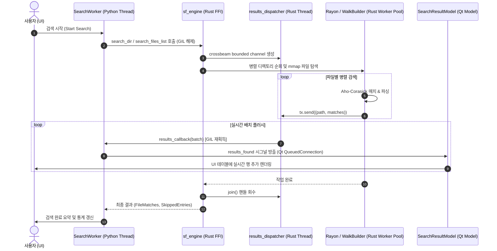

# StringFinder 개발자 가이드 (Developer Guide)

- **문서 버전:** 1.2 (StringFinder v5.9.2 기준)
- **최종 수정일:** 2026-09-06
- **대상 독자:** 코어 검색 엔진 및 UI/UX 개발자, 기여자(Maintainers & Contributors)

---

## 1. 프로젝트 개요 및 기술 스택

**StringFinder**는 대규모 파일 시스템에서 문자열 검색 및 정밀한 데이터 탐색을 제공하는 데스크톱 애플리케이션입니다. 공식 배포본과 현재 릴리스 빌드 절차는 Windows를 기준으로 하며, 일부 파일·프로세스 처리 코드는 Linux/macOS도 고려합니다. **Python(PySide6)**의 UI/이벤트 오케스트레이션과 **Rust(PyO3)**의 고성능 검색 엔진을 결합한 하이브리드 아키텍처로 구축되었습니다.

### 🛠️ 기술 스택 (Tech Stack)

```
┌────────────────────────────────────────────────────────────────────────┐
│                        StringFinder 기술 스택                          │
├───────────────────┬────────────────────────────────────────────────────┤
│ UI Framework      │ Python 3.12+, PySide6 (Qt for Python 6.6+)         │
│ Theme / Styling   │ PyDataTheme (qdarktheme), Custom QSS               │
│ Native Core       │ Rust 1.80+ (2021 Edition), PyO3 0.23               │
│ Matching Engine   │ aho-corasick 1.1, memmap2 0.9, simdutf8 0.1       │
│ Structured Parsers│ serde_json 1.0 (Visitor Streaming), quick-xml 0.31 │
│ Spreadsheet Parser│ calamine 0.33 (Excel xlsx, xlsm, xlsb, xls)        │
│ Concurrency & I/O │ rayon 1.8, ignore 0.4, crossbeam-channel 0.5, fs2  │
│ Testing & Linting │ pytest, pytest-qt, cargo test, ruff, clippy        │
└───────────────────┴────────────────────────────────────────────────────┘
```

---

## 2. 시스템 아키텍처 및 데이터 흐름 (Architecture)

StringFinder는 검색 옵션에 따라 **이원화된 검색 엔진 파이프라인**을 제공합니다:
- **기본 검색 (Default Path):** Rust 네이티브 엔진(`sf_engine`)을 호출하여 GIL을 해제하고 Rayon 병렬 파일 순회 및 Aho-Corasick SIMD 매칭, crossbeam 채널 기반 생산자-소비자 스트리밍을 수행합니다. Python callback을 호출할 때만 GIL을 다시 획득합니다.
- **정밀 검색 (Complex/Deep Search Path):** `use_complex_search=True` 플래그 활성화 시, Python의 `GlobalExecutor(ProcessPoolExecutor)` 멀티프로세싱 워커 풀을 구동하여 줄 단위 완전 유니코드 정규화(`unicodedata.normalize('NFC')`), 표준 `casefold()`, 손상 인코딩 복구(`errors="replace"`)를 수행합니다.

### 📊 기본 검색 데이터 흐름 다이어그램 (Rust Engine Path)



---

## 3. 디렉토리 구조 및 핵심 모듈 맵

```
StringFinder/
├── src/
│   ├── sf_main.py                 # 애플리케이션 진입점, 싱글톤 잠금, 경고 필터
│   ├── core/                      # Python 코어 계층
│   │   ├── search_engine.py       # Rust FFI 연동 래퍼, 정규화 및 폴백 로직
│   │   ├── worker.py              # 백그라운드 SearchWorker, 풀 관리 및 시그널
│   │   └── system_manager.py      # 애플리케이션 로그 보관·정리 정책
│   ├── rust_engine/               # Rust 네이티브 크레이트 (sf_engine)
│   │   ├── Cargo.toml             # Rust 의존성 및 cdylib 라이브러리 설정
│   │   ├── sf_engine.pyd          # 컴파일된 단일 SSOT 네이티브 바이너리
│   │   └── src/
│   │       ├── lib.rs             # FFI 진입점, mmap 검색기, 결과 디스패처
│   │       ├── types.rs           # SearchMatch, SearchOptions, 비트플래그 정의
│   │       ├── utils.rs           # 인코딩 감지, 유니코드 정규화, 패턴 생성
│   │       ├── json_search.rs     # serde_json Visitor 기반 스트리밍 탐색기
│   │       ├── xml_search.rs      # quick-xml 기반 계층 경로 탐색기
│   │       └── excel_search.rs    # calamine 기반 셀/시트 탐색 및 패닉 격리
│   ├── ui/                        # PySide6 GUI 계층
│   │   ├── main_window.py         # 메인 윈도우, 다중 탭 관리, 설정 버튼
│   │   ├── search_tab.py          # 검색 탭 위젯, 도크 패널 배치, 세션 연동
│   │   ├── result_view.py         # 결과 테이블, 문맥 미리보기, 구문 강조
│   │   ├── models.py              # SearchResultModel, MatchDetailModel, 비동기 정렬
│   │   ├── panels.py              # 폴더, 확장자, 파일명, 검색 조건 도크 패널
│   │   └── settings_dialog.py     # 고급 설정 다이얼로그
│   └── sf_utils/                  # 공통 유틸리티
│       ├── config_manager.py      # 설정 파일(JSON) 입출력 및 범위 Clamping
│       ├── file_helper.py         # 외부 에디터 연동, 파일 열기 헬퍼
│       ├── app_strings.py         # 한국어 UI 및 로그 문자열 SSOT
│       ├── english_strings.py     # 영어 번역 카탈로그
│       └── localization.py        # 언어 설정 로드와 런타임 문자열 적용
├── tests/                         # pytest 통합 및 단위 테스트 스위트
├── tools/                         # 벤치마크 및 프로파일링 스크립트
├── build_rust.py                  # Rust 엔진 원클릭 릴리스 빌드 스크립트
├── pyproject.toml                 # 프로젝트 메타데이터 및 빌드 설정
└── run.py                         # 로컬 개발 실행 진입점
```

---

## 4. Rust-Python FFI 인터페이스 & 데이터 계약 (Data Contract)

### 4.1 `SearchOptions` (Named Configuration)
파라미터 폭증을 방지하고 Python과 Rust 간 옵션을 이름으로 전달하기 위해 [`src/rust_engine/src/types.rs`](../src/rust_engine/src/types.rs)에 `SearchOptions` pyclass가 정의되어 있습니다. 이 객체는 현재 Rust 확장 모듈의 선택적 저수준 API이며, 일반 애플리케이션 코드는 `core.search_engine` 래퍼를 우선 사용해야 합니다.

```python
# Python에서의 사용 예시
from core.search_engine import sf_engine

options = sf_engine.SearchOptions(
    mode_bits=1,                    # JSON 비트플래그 (Constants.RUST_MODE_JSON 권장)
    extensions=["py", "rs"],        # 확장자 필터
    filename_filter=["*test*"],     # 파일명 글로브 필터
    exclude_hidden=True,            # 숨김 파일 제외
    stop_event=stop_event,          # 취소 감시용 threading.Event
    results_callback=callback_fn,   # 실시간 배치 수신 콜백
    batch_size=100,                 # 디스패치 배치 크기
    flush_ms=20,                    # 플러시 주기 (ms)
    max_per_file=5000,              # 파일당 최대 매치 수
    max_check_cells=500000,         # 엑셀 셀 검사 상한
    max_json_depth=20000,           # JSON 탐색 깊이 제한
    max_json_size=524288000,        # JSON 크기 제한 (500MB)
)
```

`results_callback`을 사용하는 디렉터리/파일 목록 검색에서는 callback이 결과의 단일 전달 경로입니다. callback에는 `(path, matches)` 배치가 전달되고, 동기 반환 목록은 중복 메모리 보관을 피하기 위해 비워질 수 있습니다. callback 없이 호출하면 동기 반환 목록을 사용할 수 있습니다. callback 예외는 Rust 검색 오류로 호출자에게 전파됩니다.

파일 단위 결과 제한은 `__SF_TRUNCATED__`, JSON 깊이 제한은 `__SF_JSON_DEPTH_LIMIT__|<limit>`, Excel 존재 확인 셀 제한은 `__SF_EXCEL_CELL_LIMIT__|<limit>` 메타데이터로 전달합니다. 이 신호들은 치명적 오류가 아니므로 정상 매치를 제거하지 않습니다. Python 계층은 같은 파일에서 발생한 부분 검색 사유를 하나로 합쳐 `skipped` 스트림에도 전달하며, UI는 기존 **건너뛴 파일 수** 패널과 목록 팝업을 재사용합니다. 제한만 발생해 정상 매치가 없어도 해당 파일은 `skipped` 안내에 포함되어야 합니다. 존재 여부 검색과 스마트 스캔도 적용 가능한 제한 안내 계약을 지켜야 합니다.

### 4.2 `SearchMatch` (Structured Match Object)
검색 매치 결과를 튜플 및 속성(Property) 양방향으로 읽을 수 있는 통합 구조체입니다.

| 필드명 | 타입 | 설명 |
| :--- | :---: | :--- |
| `line` | `usize` | 1-based 라인 번호 (내부 메타데이터 마커는 0) |
| `content` | `String` | 매칭 라인 텍스트 또는 포맷된 결과 (`path\tvalue`) |
| `offset` | `Option<usize>` | 매치 시작 바이트 오프셋 |
| `length` | `Option<usize>` | 매치 바이트 길이 |
| `kind` | `String` | `"match"`, `"partial"`, `"binary"`, `"long_line"`, `"truncated"`, `"sheet_error"`, `"error"` |
| `code` | `Option<String>` | 에러/안내 코드 (`ERR_MMAP`, `ERR_JSON_SIZE_LIMIT`, `JSON_DEPTH_LIMIT`, `EXCEL_CELL_LIMIT` 등) |
| `detail` | `Option<String>` | 상세 메시지 |

구조 검색의 `content` 직렬화 형식은 JSON/XML의 경우 `path\tvalue`, Excel의 경우 `sheet\tcell\tvalue`입니다. Python의 `_normalize_rust_matches()`가 이 값을 UI 모델용 튜플로 변환하므로 필드 구분자를 변경할 때는 Rust 생성부, Python 정규화 계층, UI 모델과 세션 회귀 테스트를 함께 수정해야 합니다. 구버전 세션·확장 모듈이 사용한 Excel `sheet | cell | value` 형식도 계속 읽으며, 시트 이름에 ` | `가 들어갈 수 있으므로 오른쪽의 셀·값 필드부터 분리합니다.

메모리 매핑 실패의 프로토콜 코드는 `ERR_MMAP`입니다. 정의되지 않은 코드나 잘못 표기된 코드는 다른 코드로 추정 변환하지 않습니다. 저장 세션 복원 시 형식·코드 검증에 실패한 스킵 항목과 오염된 로그 레코드는 제외하며, JSON 자체가 손상되었거나 루트 객체 형식이 아닌 세션 파일은 제거합니다.

---

## 5. 안정성 및 고성능 설계 원칙 (Resilience & Safety)

### 1) mmap 동시 수정 크래시 방어 (`FileSnapshot`)
- **위치:** [`src/rust_engine/src/lib.rs`](../src/rust_engine/src/lib.rs)
- Windows 환경에서 타 프로세스에 의해 파일이 Truncate될 때 발생하는 `STATUS_IN_PAGE_ERROR(0xC0000006)` OS 크래시를 방지합니다.
- `fs2::FileExt::try_lock_shared`로 공유 락을 획득하고 파일 메타데이터(크기 및 수정 시간)가 일치할 때만 `FileSnapshot::Mapped`를 사용하며, 잠금 실패 시 `FileSnapshot::Owned(Vec<u8>)` 인메모리 버퍼로 자동 격리합니다.

### 2) `serde_json Visitor` 기반 스트리밍 파싱
- **위치:** [`src/rust_engine/src/json_search.rs`](../src/rust_engine/src/json_search.rs)
- 거대한 AST 트리를 생성하지 않고 `DeserializeSeed`와 `Visitor`를 통해 JSON 스칼라 값이 들어오는 즉시 Aho-Corasick으로 검사합니다.
- `max_json_depth`를 초과하는 하위 트리는 `serde::de::IgnoredAny`로 파싱 비용을 즉시 차단하여 OOM을 방지합니다.

### 3) XML 문서 상태 검증과 DTD 정책
- **위치:** [`src/rust_engine/src/xml_search.rs`](../src/rust_engine/src/xml_search.rs), [`src/core/search_engine.py`](../src/core/search_engine.py)
- Rust XML 파서는 문서를 `Prolog → Root → Epilog` 상태로 추적합니다. XML 선언은 UTF-8 BOM을 제외한 문서 시작 위치에 한 번만 허용하고, 단일 루트 요소와 루트 밖 텍스트·CDATA 금지 규칙을 문서 끝까지 검증합니다.
- 검색어가 앞부분에서 발견되어도 파싱을 조기 종료하지 않습니다. 손상된 XML은 단일 파일, 디렉터리, 파일 목록, 스마트 스캔, 존재 여부 검색 모두에서 결과가 아니라 `ERR_XML_PARSE` 스킵으로 전달되어야 합니다.
- DTD 선언과 사용자 정의 엔터티 확장은 수행하지 않습니다. Rust 경로는 `ERR_XML_UNSUPPORTED_DTD`로, Python 정밀 검색 경로는 동일한 사용자 메시지로 명시적으로 스킵합니다. DTD 지원을 추가하려면 엔터티 확장량·재귀 깊이·외부 엔터티 접근을 별도의 제한과 테스트로 먼저 통제해야 합니다.

### 4) 엑셀 파싱 라이브러리 패닉 격리
- **위치:** [`src/rust_engine/src/excel_search.rs`](../src/rust_engine/src/excel_search.rs)
- 손상된 `.xlsx`, `.xlsb` 파일 파싱 시 `calamine` 내부에서 패닉이 발생하더라도 `std::panic::catch_unwind`로 포획하여 GUI 프로세스의 비정상 종료를 방지하고 `__SF_EXCEL_SHEET_ERR__|` 스킵 결과로 안전하게 변환합니다.
- 존재 확인 경로는 Rust와 Python 모두 파일별 `max_check_cells`를 적용합니다. 한도 도달은 음성 결과가 아니라 `EXCEL_CELL_LIMIT` 부분 검색으로 전달해야 하며, 한도 전에 발견한 매치는 즉시 반환합니다.
- `python-calamine`의 `total_height`/`total_width`는 0 기반 마지막 인덱스이므로 값이 0이라고 빈 시트로 판단하지 않습니다. `start is None`을 우선 사용하여 실제 빈 시트의 `iter_rows()` 패닉만 회피합니다.

### 5) 파일 크기 제한과 시스템 메모리 압력의 분리

- JSON의 설정 크기 제한은 Rust에서 `ERR_JSON_SIZE_LIMIT`로 전달하며, 해당 파일만 `skipped`에 추가합니다. 이 사유로 전체 검색을 중단하거나 메모리 부족 팝업을 표시해서는 안 됩니다.
- `resource_guard.py`의 장치별 한도는 `reserve = clamp(total RAM × 5%, 512MB, 2GB)`, `process_limit = min(total RAM × 60%, 8GB)`로 계산합니다. 단순 시스템 사용률(`system_percent`)은 로그 진단값일 뿐 판정 조건이 아닙니다.
- 현재 `available < reserve`이거나 StringFinder 프로세스 트리 `RSS >= process_limit`이면 실제 시스템 압력으로 간주하여 전체 검색을 한 번만 중단합니다. 메모리 계측값이 없거나 유효하지 않으면 가드 자체가 검색 실패를 만들지 않도록 계속 진행합니다.
- 개별 구조 문서 파싱 전에는 파일 크기를 기준으로 추가 작업 메모리를 보수적으로 예상합니다. Rust JSON/XML은 `2.5 × size + 64MB`, Python XML은 `4 × size + 64MB`, Python JSON은 `6 × size + 128MB`를 사용합니다. 예상 사용 후 `reserve` 또는 `process_limit`을 침범하면 `ERR_RESOURCE_BUDGET` 파일 스킵으로 반환하고 전체 검색은 유지합니다.
- 이 사전 예상은 현재 개별 JSON/XML 검색 진입점과 Python 정밀 검색 경로를 보호합니다. Rust 디렉터리 병렬 검색의 동시 파일 예산 예약은 별도 동시성 가드가 필요하며, 기존 JSON 크기 제한·streaming 파싱·부모 워커의 실제 RSS 감시가 계속 적용됩니다.
- `SearchWorker._is_memory_skip()`의 판정 범위를 넓힐 때는 파일 단위 제한 코드가 섞이지 않도록 반드시 혼합 파일 회귀 테스트를 추가합니다.

### 6) 정밀 일반 텍스트 검색의 무결성과 상한

- `max_small_file_size` 기준의 양쪽 경로는 모두 `search_engine._search_text_stream()`을 사용합니다. 파일 크기에 따라 인코딩 감지와 준비 경로는 달라질 수 있지만, 각 줄의 Unicode NFC 정규화·casefold·정확히 일치 판단은 동일해야 합니다.
- ASCII 줄은 이미 NFC이므로 정규화 할당을 생략하고, 검색 모드 분기는 줄 반복문 밖에서 결정합니다. 설정값은 파일마다 한 번만 읽으며 매치 반복문 안에서 `ConfigManager`를 다시 호출하지 않습니다.
- 일반 텍스트는 `max_per_file + 1`번째 매치를 확인해 truncation 마커를 추가한 즉시 나머지 입력 소비를 중단합니다. 반환 카운트와 사용자 표시 결과는 상한과 마커 계약을 유지합니다.
- JSON/XML은 결과 상한이나 존재 확인 매치가 발생해도 후반부 구문 오류를 놓치지 않도록 문서 검증을 끝까지 수행합니다. 일반 텍스트의 조기 중단 최적화를 구조 파서에 그대로 적용해서는 안 됩니다.

---

## 6. 개발 환경 설정 및 빌드/테스트 가이드

### 6.1 필수 요구사항
- Python 3.12 이상
- Rust 1.80 이상 (`rustc`, `cargo`)
- 공식 릴리스·패키징 검증: Windows 10/11 64-bit
- 소스 실행: Python/Rust 의존성과 플랫폼별 빌드 조정이 필요하며, Linux/macOS는 별도 CI 검증이 필요

### 6.2 환경 구성 및 의존성 설치
```bash
# 가상환경 생성 및 활성화
python -m venv .venv
source .venv/bin/activate  # Windows: .venv\Scripts\activate

# Python 런타임 및 개발 의존성 설치
python -m pip install -e ".[dev]"
```

### 6.3 Rust 엔진 릴리스 빌드
Windows 환경에서 `.pyd`를 단일 경로에 배포하는 통합 스크립트를 사용합니다. 새 바이너리를 대상 폴더의 임시 파일에 복사한 뒤 교체하며, 잠금으로 교체에 실패하면 기존 파일을 보존하고 오류로 종료합니다. 다른 프로세스를 강제 종료하지 않으므로 엔진을 사용 중인 앱을 직접 닫은 후 재시도하세요.
```bash
python build_rust.py
```

### 6.4 전체 테스트 실행
```bash
# 1. Rust 엔진 네이티브 단위 테스트
cargo test --manifest-path src/rust_engine/Cargo.toml

# 2. Python 통합 및 UI 테스트
pytest

# 3. 정적 코드 분석
ruff check src tests tools
```

XML 파서 변경 시에는 최소한 다음 회귀 조건도 확인합니다.

- `"<root><v>needle</root>"`처럼 매치 뒤에 구문 오류가 있는 문서는 `results=[]`, `skipped=[...]`이어야 합니다.
- 루트 뒤 DOCTYPE, 중복 DOCTYPE, 루트 뒤 XML 선언은 모두 스킵되어야 합니다.
- 내부 DTD 엔터티가 있는 문서는 엔터티를 확장하지 않고 `ERR_XML_UNSUPPORTED_DTD`로 스킵되어야 합니다.
- XML 선언·주석·처리 지시문이 올바른 위치에 있는 정상 문서는 기존과 같이 검색되어야 합니다.

### 6.5 성능 벤치마크 실행
```bash
python tools/benchmark_engine.py
```

### 6.6 Windows 배포본 빌드

`build.py`는 `pyproject.toml`의 버전을 읽고 Rust 엔진을 다시 빌드한 뒤 PyInstaller 단일 실행 파일을 생성합니다. 결과물은 `dist/StringFinder.exe`입니다. 현재 이 절차는 Windows 배포를 기준으로 합니다.

실행 파일은 먼저 `build/release`에 생성한 뒤 성공 시 `dist/StringFinder.exe`를 교체합니다. 빌드·복사·교체 실패 시 기존 배포 실행 파일을 먼저 삭제하지 않습니다. Rust 개발용 `.pyd`는 앞 단계에서 갱신될 수 있으므로 EXE 빌드 실패가 소스와 개발 엔진까지 되돌린다는 의미는 아닙니다.

```powershell
python build.py
```

---

## 7. 코딩 컨벤션 및 기여 가이드

1. **에러 핸들링:** Rust 내부의 파일 접근·메타데이터·매핑·크기 제한 오류는 `SkippedEntries`로 기록하고, 검색 파이프라인 전체가 중단되지 않도록 작성합니다. 숨김·바이너리·빈 파일처럼 의도적으로 제외한 항목은 오류 스킵으로 보고되지 않을 수 있습니다.
2. **사용자 대면 문자열:** 기본 문자열은 `src/sf_utils/app_strings.py`, 영어 번역은 `src/sf_utils/english_strings.py`에 같은 상수명으로 추가합니다. 두 언어의 `{}` 자리표시자 이름·순서·서식은 반드시 같아야 합니다. 코드 내부 식별자와 기술 주석은 기존 모듈의 언어·스타일을 일관되게 따릅니다.
3. **버전 관리:** `pyproject.toml`을 Python 프로젝트 버전의 기준으로 삼습니다. `build.py`가 이 값을 읽어 `src/sf_utils/_version.py`를 생성하며, Rust의 `CARGO_PKG_VERSION`은 `src/rust_engine/Cargo.toml`의 버전에서 나오므로 릴리스 시 두 선언을 함께 확인해야 합니다.

### 7.1 변경 시 함께 확인할 계약

- Rust 결과 형식을 바꾸면 `src/core/search_engine.py`의 정규화 로직과 `src/ui/models.py`의 표시 로직을 함께 수정합니다.
- 비동기 정렬 결과는 요청 번호와 데이터 리비전이 현재 상태와 일치할 때만 적용합니다. 검색 초기화·결과 추가 이후의 오래된 스냅샷이나 정렬 실패로 현재 결과를 덮어쓰지 않습니다. 정렬 중 접수된 최신 정렬 요청은 현재 데이터로 다시 실행합니다.
- XML은 결과 상한 도달 또는 존재 확인 성공 이후에도 모든 속성의 구문·엔터티 검증을 계속합니다. 경로는 시작/빈 요소 진입 시 추가하고 종료 시 이전 길이로 복원하며, 동일 이름 및 비ASCII 태그의 경로를 유지합니다.
- XML 속성 위치는 해당 속성 값의 원본 바이트 범위에서 계산합니다. 엔터티 변환으로 원본과 값이 달라지면 바이트 위치를 생략하며, UTF-16 등 디코딩된 XML의 위치를 원본 오프셋으로 반환하지 않습니다. 행 번호와 구조 경로는 별도로 유지합니다.
- 비UTF-8 텍스트의 개행 검색은 새로 디코딩한 구간부터 재개하고 처리한 접두부는 청크당 한 번 제거합니다. 취소는 입력 청크마다 확인하되 이미 수집한 결과를 보존합니다. 긴 한 줄 자체의 버퍼링과 파일 스냅샷 I/O까지 즉시 중단되는 것은 아닙니다.
- 새 사용자 문자열을 추가하면 한국어·영어 카탈로그와 현지화 계약 테스트를 함께 갱신합니다. 저장된 언어는 UI 모듈 import 전에 적용해야 클래스 수준 문자열 캐시가 한 언어로 일관됩니다.
- 운영체제·파서·Rust/Calamine의 원본 오류는 로그에 보존하고, 건너뛴 파일 팝업에는 `search_engine.py`의 `format_skip_reason()`과 `localize_skip_reason_for_display()`로 정규화한 현재 언어의 사용자용 사유만 전달합니다. 세션에서 복원한 사유도 표시 전에 다시 현지화합니다.
- 메모리 가드의 비율·절대 상한·예상 사용량 계수를 변경할 때는 4/8/16/32/64/128GB 장치별 한도, 정확한 경계값, 유효하지 않은 계측값, 파일 단위 스킵과 전체 중단의 분리를 모두 테스트합니다. `system_percent`를 판정 조건으로 다시 사용하지 않습니다.
- 검색 결과 상한(`max_per_file`, 전체 결과 상한), JSON 깊이·크기 제한, Excel 셀 검사 상한은 안전장치이므로 기본값과 UI 범위를 함께 검토합니다.
- 고급 설정의 기본값·최솟값·최댓값은 `Constants.ADVANCED_SETTING_SPECS`가 단일 계약입니다. `ConfigManager`와 설정 UI가 이 스키마를 함께 사용해야 하며, 새 키를 추가할 때 숫자 범위를 UI에 중복 선언하지 않습니다. 설정 스키마 v3은 사용되지 않는 `case_insensitive` 키를 제거하고, 수동 편집값도 같은 범위로 정규화합니다. 고급 설정 초기화는 메모리 변경 후 저장을 예약해야 합니다.
- `max_small_file_size`, `json_mmap_threshold`, `timeout_worker_hang`는 **정밀 검색의 Python 처리 경로 전용**입니다. 앞의 두 값은 각각 일반 텍스트의 소형 파일 처리 경로와 JSON mmap 읽기 전환 크기입니다. 소형 파일 기준 양쪽은 동일한 `_search_text_stream()` 매칭 정책을 사용해야 하며, 임계값 변경으로 검색 결과가 달라져서는 안 됩니다. mmap 경로도 최종 JSON 분석은 전체 문서를 대상으로 하므로 스트리밍 파서라고 설명하지 않습니다. 타임아웃은 파일별 실행 시간이 아니라 완료된 배치가 없는 대기 시간이며, 초과 시 전체 Python 작업 풀을 종료합니다. 세 값은 Rust 기본 검색 옵션으로 전달하지 않습니다.
- `max_json_dom_size`는 실제 메모리 측정값이 아니라 모든 JSON 검색과 Python 정밀 XML 검색의 입력 파일 크기 상한입니다. Rust 기본 XML 검색에는 적용되지 않으므로 UI·문서에서 JSON 전용 또는 공통 XML 한도라고 단정하지 않습니다.
- `__SF_TRUNCATED__`, `__SF_JSON_DEPTH_LIMIT__|<limit>`, `__SF_EXCEL_CELL_LIMIT__|<limit>`는 부분 검색 안내입니다. 정규화 시 사용자 결과 행에서는 메타데이터를 제거하되, 해당 파일을 현지화된 `skipped` 안내에 추가하고 기존 정상 결과는 보존합니다. 여러 제한이 같은 파일에서 발생하면 파일 수가 중복 증가하지 않도록 사유를 한 항목으로 병합합니다.
- 오류 코드는 `ERR_*|detail` 형식을 사용하며 메모리 매핑 실패는 `ERR_MMAP`으로 생성해야 합니다. 저장 세션의 미등록 오류 코드는 호환 별칭으로 해석하지 않고 해당 항목을 폐기합니다. Excel 직렬화는 탭 구분 형식을 생성하고, Python 정규화 계층은 구버전 파이프 구분 형식까지 읽어야 합니다.
- 결과 callback은 검색 중 UI로 전달되는 스트림입니다. callback을 추가·변경할 때는 중복 전달, callback 예외 전파, 중지 시 이미 큐에 들어온 배치 처리 여부를 테스트합니다.
- Excel 미리보기는 검색 결과에 포함된 시트·셀·값만 사용하고 원본 통합 문서를 다시 열지 않습니다. Excel 모드에서는 위·아래 문맥 설정을 숨깁니다. Excel 내보내기 경로는 모든 셀을 `_append_excel_row()`로 전달하여 수식 접두 문자가 있는 사용자 데이터를 일반 텍스트로 저장해야 합니다.
- Rust 취소·진행 감시 스레드는 100ms 폴링 주기로 실행 중 취소를 확인하되, 검색 완료 시 완료 채널로 즉시 깨워야 합니다. 완료 경로에서 단순 `sleep` 종료를 기다리면 짧은 검색마다 약 100ms의 지연이 추가되므로 다시 도입하지 않습니다.
- Python 취소 이벤트를 확인하는 감시 스레드의 `join()`은 반드시 `py.allow_threads` 내부(GIL 해제 상태)에서 수행합니다. GIL을 재획득한 뒤 종료를 기다리면 감시 스레드의 GIL 획득과 교착될 수 있습니다. 정상 반환과 오류 반환 모두 이 규칙을 지키며, `tests/test_rust_single_file_shutdown.py`에서 별도 프로세스와 제한 시간으로 회귀를 검증합니다.
- 여러 검색 루트의 존재 여부 확인은 모든 루트를 하나의 `WalkBuilder`에 등록해 단일 병렬 워커 풀로 순회합니다. 루트 바깥쪽에 Rayon 병렬 반복을 다시 추가하면 루트 수만큼 파일 워커 풀이 중첩되므로 금지합니다.
- 검색 결과의 실행 가능 파일은 UI에서 사용자 확인을 거친 뒤 시스템 연결 프로그램으로 전달합니다. 명시적으로 선택한 외부 텍스트 편집기가 실패한 경우 실행 가능 파일을 시스템 연결 프로그램으로 자동 폴백하지 않습니다. `open_file()`과 `open_in_external_editor()` 사이의 상호 호출로 재귀 경로를 만들지 않습니다.
- 시스템 진단서는 `sf_doctor_*.md` 형식의 고유 임시 파일로 생성합니다. 고정 파일명을 다시 사용하지 않으며, 7일이 지난 StringFinder 소유 진단서만 정리합니다.

### 7.2 벤치마크와 릴리스 검증

대표 엔진 경로의 baseline은 다음 명령으로 측정하며, 기록은 [`docs/ENGINE_PERFORMANCE_BASELINE.md`](ENGINE_PERFORMANCE_BASELINE.md)에 남깁니다.

```bash
python tools/benchmark_engine.py
```

대량 문자열 셀을 가진 Excel의 일반·존재 확인 경로는 다음 전용 benchmark로 측정합니다. 파싱 비용과 셀 매칭 비용이 함께 포함되므로 여러 번 교차 측정하고, 결과가 일관되지 않으면 최적화를 유지하지 않습니다.

```bash
python tools/benchmark_excel.py
```

Set A–J 통합 benchmark와 이력 누적은 다음 명령으로 수행합니다.

```bash
python scripts/benchmark_performance.py
```

릴리스 빌드 전에는 `python build.py`, Python/Rust 테스트, Ruff, Clippy를 실행하고, `dist/StringFinder.exe`와 `src/rust_engine/sf_engine.pyd`의 버전이 일치하는지 확인합니다.
