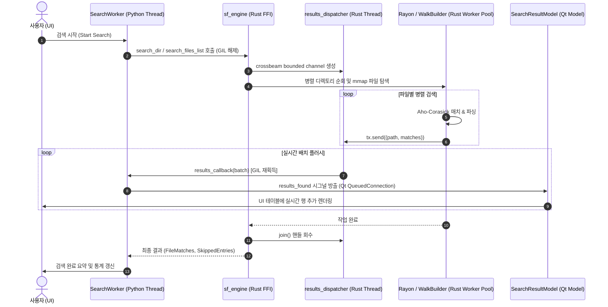

# StringFinder 개발자 가이드 (Developer Guide)

- **문서 버전:** 1.1 (StringFinder v5.7.2 기준)
- **최종 수정일:** 2026-09-01
- **대상 독자:** 코어 검색 엔진 및 UI/UX 개발자, 기여자(Maintainers & Contributors)

---

## 1. 프로젝트 개요 및 기술 스택

**StringFinder**는 대규모 파일 시스템에서 문자열 검색 및 정밀한 데이터 탐색을 제공하는 데스크톱 애플리케이션입니다. 공식 배포본과 현재 릴리스 빌드 절차는 Windows를 기준으로 하며, 일부 파일·프로세스 처리 코드는 Linux/macOS도 고려합니다. **Python(PySide6)**의 UI/이벤트 오케스트레이션과 **Rust(PyO3)**의 고성능 검색 엔진을 결합한 하이브리드 아키텍처로 구축되었습니다.

### 🛠️ 기술 스택 (Tech Stack)

```
┌────────────────────────────────────────────────────────────────────────┐
│                        StringFinder 기술 스택                          │
├───────────────────┬────────────────────────────────────────────────────┤
│ UI Framework      │ Python 3.12+, PySide6 (Qt for Python 6.6+)         │
│ Theme / Styling   │ PyDataTheme (qdarktheme), Custom QSS               │
│ Native Core       │ Rust 1.80+ (2021 Edition), PyO3 0.23               │
│ Matching Engine   │ aho-corasick 1.1, memmap2 0.9, simdutf8 0.1       │
│ Structured Parsers│ serde_json 1.0 (Visitor Streaming), quick-xml 0.31 │
│ Spreadsheet Parser│ calamine 0.33 (Excel xlsx, xlsm, xlsb, xls)        │
│ Concurrency & I/O │ rayon 1.8, ignore 0.4, crossbeam-channel 0.5, fs2  │
│ Testing & Linting │ pytest, pytest-qt, cargo test, ruff, clippy        │
└───────────────────┴────────────────────────────────────────────────────┘
```

---

## 2. 시스템 아키텍처 및 데이터 흐름 (Architecture)

StringFinder는 Rust의 파일 순회·검색 구간에서 GIL을 해제하고 Rayon 병렬 처리를 사용하는 생산자-소비자(Producer-Consumer) 스트리밍 파이프라인을 갖추고 있습니다. Python callback을 호출하거나 Python 폴백 경로를 사용할 때는 GIL이 다시 획득되므로, 애플리케이션 전체가 GIL을 완전히 우회하는 것은 아닙니다.

### 📊 데이터 흐름 다이어그램



---

## 3. 디렉토리 구조 및 핵심 모듈 맵

```
StringFinder/
├── src/
│   ├── sf_main.py                 # 애플리케이션 진입점, 싱글톤 잠금, 경고 필터
│   ├── core/                      # Python 코어 계층
│   │   ├── search_engine.py       # Rust FFI 연동 래퍼, 정규화 및 폴백 로직
│   │   ├── worker.py              # 백그라운드 SearchWorker, 풀 관리 및 시그널
│   │   └── system_manager.py      # 시스템 리소스 및 환경 관리
│   ├── rust_engine/               # Rust 네이티브 크레이트 (sf_engine)
│   │   ├── Cargo.toml             # Rust 의존성 및 cdylib 라이브러리 설정
│   │   ├── sf_engine.pyd          # 컴파일된 단일 SSOT 네이티브 바이너리
│   │   └── src/
│   │       ├── lib.rs             # FFI 진입점, mmap 검색기, 결과 디스패처
│   │       ├── types.rs           # SearchMatch, SearchOptions, 비트플래그 정의
│   │       ├── utils.rs           # 인코딩 감지, 유니코드 정규화, 패턴 생성
│   │       ├── json_search.rs     # serde_json Visitor 기반 스트리밍 탐색기
│   │       ├── xml_search.rs      # quick-xml 기반 계층 경로 탐색기
│   │       └── excel_search.rs    # calamine 기반 셀/시트 탐색 및 패닉 격리
│   ├── ui/                        # PySide6 GUI 계층
│   │   ├── main_window.py         # 메인 윈도우, 다중 탭 관리, 설정 버튼
│   │   ├── search_tab.py          # 검색 탭 위젯, 도크 패널 배치, 세션 연동
│   │   ├── result_view.py         # 결과 테이블, 문맥 미리보기, 구문 강조
│   │   ├── models.py              # SearchResultModel, MatchDetailModel, 비동기 정렬
│   │   ├── panels.py              # 폴더, 확장자, 파일명, 검색 조건 도크 패널
│   │   └── settings_dialog.py     # 고급 설정 다이얼로그
│   └── sf_utils/                  # 공통 유틸리티
│       ├── config_manager.py      # 설정 파일(JSON) 입출력 및 범위 Clamping
│       ├── file_helper.py         # 외부 에디터 연동, 파일 열기 헬퍼
│       └── app_strings.py         # UI 및 로그 다국어/한국어 문자열 SSOT
├── tests/                         # pytest 통합 및 단위 테스트 스위트
├── tools/                         # 벤치마크 및 프로파일링 스크립트
├── build_rust.py                  # Rust 엔진 원클릭 릴리스 빌드 스크립트
├── pyproject.toml                 # 프로젝트 메타데이터 및 빌드 설정
└── run.py                         # 로컬 개발 실행 진입점
```

---

## 4. Rust-Python FFI 인터페이스 & 데이터 계약 (Data Contract)

### 4.1 `SearchOptions` (Named Configuration)
파라미터 폭증을 방지하고 Python과 Rust 간 옵션을 이름으로 전달하기 위해 [`src/rust_engine/src/types.rs`](../src/rust_engine/src/types.rs)에 `SearchOptions` pyclass가 정의되어 있습니다. 이 객체는 현재 Rust 확장 모듈의 선택적 저수준 API이며, 일반 애플리케이션 코드는 `core.search_engine` 래퍼를 우선 사용해야 합니다.

```python
# Python에서의 사용 예시
from core.search_engine import sf_engine

options = sf_engine.SearchOptions(
    mode_bits=1,                    # JSON 비트플래그 (Constants.RUST_MODE_JSON 권장)
    extensions=["py", "rs"],        # 확장자 필터
    filename_filter=["*test*"],     # 파일명 글로브 필터
    exclude_hidden=True,            # 숨김 파일 제외
    stop_event=stop_event,          # 취소 감시용 threading.Event
    results_callback=callback_fn,   # 실시간 배치 수신 콜백
    batch_size=100,                 # 디스패치 배치 크기
    flush_ms=20,                    # 플러시 주기 (ms)
    max_per_file=5000,              # 파일당 최대 매치 수
    max_check_cells=500000,         # 엑셀 셀 검사 상한
    max_json_depth=20000,           # JSON 탐색 깊이 제한
    max_json_size=524288000,        # JSON 크기 제한 (500MB)
)
```

`results_callback`을 사용하는 디렉터리/파일 목록 검색에서는 callback이 결과의 단일 전달 경로입니다. callback에는 `(path, matches)` 배치가 전달되고, 동기 반환 목록은 중복 메모리 보관을 피하기 위해 비워질 수 있습니다. callback 없이 호출하면 동기 반환 목록을 사용할 수 있습니다. callback 예외는 Rust 검색 오류로 호출자에게 전파됩니다.

### 4.2 `SearchMatch` (Structured Match Object)
검색 매치 결과를 튜플 및 속성(Property) 양방향으로 읽을 수 있는 통합 구조체입니다.

| 필드명 | 타입 | 설명 |
| :--- | :---: | :--- |
| `line` | `usize` | 1-based 라인 번호 (내부 메타데이터 마커는 0) |
| `content` | `String` | 매칭 라인 텍스트 또는 포맷된 결과 (`path\tvalue`) |
| `offset` | `Option<usize>` | 매치 시작 바이트 오프셋 |
| `length` | `Option<usize>` | 매치 바이트 길이 |
| `kind` | `String` | `"match"`, `"binary"`, `"long_line"`, `"truncated"`, `"sheet_error"`, `"error"` |
| `code` | `Option<String>` | 에러/경고 코드 (`ERR_MAP`, `ERR_MEMORY_GUARD` 등) |
| `detail` | `Option<String>` | 상세 메시지 |

---

## 5. 안정성 및 고성능 설계 원칙 (Resilience & Safety)

### 1) mmap 동시 수정 크래시 방어 (`FileSnapshot`)
- **위치:** [`src/rust_engine/src/lib.rs`](../src/rust_engine/src/lib.rs)
- Windows 환경에서 타 프로세스에 의해 파일이 Truncate될 때 발생하는 `STATUS_IN_PAGE_ERROR(0xC0000006)` OS 크래시를 방지합니다.
- `fs2::FileExt::try_lock_shared`로 공유 락을 획득하고 파일 메타데이터(크기 및 수정 시간)가 일치할 때만 `FileSnapshot::Mapped`를 사용하며, 잠금 실패 시 `FileSnapshot::Owned(Vec<u8>)` 인메모리 버퍼로 자동 격리합니다.

### 2) `serde_json Visitor` 기반 스트리밍 파싱
- **위치:** [`src/rust_engine/src/json_search.rs`](../src/rust_engine/src/json_search.rs)
- 거대한 AST 트리를 생성하지 않고 `DeserializeSeed`와 `Visitor`를 통해 JSON 스칼라 값이 들어오는 즉시 Aho-Corasick으로 검사합니다.
- `max_json_depth`를 초과하는 하위 트리는 `serde::de::IgnoredAny`로 파싱 비용을 즉시 차단하여 OOM을 방지합니다.

### 3) 엑셀 파싱 라이브러리 패닉 격리
- **위치:** [`src/rust_engine/src/excel_search.rs`](../src/rust_engine/src/excel_search.rs)
- 손상된 `.xlsx`, `.xlsb` 파일 파싱 시 `calamine` 내부에서 패닉이 발생하더라도 `std::panic::catch_unwind`로 포획하여 GUI 프로세스의 비정상 종료를 방지하고 `__SF_EXCEL_SHEET_ERR__|` 스킵 결과로 안전하게 변환합니다.

---

## 6. 개발 환경 설정 및 빌드/테스트 가이드

### 6.1 필수 요구사항
- Python 3.12 이상
- Rust 1.80 이상 (`rustc`, `cargo`)
- 공식 릴리스·패키징 검증: Windows 10/11 64-bit
- 소스 실행: Python/Rust 의존성과 플랫폼별 빌드 조정이 필요하며, Linux/macOS는 별도 CI 검증이 필요

### 6.2 환경 구성 및 의존성 설치
```bash
# 가상환경 생성 및 활성화
python -m venv .venv
source .venv/bin/activate  # Windows: .venv\Scripts\activate

# Python 런타임 및 개발 의존성 설치
python -m pip install -e ".[dev]"
```

### 6.3 Rust 엔진 릴리스 빌드
Windows 환경에서 실행 중인 파이썬 프로세스 잠금을 자동 해제하고 `.pyd`를 단일 경로에 배포하는 통합 스크립트를 사용합니다.
```bash
python build_rust.py
```

### 6.4 전체 테스트 실행
```bash
# 1. Rust 엔진 네이티브 단위 테스트
cargo test --manifest-path src/rust_engine/Cargo.toml

# 2. Python 통합 및 UI 테스트
pytest

# 3. 정적 코드 분석
ruff check src tests tools
```

### 6.5 성능 벤치마크 실행
```bash
python tools/benchmark_engine.py
```

### 6.6 Windows 배포본 빌드

`build.py`는 `pyproject.toml`의 버전을 읽고 Rust 엔진을 다시 빌드한 뒤 PyInstaller 단일 실행 파일을 생성합니다. 결과물은 `dist/StringFinder.exe`입니다. 현재 이 절차는 Windows 배포를 기준으로 합니다.

```powershell
python build.py
```

---

## 7. 코딩 컨벤션 및 기여 가이드

1. **에러 핸들링:** Rust 내부의 파일 접근·메타데이터·매핑·크기 제한 오류는 `SkippedEntries`로 기록하고, 검색 파이프라인 전체가 중단되지 않도록 작성합니다. 숨김·바이너리·빈 파일처럼 의도적으로 제외한 항목은 오류 스킵으로 보고되지 않을 수 있습니다.
2. **사용자 대면 문자열:** UI·로그 문자열은 `src/sf_utils/app_strings.py`에 모으고, 코드 내부 식별자와 기술 주석은 기존 모듈의 언어·스타일을 일관되게 따릅니다.
3. **버전 관리:** `pyproject.toml`을 Python 프로젝트 버전의 기준으로 삼습니다. `build.py`가 이 값을 읽어 `src/sf_utils/_version.py`를 생성하며, Rust의 `CARGO_PKG_VERSION`은 `src/rust_engine/Cargo.toml`의 버전에서 나오므로 릴리스 시 두 선언을 함께 확인해야 합니다.

### 7.1 변경 시 함께 확인할 계약

- Rust 결과 형식을 바꾸면 `src/core/search_engine.py`의 정규화 로직과 `src/ui/models.py`의 표시 로직을 함께 수정합니다.
- 검색 결과 상한(`max_per_file`, 전체 결과 상한), JSON 깊이·크기 제한, Excel 셀 검사 상한은 안전장치이므로 기본값과 UI 범위를 함께 검토합니다.
- 결과 callback은 검색 중 UI로 전달되는 스트림입니다. callback을 추가·변경할 때는 중복 전달, callback 예외 전파, 중지 시 이미 큐에 들어온 배치 처리 여부를 테스트합니다.

### 7.2 벤치마크와 릴리스 검증

대표 엔진 경로의 baseline은 다음 명령으로 측정하며, 기록은 [`docs/ENGINE_PERFORMANCE_BASELINE.md`](ENGINE_PERFORMANCE_BASELINE.md)에 남깁니다.

```bash
python tools/benchmark_engine.py
```

Set A–J 통합 benchmark와 이력 누적은 다음 명령으로 수행합니다.

```bash
python scripts/benchmark_performance.py
```

릴리스 빌드 전에는 `python build.py`, Python/Rust 테스트, Ruff, Clippy를 실행하고, `dist/StringFinder.exe`와 `src/rust_engine/sf_engine.pyd`의 버전이 일치하는지 확인합니다.
