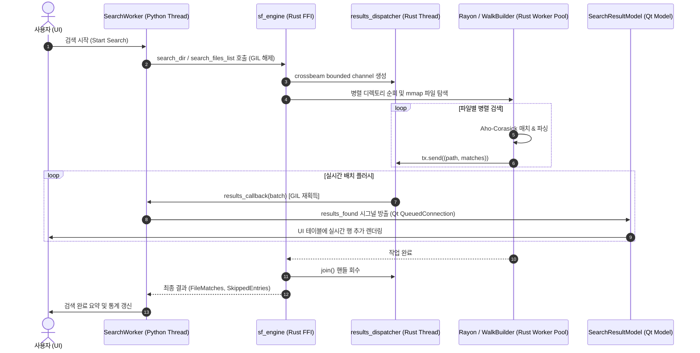

# StringFinder 개발자 가이드 (Developer Guide)

- **문서 버전:** 1.26 (StringFinder v6.1.1 안정 버전 기준)
- **최종 수정일:** 2026-10-04
- **대상 독자:** 코어 검색 엔진 및 UI/UX 개발자, 기여자(Maintainers & Contributors)

> Documentation baseline: **StringFinder 6.1.1 (stable)** · Updated: **2026-10-04**

## 문서별 역할과 읽는 순서

전체 분류와 작성 규칙은 [문서 안내](README.md)를 확인합니다.

1. 환경·빌드·테스트는 **6절**, 구조·책임·FFI는 **1–4절**을 읽습니다.
2. 현재 설계를 선택한 배경은 아래 **현재 설계로 이어진 결정**을 확인합니다.
3. 준수 계약은 [구현 정책](IMPLEMENTATION_POLICY.md), 반려·보류한 방식과 이유는 [설계 검토 기록](DESIGN_REVIEW_HISTORY.md)에 있습니다.
4. 과거 측정은 [성능 개선 기록](PERFORMANCE_HISTORY.md), 버전별 변경은 [개발 히스토리](DEVELOPMENT_HISTORY.md)에 있습니다.

## 1. 프로젝트 개요 및 기술 스택

**StringFinder**는 대규모 파일 시스템에서 문자열 검색 및 정밀한 데이터 탐색을 제공하는 데스크톱 애플리케이션입니다. 공식 배포본과 현재 릴리스 빌드 절차는 Windows를 기준으로 하며, 일부 파일·프로세스 처리 코드는 Linux/macOS도 고려합니다. **Python(PySide6)**의 UI/이벤트 오케스트레이션과 **Rust(PyO3)**의 고성능 검색 엔진을 결합한 하이브리드 아키텍처로 구축되었습니다.

### 1.1 기술 스택 (Tech Stack)

```
┌────────────────────────────────────────────────────────────────────────┐
│                        StringFinder 기술 스택                          │
├───────────────────┬────────────────────────────────────────────────────┤
│ UI Framework      │ Python 3.12+, PySide6 (Qt for Python 6.6+)         │
│ Theme / Styling   │ pyqtdarktheme (qdarktheme), Custom QSS             │
│ Native Core       │ Rust 1.88+ (2021 Edition), PyO3 0.23               │
│ Matching Engine   │ aho-corasick 1.1, memmap2 0.9, simdutf8 0.1       │
│ Structured Parsers│ serde_json 1.0 (Visitor Streaming), quick-xml 0.31 │
│ Spreadsheet Parser│ calamine 0.33 (Excel xlsx, xlsm, xlsb, xls)        │
│ Concurrency & I/O │ rayon 1.8, ignore 0.4, crossbeam-channel 0.5, fs2  │
│ Testing & Linting │ pytest, pytest-qt, cargo test, ruff, clippy        │
└───────────────────┴────────────────────────────────────────────────────┘
```

---

## 2. 시스템 아키텍처 및 데이터 흐름 (Architecture)

StringFinder는 검색 옵션에 따라 **이원화된 검색 엔진 파이프라인**을 제공합니다:
- **기본 검색 (Default Path):** Rust 네이티브 엔진(`sf_engine`)을 호출하여 GIL을 해제하고 Rayon 병렬 파일 순회 및 Aho-Corasick SIMD 매칭, crossbeam 채널 기반 생산자-소비자 스트리밍을 수행합니다. Python 콜백 호출이나 감시 스레드의 취소 이벤트 조회 등 Python 객체에 접근하는 구간에서는 GIL을 다시 획득합니다.
- **누락 방지 검색 (Complex/Deep Search Path):** `use_complex_search=True` 플래그 활성화 시, Python의 `GlobalExecutor(ProcessPoolExecutor)` 멀티프로세싱 워커 풀과 형식별 Python 검색기를 사용합니다. 일반 텍스트는 줄 단위 Unicode NFC 정규화(`unicodedata.normalize('NFC')`)와 `casefold()`로 비교합니다. 자동 인코딩의 일반 텍스트 검색에서 엄격한 디코딩과 재시도가 실패한 경우에만 최종 폴백으로 읽을 수 없는 문자를 치환합니다(`errors="replace"`). JSON/XML 특수 검색과 인코딩 지정 모드는 엄격하게 디코딩하며, 치환으로 손상된 문자를 복구한다는 의미는 아닙니다.

### 2.1 기본 검색 데이터 흐름 다이어그램 (Rust Engine Path)


```mermaid
sequenceDiagram
    autonumber
    actor User as 사용자 (UI)
    participant Worker as SearchWorker (Python Thread)
    participant Engine as sf_engine (Rust FFI)
    participant Dispatcher as results_dispatcher (Rust Thread)
    participant Rayon as Rayon / WalkBuilder (Rust Worker Pool)
    participant Model as SearchResultModel (Qt Model)

    User->>Worker: 검색 시작 (Start Search)
    Worker->>Engine: search_dir / search_files_list 호출 (GIL 해제)
    Engine->>Dispatcher: crossbeam bounded channel 생성
    Engine->>Rayon: 병렬 디렉토리 순회 및 mmap 파일 탐색
    loop 파일별 병렬 검색
        Rayon->>Rayon: Aho-Corasick 매치 & 파싱
        Rayon->>Dispatcher: tx.send((path, matches))
    end
    loop 실시간 배치 플러시
        Dispatcher->>Worker: results_callback(batch) [GIL 재획득]
        Worker->>Model: results_found 시그널 방출 (Qt QueuedConnection)
        Model->>User: UI 테이블에 실시간 행 추가 렌더링
    end
    Rayon-->>Engine: 작업 완료
    Engine->>Dispatcher: join() 핸들 회수
    Engine-->>Worker: 최종 결과 (FileMatches, SkippedEntries)
    Worker->>User: 검색 완료 요약 및 통계 갱신
```

---

## 3. 디렉토리 구조 및 핵심 모듈 맵

```
StringFinder/
├── src/
│   ├── sf_main.py                 # 애플리케이션 진입점, 싱글톤 잠금, 경고 필터
│   ├── core/                      # Python 코어 계층
│   │   ├── search_engine.py       # Rust FFI 연동 래퍼, 검색 디스패치 및 폴백 로직
│   │   ├── excel_sparse.py        # XLSX/XLSM 실제 셀·절대 좌표 열거, 기존 Excel 행 어댑터
│   │   ├── search_query.py        # 검색어 길이 검증과 입력 오류 계약
│   │   ├── json_policy.py         # 중복 키 정책과 깊은 JSON의 Python 디코딩
│   │   ├── excel_date_formats.py  # XLSX/XLSM 1904 첫날의 날짜·시간 형식 구분
│   │   ├── skip_reason_codes.py   # 검색 경로 공통 스킵 코드 계약
│   │   ├── skip_reason_formatter.py # 내부 스킵 사유를 사용자 언어로 변환
│   │   ├── worker.py              # 백그라운드 SearchWorker, 풀 관리 및 시그널
│   │   ├── system_manager.py      # 애플리케이션 로그 보관·정리 정책
│   │   └── doctor.py              # 시스템 자가 진단 및 진단 리포트
│   ├── rust_engine/               # Rust 네이티브 크레이트 (sf_engine)
│   │   ├── Cargo.toml             # Rust 의존성 및 cdylib 라이브러리 설정
│   │   ├── sf_engine.pyd          # 컴파일된 단일 SSOT 네이티브 바이너리
│   │   └── src/
│   │       ├── lib.rs             # FFI 진입점, mmap 검색기, 결과 디스패처
│   │       ├── types.rs           # SearchMatch, SearchOptions, 비트플래그 정의
│   │       ├── utils.rs           # 인코딩 감지, 유니코드 정규화, 패턴 생성
│   │       ├── json_search.rs     # serde_json Visitor 기반 스트리밍 탐색기
│   │       ├── xml_search.rs      # quick-xml 기반 계층 경로 탐색기
│   │       ├── excel_search.rs    # calamine 기반 셀/시트 탐색 및 패닉 격리
│   │       └── excel_date_formats.rs # 모호한 1904 셀의 날짜 형식 지연 확인
│   ├── ui/                        # PySide6 GUI 계층
│   │   ├── main_window.py         # 메인 윈도우, 다중 탭 관리, 상태 표시줄 버튼
│   │   ├── search_tab.py          # 검색 탭 위젯, 도크 패널 배치, 세션 연동
│   │   ├── result_view.py         # 결과 테이블, 문맥 미리보기, 구문 강조
│   │   ├── models.py              # SearchResultModel, MatchDetailModel, 비동기 정렬
│   │   ├── panels.py              # 폴더, 확장자, 파일명, 검색 조건 도크 패널
│   │   ├── settings_dialog.py     # 일반/고급 설정과 성능 진단 UI
│   │   ├── proxies.py             # 결과 테이블 정렬·필터 프록시
│   │   ├── widgets.py             # 공통 Qt 위젯
│   │   ├── styles.py              # 앱 QSS 및 상태 색상
│   │   ├── startup.py             # 첫 Paint 이후 준비 콜백의 1회 실행
│   │   └── syntax_highlighter.py  # 미리보기 구문 강조
│   └── sf_utils/                  # 설정, 공통 자원, 로깅, 현지화 유틸리티
│       ├── settings_defaults.py   # 설정 스키마/기본값/기본값 버전
│       ├── constants.py           # 설정 키와 검색 모드·한도 계약
│       ├── config_manager.py      # 설정/세션 JSON 입출력 및 검증
│       ├── resource_guard.py      # 장치·프로세스 메모리 가드
│       ├── resource_helper.py     # 패키징 자원 경로 조회
│       ├── single_instance.py     # 단일 실행 인스턴스 잠금
│       ├── startup.py             # 초기 로그 정리 스레드의 시작·종료 관리
│       ├── logger.py              # 로그 초기화 및 공통 로거
│       ├── file_helper.py         # 외부 편집기·파일 열기 헬퍼
│       ├── app_strings.py         # 한국어 문자열 카탈로그
│       ├── english_strings.py     # 영어 문자열 카탈로그
│       └── localization.py        # UI import 전 언어 선택과 문자열 적용
├── tests/                         # pytest 단위·통합·GUI·회귀 테스트
├── tools/                         # 벤치마크, 진단, 환경 검사 도구
├── scripts/                       # 벤치마크 이력 등 보조 스크립트
├── build.py                       # Rust + PyInstaller 릴리스 빌드/스모크 테스트
├── build_rust.py                  # Rust 확장 모듈 빌드 및 안전 교체
├── build_support.py               # 배포 런타임 검증 지원
├── pyproject.toml                 # Python 메타데이터, 의존성, 도구 설정
├── README.md                      # 프로젝트 개요
└── run.py                         # 로컬 개발 실행 진입점
```

### 3.1 계층 책임과 의존 방향

변경은 가능한 한 아래 방향으로 흐르게 합니다. UI는 코어 내부 구현이나 Rust 확장 모듈을 직접 호출하지 않고 `SearchWorker`와 `core.search_engine`의 래퍼를 사용합니다.

```text
UI (src/ui)
  └─ SearchWorker / core.search_engine
       ├─ 일반 검색 ───────────────> Rust 확장 (src/rust_engine)
       └─ 누락 방지 검색 ──────────> Python 검색기 + 프로세스 풀
  └─ sf_utils (설정, 리소스, 문자열, 로깅)
```

- **UI 계층**은 검색 입력·표시·사용자 동작을 책임집니다. `SearchTab`은 탭 상태와 검색 패널을 연결하고, `ResultView`는 결과 표시·미리보기·내보내기를, `models.py`는 테이블 데이터 모델을 담당합니다. UI에서 파일 탐색이나 문서 파싱을 직접 하지 않습니다.
- **작업 오케스트레이션**은 `core/worker.py`의 `SearchWorker`가 맡습니다. 진행·결과·스킵·오류·완료를 Qt 시그널로 전달하고, 중지와 전체 결과 제한을 조정합니다. 프로세스 풀에는 GUI 객체가 아니라 경로·문자열·숫자·플래그 등 직렬화 가능한 인자만 전달합니다.
- **검색 정책/어댑터**는 `core/search_engine.py`가 맡습니다. 검색 옵션 정규화, Rust 모드 비트 변환, Rust 결과의 Python 계약 변환, 공통 파일 크기 검사, Python 검색기 및 스킵 프로토콜 연결이 여기에 모입니다. 검색 모드 분기 변경 시 Rust/Python 경로를 함께 확인해야 합니다.
- **Rust 엔진**은 파일 순회와 기본 검색 구현을 담당합니다. PyO3 진입점은 `lib.rs`, 공통 데이터 형식은 `types.rs`, 인코딩·패턴 처리는 `utils.rs`, 구조화 파서는 `json_search.rs`, `xml_search.rs`, `excel_search.rs`에 둡니다.
- **공통 유틸리티**는 UI와 코어 간 순환 의존을 만들지 않습니다. `settings_defaults.py`는 기본값과 버전, `constants.py`는 설정 키와 모드 계약, `config_manager.py`는 저장·검증·마이그레이션을 담당합니다. 현지화 카탈로그는 UI 모듈보다 먼저 적용되어야 합니다.
- **테스트**는 사용자 데이터나 실제 저장소 상태에 의존하지 않아야 합니다. 임시 경로·fixture를 사용하고, 임시 산출물이 Git에 들어가지 않는지 확인합니다.

### 3.2 검색 경로 선택과 공통 계약

| 모드 | 주 실행 경로 | 설계상 의미 |
| --- | --- | --- |
| 일반 검색 | Rust 확장 | 기본 고성능 경로. 병렬 파일 순회와 배치 결과 전달을 사용합니다. |
| 누락 방지 검색 | Python 스캐너·배치 프로세스 풀·Python 검색기 | Unicode/인코딩 처리의 보수성을 우선합니다. 별도 취소·메모리·동시성 관리가 필요합니다. |
| 존재만 확인 | 선택된 검색 경로에 존재 확인 플래그 추가 | 추가 결과 수집은 중단하지만 JSON/XML은 뒤쪽 구문과 중복 키 정책도 검증합니다. Excel 셀 수 상한은 두지 않습니다. |
| JSON/XML/Excel | 선택된 경로 안의 형식별 파서 | JSON/XML 파싱 실패는 앞부분의 결과도 폐기합니다. Excel은 정상 시트 결과를 보존하고 읽지 못한 시트를 부분 검색 안내로 보고합니다. |

두 검색 경로는 구현이 같다는 뜻이 아니라 **후보 파일 집합과 사용자에게 보이는 검색 의미가 일치해야 한다**는 뜻입니다. 도트로 시작하는 파일, 숨김 옵션, `.gitignore`/`.ignore`, 겹치는 루트, 심볼릭 링크, 빈 확장자 필터, 휴지통, 파일 크기 상한을 양쪽에서 회귀 검증합니다. 정책 변경 시 같은 fixture를 각 경로에 적용하고 의도한 차이만 허용합니다.

세션 복원은 저장된 폴더·확장자·파일명 목록과 체크 상태를 재구성합니다. 현재 전역 필터와 병합하면 대상 파일 집합이 달라지므로 병합하지 않습니다. 복원 중 패널 시그널을 차단해 다른 탭의 전역 설정에 중간 상태를 저장하지 않습니다. 필터 항목은 비어 있지 않은 문자열, 체크 상태는 bool만 허용하며 잘못된 항목은 제외합니다.

세션 입력값 방어, 결과 생성 당시 조건의 보존, 복원 실패 시 파일 처리 정책은 [구현 정책 3.4절](IMPLEMENTATION_POLICY.md#34-설정-현지화-ui-모델의-함정)에 모았습니다. 검증은 `tests/test_session_input_defense.py`와 `tests/test_session_filter_integrity.py`를 참조합니다.

설정 저장은 같은 디렉터리의 고유 `.config_*.tmp` 파일에 직렬화하고 닫은 뒤 기존 설정을 교체합니다. 실패한 시도의 임시 파일만 정리하며, 기존 설정 파일과 다른 프로세스의 임시 파일은 삭제하지 않습니다. 잠겨서 삭제할 수 없는 임시 파일은 로그를 남기되 다음 저장을 막지 않습니다. 최종 설정 파일 자체가 잠기면 저장은 실패할 수 있습니다. 기본 저장 폴더 생성이 실패해 임시 폴더로 전환되면 `uses_temporary_storage`가 참이며, 메인 창에서 한글·영문 경고를 한 번 표시합니다. `APPDATA` 미설정 시의 사용자 홈 폴더 대체 경로는 임시 저장으로 취급하지 않습니다.

Python JSON 읽기는 열린 파일의 크기를 확인하고, 읽기·메모리 매핑 전에 공통 크기 상한을 다시 검사합니다. 경로 크기 조회를 줄이는 최적화에서도 열린 파일 기준의 검사는 제거하지 않습니다. 메모리 가드의 실패 주입 범위는 **7.5절**을 따릅니다.

---

## 4. Rust-Python FFI 인터페이스 & 데이터 계약 (Data Contract)

### 4.1 `SearchOptions` (Named Configuration)

파라미터 폭증을 방지하고 Python과 Rust 간 옵션을 이름으로 전달하기 위해 [`src/rust_engine/src/types.rs`](../src/rust_engine/src/types.rs)에 `SearchOptions` pyclass가 정의되어 있습니다. 이 객체는 현재 Rust 확장 모듈의 선택적 저수준 API이며, 일반 애플리케이션 코드는 `core.search_engine` 래퍼를 우선 사용해야 합니다.

```python
# Python에서의 사용 예시

from core.search_engine import sf_engine

options = sf_engine.SearchOptions(
    mode_bits=1,                    # JSON 비트플래그 (Constants.RUST_MODE_JSON 권장)
    extensions=["json"],            # JSON 예시의 확장자 필터
    filename_filter=["test"],       # GUI 파일명 필터는 리터럴 이름 조각
    exclude_hidden=True,            # 숨김 파일 제외
    stop_event=stop_event,          # 취소 감시용 threading.Event
    results_callback=callback_fn,   # 실시간 배치 수신 콜백
    batch_size=100,                 # 디스패치 배치 크기
    flush_ms=20,                    # 플러시 주기 (ms)
    max_per_file=10000,             # 파일당 최대 검색 결과 수
    max_json_depth=20000,           # JSON 탐색 깊이 제한
    max_json_size=1073741824,       # 공통 검색 파일 크기 제한 (1GB; legacy API 이름)
)
```

설정 화면의 파일명 필터는 `*`, `?`, `[`, `]`, `\`를 패턴 문법으로 해석하지 않고 입력 단계에서 거부합니다. 파일명 조건은 리터럴 이름 조각으로만 추가하며, 세션 복원 경로도 같은 검증을 통과해야 합니다. 이 UI 정책을 바꿀 때는 일반 검색과 누락 방지 검색의 후보 파일 집합이 같은지 회귀 테스트를 갱신합니다.

JSON 특수 검색은 `allow_duplicate_json_keys` 설정(기본 `False`)을 사용합니다. Rust 모드 비트 `MODE_ALLOW_DUPLICATE_JSON_KEYS`와 Python 검색 설정 스냅샷에 동일 정책을 전달합니다. 중복 판정은 객체별로 디코딩된 키를 비교하며, 결과를 찾았거나 결과·깊이 제한에 도달한 뒤에도 문서 검증을 계속합니다. 허용 시 Python의 `ObjectPairs`로 중복 값을 보존합니다. `core/json_policy.py`의 스택 기반 디코더는 깊은 문서에서도 Python의 NFC·casefold 비교 정책을 유지하기 위한 폴백이며, Rust 일반 검색으로 바꿔 재검색해서는 안 됩니다.

Python 순회의 접근 실패는 `FileScanner.skipped`로 수집해 워커의 건너뛴 목록·최종 건수에 전달합니다. 후보 선별 정책은 [구현 정책 2.2절](IMPLEMENTATION_POLICY.md#22-검색-정책오류취소-계약), Excel 셀 열거·좌표 처리는 **5절의 Excel 설계**를 따릅니다.

UI 모델에 별도의 100,000파일 상한을 두지 않습니다. 결과 한도는 워커의 사용자 설정 계약으로 통제하며, 오류 후 완료 신호를 받아도 검색 완료로 표기하지 않습니다. 이 계약과 XML 인접 텍스트·CDATA, UTF-8 샘플 경계, UTF-16 제외 정책은 `tests/test_search_reliability_regressions.py`로 검증합니다.

예상 밖 워커 예외는 `search_finished` 없이 `finished`만 전달될 수 있습니다. UI는 오류 여부와 요약 확정 여부를 별도로 추적하고, 이 경우 마지막 결과 버퍼를 비우기 전에 실패 요약을 확정해야 합니다. 일반 완료 경로를 중복 실행하지 않도록 확정 상태는 새 검색 시작 시 초기화합니다. 실패 주입 테스트는 오류 문구뿐 아니라 부분 결과 보존과 입력 잠금 해제도 함께 확인해야 합니다.

검색 경로의 값 표현·선별 계약은 다음과 같습니다. `tests/test_search_omission_regressions.py`에서 실제 네이티브 엔진과 Python 경로를 비교합니다.

- `include_junctions` 기본값은 false입니다. Python은 `os.path.isjunction()`으로 정션을 구분하고, Rust는 Windows reparse tag로 정션과 심볼릭 링크를 구분합니다. 포함 시 실제 경로를 등록하여 순환·중복 탐색을 방어합니다. Rust 등록 집합은 병렬 순회 및 모든 검색 루트가 공유합니다. 심볼릭 링크까지 무조건 허용하는 옵션으로 바꾸지 않습니다.
- `search_encoding`은 자동/UTF-8/CP949/UTF-16 LE/BE 중 하나입니다. 필터가 아니라 디코딩 정책이며, 검색 시작 시 설정 스냅샷과 Rust SearchOptions에 전달합니다. 지정 모드에서는 다른 인코딩으로 자동 재시도하지 않습니다. Excel 바이너리 파서에는 적용하지 않습니다. 자동 UTF-16 보완은 UTF-8 및 유효 CP949와 충돌하지 않는 한글 중심 표본만 사용하며, 모호한 파일의 완전 자동 판별을 보장하지 않습니다.
- JSON 큰 정수는 serde_json의 arbitrary_precision 경로에서 자릿수를 보존합니다. synthetic Number map과 실제 같은 이름의 객체 키는 원본 문자열 참조 여부로 구별하며, 이스케이프된 키도 회귀 검사합니다. 정수 `-0`은 `0`, 실수 `-0.0`은 그대로 유지합니다. 유한 범위를 넘는 실수는 두 경로 모두 문서 오류로 반환합니다.
- 1904 날짜 체계의 serial 0 이상 1 미만은 날짜와 시간 모두 가능합니다. XLSX/XLSM의 모호한 값에서만 styles·worksheet 메타데이터를 지연 조회하여 날짜 형식 셀을 복구합니다. 일반 날짜·시간 및 다른 파일 형식은 기존 경로를 유지합니다. 조회 실패를 검색 결과 없음으로 숨기지 않습니다. `tests/test_search_encoding_junctions.py`에서 후보·숫자·디코딩·날짜 경계를 검증합니다.
- 파일명 필터는 대소문자를 무시하는 **문자 그대로의 부분 문자열**입니다. Rust의 GlobSet은 필터 문자를 `globset::escape()`로 이스케이프한 뒤 내부 구현에만 사용합니다. `{a,b}` 등을 패턴으로 해석하거나 과거 저장값을 와일드카드로 실행하지 않습니다.
- UTF-8/CP949 판정을 ASCII 접두부만으로 확정하지 않습니다. Python 텍스트 검색은 strict UTF-8 실패 시 CP949로 처음부터 재시도하여 중간 결과를 중복 누적하지 않습니다. 두 인코딩 모두 읽을 수 없는 일반 텍스트는 기존 치환 정책을 유지하며, 구조화 Python 문서는 strict 디코딩을 사용합니다. UTF-8 BOM과 UTF-16 판정은 우선합니다.
- Rust 일반 ASCII 부분 검색은 샘플 판정과 결과 문자열의 UTF-8 검증을 함께 사용합니다. 치환 문자가 포함된 결과는 전체 인코딩을 재검증하고 필요하면 결과를 다시 생성합니다. 비 ASCII 검색어·정확히 일치·구조화 검색은 전체 입력을 판정합니다. 일반 텍스트 존재 확인은 NUL 없는 ASCII 접두부에서 결과를 확실히 찾았을 때만 전체 인코딩 검사를 생략합니다. JSON/XML의 전체 구문 검증에는 이 조기 종료를 적용하지 않습니다.
- CP949/UTF-16 일반 부분 검색도 한 줄의 **각 검색 위치**를 집계합니다. 디코딩된 위치를 원본 파일 바이트 오프셋으로 오인하지 않으며, 긴 결과 문자열은 검색 위치 주변으로 제한합니다. 파일당 상한과 존재 확인의 1건 반환 계약은 유지합니다.
- JSON 실수는 Python의 해석된 숫자 표현과 동일하게 비교합니다(`1.0`, `1e+20`, `1e-05`). Rust는 `serde_json/float_roundtrip`으로 변환 정확도를 보존합니다. 원문 숫자의 표기와 해석된 표현이 다를 때 원문에 없는 검색어 위치를 추정하지 않습니다.
- Excel은 정수 값에 불필요한 `.0`을 붙이지 않고, 실수의 작은 소수부를 허용 오차로 반올림해 제거하지 않습니다. Boolean은 `true`/`false`, 날짜는 `YYYY-MM-DD`, 시간이 있는 날짜는 `YYYY-MM-DD HH:MM:SS`, 시간은 `HH:MM:SS`로 비교합니다. 밀리초가 있으면 6자리 소수부로 표현합니다. 문자열 셀의 내용은 변환하지 않습니다. 날짜의 숫자 저장·ISO 저장 및 1900/1904 날짜 체계를 구분해야 합니다.
- 완료된 배치의 건너뛴 파일 안내는 그 배치의 결과를 전체 상한에 맞춰 자르기 **전에** 전달·집계합니다. 상한에 도달했다고 이미 확보한 오류 안내를 버리지 않습니다.

중복 검사 비용은 `tools/benchmark_json_policy.py`로 분리 측정합니다. 같은 코드에서 허용·금지를 번갈아 실행하며, `--compare-engine`에 저장한 바이너리를 전달하면 두 엔진·두 정책을 번갈아 측정합니다. 준비 실행은 제외하고, 결과 내용·오프셋·길이의 지문이 같음을 검증합니다. `--backend native`는 Rust 호출, `normal`은 Python 포장·무결과 호환 경로 포함, `precise`는 Python 누락 방지 경로입니다. 서로 다른 측정 경로의 시간을 직접 비교하거나 전체 수정 전후 증가분을 중복 검사 하나의 비용으로 해석하지 않습니다.

`results_callback`을 사용하는 디렉터리/파일 목록 검색에서는 callback이 결과의 단일 전달 경로입니다. callback에는 `(path, matches)` 배치가 전달되고, 동기 반환 목록은 중복 메모리 보관을 피하기 위해 비워질 수 있습니다. callback 없이 호출하면 동기 반환 목록을 사용할 수 있습니다. callback 예외는 Rust 검색 오류로 호출자에게 전파됩니다.

파일 단위 결과 제한은 `__SF_TRUNCATED__`, JSON 깊이 제한은 `__SF_JSON_DEPTH_LIMIT__|<limit>` 메타데이터로 전달합니다. 이 신호들은 치명적 오류가 아니므로 정상 매치를 제거하지 않습니다. Python 계층은 같은 파일에서 발생한 부분 검색 사유를 하나로 합쳐 `skipped` 스트림에도 전달하며, UI는 기존 **건너뛴 파일 수** 패널과 목록 팝업을 재사용합니다. 제한만 발생해 정상 매치가 없어도 해당 파일은 `skipped` 안내에 포함되어야 합니다. Excel 존재 확인에는 셀 수 상한이 없으므로 해당 부분 검색 메타데이터를 새로 만들지 않습니다. 구버전 엔진이 남긴 `__SF_EXCEL_CELL_LIMIT__|<limit>`은 호환 파싱만 유지합니다.

### 4.2 `SearchMatch` (Structured Match Object)

검색 매치 결과를 튜플 및 속성(Property) 양방향으로 읽을 수 있는 통합 구조체입니다.

| 필드명 | 타입 | 설명 |
| :--- | :---: | :--- |
| `line` | `usize` | 1-based 라인 번호 (내부 메타데이터 마커는 0) |
| `content` | `String` | 매칭 라인 텍스트 또는 포맷된 결과 (`path\tvalue`) |
| `offset` | `Option<usize>` | 매치 시작 바이트 오프셋 |
| `length` | `Option<usize>` | 매치 바이트 길이 |
| `kind` | `String` | `"match"`, `"partial"`, `"binary"`, `"long_line"`, `"truncated"`, `"sheet_error"`, `"error"` |
| `code` | `Option<String>` | 에러/안내 코드 (`ERR_MMAP`, `ERR_JSON_SIZE_LIMIT`, `JSON_DEPTH_LIMIT` 등; `EXCEL_CELL_LIMIT`은 구버전 바이너리 호환용) |
| `detail` | `Option<String>` | 상세 메시지 |

구조 검색의 기본 `content` 직렬화 형식은 JSON/XML의 경우 `path\tvalue`, Excel의 경우 `sheet\tcell\tvalue`입니다. JSON 키에 탭이 있으면 필드를 모호하게 나누지 않도록 `JSON_FIELDS|` 접두부와 JSON 배열로 경로·값을 전달합니다. 이는 오류 마커가 아닌 정상 결과 형식입니다. Python의 `_normalize_rust_matches()`가 이 값을 UI 모델용 튜플로 변환하므로 형식 변경 시 Rust 생성부, Python 정규화 계층, UI 모델과 세션 회귀 테스트를 함께 수정해야 합니다. 구버전 세션·확장 모듈이 사용한 Excel `sheet | cell | value` 형식도 계속 읽으며, 시트 이름에 ` | `가 들어갈 수 있으므로 오른쪽의 셀·값 필드부터 분리합니다.

XML 단일 파일 결과도 같은 정규화 계층을 사용합니다. `_visible_match_count()`는 제한 메타데이터를 결과 수에 포함하지 않으며, 정상 결과와 부분 검색 안내는 별도 스트림으로 전달합니다. 관련 실패 주입·문자열 표시·XML 제한 회귀는 `tests/test_audit_integrity_fixes.py`로 확인합니다.

메모리 매핑 실패의 프로토콜 코드는 `ERR_MMAP`입니다. 정의되지 않은 코드나 잘못 표기된 코드는 다른 코드로 추정 변환하지 않습니다. 저장 세션 복원 시 형식·코드 검증에 실패한 스킵 항목과 오염된 로그 레코드는 제외합니다. 세션 파일 자체의 제거·보존 조건은 [구현 정책 3.4절](IMPLEMENTATION_POLICY.md#34-설정-현지화-ui-모델의-함정)을 따릅니다.

운영체제·파서·Rust/Calamine의 원본 오류는 로그에 보존합니다. 건너뛴 파일 팝업에는 `format_skip_reason()`과 `localize_skip_reason_for_display()`로 정규화한 현재 언어의 사용자용 사유를 전달하며, 세션에서 복원한 사유도 표시 전에 다시 현지화합니다.

---

## 5. 현재 설계로 이어진 결정

| 결정 | 이유·범위 | 현재 계약 |
| --- | --- | --- |
| Rust 일반 검색과 Python 누락 방지 검색 분리 | 속도와 NFC·casefold 비교 요구를 경로별로 다룸. 후보 집합과 사용자 의미는 공통 검증 | 3.2절, 구현 정책 3.2절 |
| JSON/XML 전체 검증 후 결과 확정 | 앞부분 매치만으로 손상 문서를 정상 처리하지 않음. 존재 확인·상한 이후에도 검증 유지 | 구현 정책 1절·8.6절 |
| Excel 시트별 실패 격리 | 정상 시트 결과 보존과 부분 검색 안내. 존재 확인은 첫 매치 이후 시트까지 보장하지 않음 | 구현 정책 3.5절 |
| XLSX/XLSM 실제 셀 저장 · 6.0.3 | 직사각형 빈 영역 할당 회피. 실제 셀 수에 비례하는 저장이며 상수 메모리 스트리밍이 아님 | 아래 Excel 설계 |
| 검색 설정 스냅샷 · 5.9.21 | 검색 중 정책 변경·파일별 반복 조회 방지. 다음 검색부터 변경 적용 | 구현 정책 2.1절 |
| 스킵·부분 검색·전체 제한 분리 | 정상 결과와 처리 실패·완전성을 구분 | 4절, 구현 정책 2.2절 |
| 한영 문자열 카탈로그 | 상수명·자리표시자 계약 유지 | 구현 정책 3.4절 |
| 현재 성능 기준과 과거 측정 분리 | 작업본 결과와 배포 버전·현재 기준의 혼동 방지 | 문서 안내·성능 기준·성능 개선 기록 |

### 5.1 Excel 실제 셀 읽기 설계

Rust `SheetReader`는 XLSX/XLSM에 실제 셀 벡터, XLS/XLSB에 기존 `Range`를 사용합니다. 순서대로 유일한 좌표는 정렬을 생략하고 나머지는 안정 정렬·중복 제거로 행·열순과 마지막 비어 있지 않은 값의 계약을 보존합니다. 시트 전체 파싱 후 검색하므로 첫 매치나 상세 상한이 손상 시트 검증을 생략하지 않습니다.

누락 방지 검색은 `SparseExcelWorkbook.read_sheet()`로 시트 단위 값·절대 좌표를 받고 Python 비교 정책을 유지합니다. 셀별 FFI 호출과 열 시작 오프셋의 중복 가산을 피합니다. 6.0.4 날짜 변환 보완은 python-calamine 0.6.2 규칙에 맞췄습니다. 공유 문자열·서식 로딩과 밀집 값 저장은 남으며, API가 없는 엔진의 호환 경로에는 같은 메모리 개선이 적용되지 않습니다. 측정·한계는 [성능 개선 기록 5절](PERFORMANCE_HISTORY.md#5-v603-xlsxxlsm-빈-영역-배열-할당-제거)에 보존합니다.

## 6. 개발 환경 설정 및 빌드/테스트 가이드

### 6.1 필수 요구사항

- Python 3.12 이상
- Rust 1.88 이상 (`rustc`, `cargo`). 현재 `Cargo.lock`의 `psm 0.1.32`와 `ar_archive_writer 0.5.3`이 1.88을 요구합니다. 의존성 갱신 시 최소 도구 버전도 다시 확인합니다.
- 공식 릴리스·패키징 검증: Windows 10/11 64-bit
- 소스 실행: Python/Rust 의존성과 플랫폼별 빌드 조정이 필요하며, Linux/macOS는 별도 CI 검증이 필요

### 6.2 환경 구성 및 의존성 설치

```powershell
# 가상환경 생성 및 활성화

python -m venv .venv
.\.venv\Scripts\Activate.ps1

# Python 런타임 및 개발 의존성 설치

python -m pip install -e ".[dev]"
```

### 6.3 Rust 엔진 릴리스 빌드

Windows 환경에서 `.pyd`를 단일 경로에 배포하는 통합 스크립트를 사용합니다. 새 바이너리를 대상 폴더의 임시 파일에 복사한 뒤 교체하며, 잠금으로 교체에 실패하면 기존 파일을 보존하고 오류로 종료합니다. 다른 프로세스를 강제 종료하지 않으므로 엔진을 사용 중인 앱을 직접 닫은 후 재시도하세요.
```bash
python build_rust.py
```

### 6.4 기본 테스트와 정적 검사

기본 `pytest`는 `pyproject.toml`의 설정에 따라 stress·chaos를 제외합니다. 전체 Python 검증과 릴리스 추가 검증 명령은 **7.3절**을 따릅니다. Rust 변경에는 같은 절의 포맷·Clippy 검사도 포함합니다.

테스트는 제품 코드의 결과나 상태를 검증해야 합니다. 실패 조건이 없는 검사와 제품 구현을 호출하지 않는 자체 시뮬레이션은 회귀 방어로 계산하지 않습니다. Rust 감시 스레드 반복 호출 검증은 별도 프로세스에서 실제 검색 결과와 종료 후 스레드 수를 확인하고, 시간 초과 시 실패시킵니다. 검색 예외를 출력만 하고 통과시키지 않습니다. Qt 창 종료 대기와 공통 스레드·이벤트·GC 정리는 테스트 간 격리를 위해 유지합니다.
```bash
# 1. Rust 엔진 네이티브 단위 테스트

cargo test --manifest-path src/rust_engine/Cargo.toml

# 2. Python 통합 및 UI 테스트

pytest

# 3. 정적 코드 분석

ruff check src tests tools
```

XML 파서 변경 시에는 최소한 다음 회귀 조건도 확인합니다.

- `"<root><v>needle</root>"`처럼 매치 뒤에 구문 오류가 있는 문서는 `results=[]`, `skipped=[...]`이어야 합니다.
- 루트 뒤 DOCTYPE, 중복 DOCTYPE, 루트 뒤 XML 선언은 모두 스킵되어야 합니다.
- 내부 DTD 엔터티가 있는 문서는 엔터티를 확장하지 않고 `ERR_XML_UNSUPPORTED_DTD`로 스킵되어야 합니다.
- XML 선언·주석·처리 지시문이 올바른 위치에 있는 정상 문서는 기존과 같이 검색되어야 합니다.

### 6.5 성능 벤치마크 실행

대표 경로·Excel·공식 A–J의 명령과 기록 위치는 **7.3절**에 모았습니다. 측정값과 비교 조건은 [현재 검색 성능 기준](ENGINE_PERFORMANCE_BASELINE.md)을 따릅니다.

개발 환경을 처음 구성했거나 빌드 오류 원인을 확인할 때는 다음 사전 점검을 실행합니다.

```bash
python tools/check_dev_environment.py
```

모든 항목의 `[OK]`는 사전 확인 조건이지 빌드 성공 보장이 아닙니다. 이 도구는 Python 버전, Cargo/Rustc 실행 파일과 PySide6/PyInstaller 모듈의 존재를 검사하며 Rust 버전이나 모든 의존성의 적합성은 검사하지 않습니다. `rustc --version`으로 요구 버전을 별도 확인하고 Pillow 등 `.[dev]` 의존성을 설치합니다.

### 6.6 Windows 배포본 빌드

`build.py`는 `pyproject.toml`의 버전을 읽고 Rust 엔진을 다시 빌드한 뒤 PyInstaller 단일 실행 파일을 생성합니다. 결과물은 `dist/StringFinder.exe`입니다. 현재 이 절차는 Windows 배포를 기준으로 합니다.

실행 파일은 먼저 `build/release`에 생성한 뒤 성공 시 `dist/StringFinder.exe`를 교체합니다. 빌드·복사·교체 실패 시 기존 배포 실행 파일을 먼저 삭제하지 않습니다. Rust 개발용 `.pyd`는 앞 단계에서 갱신될 수 있으므로 EXE 빌드 실패가 소스와 개발 엔진까지 되돌린다는 의미는 아닙니다.

패키징 단계의 PATH는 Windows 및 현재 Python 경로로 제한합니다. 외부 도구(예: Poppler)의 동명 ICU DLL이 Qt 의존성으로 포함되는 것을 방지하기 위한 조치입니다. 배포 교체 전 `build_support.py`가 포함된 ICU의 Qt 요구 심볼을 검사하고, 완성된 EXE의 `--smoke-test`를 실행합니다. 이 모드는 사용자 세션을 열지 않고 Qt 플랫폼·테마·UI 모듈 로드 및 Python/Rust 버전 일치를 확인한 뒤 종료합니다. 실패 또는 45초 초과 시 배포 파일을 교체하지 않습니다. 이는 수동 UI 흐름이나 Python 미설치 장비 검증을 대체하지 않습니다.

```powershell
python build.py
```

빌드·정리 경로는 `build_support.py`로 실제 경로를 검사합니다. 다른 프로젝트를 포함할 수 있는 문자열 접두사 비교 대신 경로 포함 관계를 확인하고, 정션·심볼릭 링크와 프로젝트 밖 삭제를 차단합니다. EXE의 Rust 엔진은 `rust_engine/sf_engine.pyd` 한 곳에만 포함하며 `verify_project_payload()`로 프로젝트 모듈·진입점의 실행 코드와 현재 소스, 엔진 바이트를 비교합니다. 불일치나 엔진 중복이 있으면 배포본을 교체하지 않습니다. Python/Qt 등 제삼자 의존성을 설치된 Python 경로에서 수집하는 것은 정상입니다.

패키징 코드 변조·정션·실패 주입 검증은 `tests/test_audit_integrity_fixes.py`와 `tests/test_packaging_guards.py`를 참조합니다.

---

## 7. 변경·진단·검증 절차

### 7.1 변경 시 함께 확인할 계약

이 절은 계약의 찾아보기입니다. 같은 규칙을 여러 곳에서 별도로 갱신하지 않도록 상세 정의는 아래 위치에서 관리합니다.

| 변경 대상 | 상세 정의·검증 위치 |
| --- | --- |
| Rust 옵션·결과 직렬화·메타데이터 | **4절** |
| 파서 무결성·깊이 제한·메모리 가드 | [구현 정책 1절](IMPLEMENTATION_POLICY.md#1-안정성-및-고성능-설계-원칙-resilience--safety), 경계 조건은 [구현 정책 3.5절](IMPLEMENTATION_POLICY.md#35-검색-입력문서-무결성-및-부분-실패-계약) |
| 설정 기본값·범위·마이그레이션·검색 스냅샷 | [구현 정책 2.1절](IMPLEMENTATION_POLICY.md#21-설정-기본값-및-버전-관리) |
| 경로별 옵션·취소·오류·전체 결과 상한 | [구현 정책 2.2절](IMPLEMENTATION_POLICY.md#22-검색-정책오류취소-계약) |
| 비동기 정렬·실제 값 보존·세션·안전한 저장 | [구현 정책 3.4절](IMPLEMENTATION_POLICY.md#34-설정-현지화-ui-모델의-함정) |
| 현지화 | [구현 정책 2절](IMPLEMENTATION_POLICY.md#2-코딩-컨벤션-및-기여-가이드), [구현 정책 3.4절](IMPLEMENTATION_POLICY.md#34-설정-현지화-ui-모델의-함정) |
| 변경별 최소 검증 | **7.5절**, 릴리스 절차는 **7.3절** |

### 7.2 실무 성능 진단

설정 UI의 **시스템 자가 진단**과 **성능 진단** 실행 버튼은 고급 탭의 **진단 도구** 그룹에 있습니다.

시스템 자가 진단 대기 창은 닫을 수 있지만 Python 진단 스레드를 강제로 중단하지 않습니다. 버튼·Esc·창 닫기를 모두 처리하며, 완료 전 중복 실행을 막습니다. 창을 닫은 뒤 완료되면 버튼 상태만 복구하고 완료 팝업은 다시 띄우지 않습니다. 설정 창이 파괴된 뒤 도착한 시그널은 안전하게 무시합니다.

파일 열기·필터 입력의 UX 회귀는 `tests/test_review_ux_feedback.py`로 확인합니다. 실행 가능 파일의 확인·폴백 정책은 [구현 정책 2.2절](IMPLEMENTATION_POLICY.md#22-검색-정책오류취소-계약), 후보 필터 계약은 **4.1절**을 따릅니다.

실무 폴더의 병목을 확인하려면 GUI의 **성능 진단** 또는 다음 명령을 사용합니다.

```powershell
python tools/diagnostic_benchmark.py <폴더> --repeats 5
```

**측정 방식**

- 일반/누락 방지 × 전체 검색/존재만 확인의 네 조합을 측정하고 JSON 상세 보고서와 Markdown 해설을 만듭니다.
- 전체 시간 예산을 네 시나리오에 나눕니다. 파일 순서는 보고서마다 무작위화하되 해당 실행의 시나리오·반복에서는 같게 유지합니다.
- 검색어는 실행별 192비트 난수 토큰입니다. 원문은 저장하지 않으며, 우연한 검색 결과가 나오면 해당 시나리오는 기준 판정에 사용하지 않습니다.
- 유효 설정, 표본 커버리지, 30초 간격 자원 표본, 형식·크기별 통계, `ERR_UNKNOWN` 원인 범주, 1GiB 초과 파일 수를 기록합니다. 원인 단서가 없으면 `unclassified`로 남깁니다.

기본 전체 시간 예산은 `DEFAULT_MAX_SECONDS = 7200`이며 파일 열거 이후의 측정에 적용합니다. CLI의 `--max-seconds`로 변경하고 `0`으로 제한을 해제할 수 있습니다. GUI의 기본 실행과 예산을 다르게 설정한 CLI 기록을 같은 조건으로 비교하지 않습니다.

**해석 시 주의**

- 파일별 순차 `search_in_file` 측정은 앱의 병렬 폴더 검색 전체 시간과 다릅니다. 리포트별 난수 검색어도 동일하지 않습니다.
- 진단 호출은 `special_mode`를 지정하지 않습니다. JSON/XML은 일반 텍스트 검색이며 Excel은 확장자에 따른 전용 파서로 처리됩니다. JSON/XML 특수 검색의 파싱 비용을 평가하려면 별도 형식별 측정이 필요합니다.
- `nominal_mb_per_second`는 입력 크기 합계로 계산한 명목치이며 실제 읽은 바이트 수가 아닙니다. 조기 종료·캐시·존재 확인·건너뛴 파일의 영향을 구분합니다.
- 예외·건너뛴 파일이 있으면 원인부터 확인합니다. 커버리지 100% 미만의 완료 반복만으로 전체 실행시간을 추정하지 않습니다.
- 자원 표본은 파일 호출 반환 후 수집되므로 단일 장기 처리의 순간 피크를 놓칠 수 있습니다. 취소·시간 예산도 호출 경계에서 확인해 즉시 중단을 보장하지 않습니다.
- 시작 시 가용 메모리 경고를 해석에 반영합니다. 파일 경로·이름·본문·검색어·난수 시드는 보고서에서 제외하지만 컴퓨터 정보와 정확한 크기·자원량은 포함될 수 있으므로 공유 전에 검토합니다.

### 7.3 벤치마크와 릴리스 검증

대표 엔진 경로는 다음 명령으로 측정합니다. 현재 기준값·판정 규칙은 [검색 성능 기준](ENGINE_PERFORMANCE_BASELINE.md)에, 최적화 시도·채택 여부·과거 비교 근거는 [성능 개선 기록](PERFORMANCE_HISTORY.md)에, A–J 실행별 원본은 [벤치마크 히스토리](benchmark_history.md)에 기록합니다. 일반 기능 변경·QA 결과·배포 검증은 [개발 이력](DEVELOPMENT_HISTORY.md)에서 관리합니다.

```bash
python tools/benchmark_engine.py
```

대량 문자열 셀을 가진 Excel의 일반·존재 확인 경로는 다음 전용 benchmark로 측정합니다. 파싱 비용과 셀 매칭 비용이 함께 포함되므로 여러 번 교차 측정하고, 결과가 일관되지 않으면 최적화를 유지하지 않습니다.

```bash
python tools/benchmark_excel.py
```

Excel 보완 세트는 아래 명령으로 측정합니다. 기존 밀집 Rust 전용 도구와 달리 제품의 `search_in_excel_special()`을 사용하여 **일반/누락 방지 × 전체 결과/존재 확인**을 비교합니다. 기본값은 표본별 준비 실행 후 조합당 5회이며 64개 조합의 결과 수·전체 결과의 시트/좌표/값을 매회 검사합니다. 검증 실패나 부분 검색은 정상 측정으로 기록하지 않습니다.

```powershell
python tools/benchmark_excel_suite.py --repeats 5 --output .qa_excel_suite/results.json --record-tag v6.1.1-excel
```

- 표본은 밀집 문자열 10만 셀, 실제 값 2개가 있는 1억 셀 직사각형 범위, 캐시된 수식 결과 10만 셀, 날짜/시간 10만 셀의 XLSX입니다. 각 표본에서 첫 위치·끝 위치·2건 적중·무결과를 검사합니다. `--rows`/`--columns`를 바꾸면 다른 크기의 측정이므로 기본 기준선과 구분한 태그를 사용합니다.
- CLI는 별도 `APPDATA`의 기본 설정과 임시 표본을 사용합니다. 사용자의 설정·원본 문서를 변경하지 않으며 표본은 종료 시 제거합니다. JSON 보고서는 앱/엔진 버전·엔진 및 표본 SHA-256·표본 크기·실행별 시간/RSS를 보관합니다.
- 측정 대상은 같은 프로세스에서 호출한 **파일 검색 함수**입니다. UI·프로세스 풀 준비·다수 Excel 동시성·폴더 탐색 비용을 포함하지 않습니다. 수식은 알고 있는 계산 결과 캐시를 넣은 표본이며 프로그램이 수식을 계산한다는 뜻이 아닙니다. XLS/XLSB/XLSM을 검증한 것으로 확대하지 않습니다.
- `--record-tag`를 지정해야 기존 히스토리에 실행별 기록을 추가합니다. 태그와 `Excel …` 세트 이름으로 A–J와 분리하며 시간 합계에 섞지 않습니다. 동기 함수이므로 히스토리의 Latency는 함수 반환 시간이고 Jitter는 진행 이벤트 미측정으로 0입니다. RSS는 10ms 간격의 현재 프로세스 관측값으로, 이전 표본·준비 실행의 잔류 메모리와 런타임을 포함하며 프로세스별 독립 할당량이 아닙니다.
- 기존 A–J 임계값을 임의로 재사용하지 않습니다. 추가 세트는 결과 계약을 필수 판정하고 시간·범위를 기준선에 기록하여 이후 동일 조건에서 비교합니다. 보편적인 성능 합격선을 새로 확정한 것은 아닙니다. 표본/검증기 회귀 테스트는 `tests/test_benchmark_excel_suite.py`입니다.

Set A–J 통합 benchmark와 이력 누적은 다음 명령으로 수행합니다.

```bash
python scripts/benchmark_performance.py
```

릴리스 전에는 Python/Rust 테스트와 정적 검사를 수행하고 **6.6절**의 `python build.py`로 배포본을 생성합니다. `dist/StringFinder.exe`와 `src/rust_engine/sf_engine.pyd`의 버전·포함 코드 일치를 확인합니다. 빌드가 엔진을 다시 생성하므로 최종 엔진을 사용하는 회귀 테스트도 확인합니다.

```powershell
cargo fmt --manifest-path src/rust_engine/Cargo.toml -- --check
cargo clippy --release --manifest-path src/rust_engine/Cargo.toml -- -D warnings
```

기본 pytest 실행은 stress·chaos를 제외합니다. 릴리스 추가 검증에서는 다음처럼 명시적으로 실행하고, 결과 수뿐 아니라 테스트의 실제 단언 범위를 확인합니다.

```powershell
python -m pytest -m "stress or chaos" -p no:cacheprovider --basetemp .qa_release_stress
python -m pytest -o addopts= -q -p no:cacheprovider --basetemp .qa_release_all
python tools/validate_parallel_resources.py
```

`--basetemp`는 pytest가 내용을 정리하는 전용 임시 경로여야 합니다. 생성된 fixture와 실행 로그를 Git에 추가하지 않습니다. 리소스 검증 도구는 생성한 파일만 검색하고 자체 자식 프로세스만 시간·메모리 한도로 종료합니다. 결과를 전체 장비/입력의 OOM 방지 보장으로 해석하지 않습니다.

### 7.4 검색 계약 회귀 검증

Rust 기본 검색과 Python 누락 방지 검색은 구현을 분리하되, 다음 계약을 공통 테스트로 고정합니다.

- 검색 결과의 파일 경로·검색 결과 수·구조화 데이터 직렬화 형식
- `max_per_file`, 존재 여부 확인, 취소 시 이미 수집된 결과 보존
- JSON/XML/Excel 오류와 `skipped` 사유의 정규화
- XML·JSON 손상 입력의 결과 폐기 및 스킵 처리
- 검색 프로필의 세션 저장·복원

새 엔진 옵션이나 파서 변경은 동일 fixture를 두 경로에 적용하고, 의도된 차이만 허용해야 합니다. 결과 계약을 바꾸는 경우 Rust 생성부, Python 정규화 계층, UI 모델과 회귀 테스트를 함께 수정합니다.

`tests/test_search_path_matrix.py`는 일반 텍스트·JSON·XML·Excel × 일반/누락 방지 × 전체/존재 확인 × 숨김 제외 × 파일명 필터의 64조합을 검증합니다. 후보 파일마다 확인용 문자열을 넣어 무결과 파일까지 후보 집합을 확인한 뒤 실제 검색어로 결과 내용·위치·건수를 따로 검사합니다. 빈 확장자 필터·확장자 없는 파일은 텍스트 표본에서, 대소문자 확장자·겹치는 루트·점 접두사·ignore 파일·휴지통 제외는 함께 검증합니다. 독립적인 기대 목록과 Counter를 사용해 누락뿐 아니라 중복도 검출하며 실제 Rust 디렉터리/파일 목록 경로와 Python 스캐너/배치 경로를 실행합니다. 멀티프로세스 스케줄링과 GUI 렌더링은 이 테스트의 범위가 아닙니다.

추가 12조합은 JSON 이스케이프·XML 문자 참조의 원문 검색/값 검색 차이와 JSON 키 전용 검색의 차이를 고정합니다. JSON 객체 순회 순서는 비교하지 않되 항목 중복은 검사합니다. XML의 Python 표시 경로는 루트 이름을 생략하므로 각 경로의 기대 위치를 따로 확인합니다. 바이트 오프셋과 긴 문맥 표시 형식을 무조건 같다고 단언하지 않습니다. 인코딩·손상 입력·결과 제한·Excel 날짜 등은 기존 전용 회귀 테스트를 재사용합니다.

배포 EXE 검증은 개발 소스 테스트와 별도로 수행합니다. 전용 검색 탭과 시험 폴더에서 검색 → 정렬/미리보기 → 중지/재검색 → 내보내기 → 종료/세션 복원을 확인하고, 가능하면 Python 미설치 Windows에서 반복합니다. 미실행 항목은 통과로 기록하지 않습니다.

### 7.5 변경 유형별 최소 검증

| 변경 | 최소 함께 확인할 테스트/검증 |
| --- | --- |
| 파일 후보 필터·순회 | Rust/Python 동일 fixture, 숨김·dotfile·ignore 파일·루트 중복·symlink·빈 확장자 |
| JSON/XML/Excel 파서 | 형식별 Rust/Python 경로, 잘못된 입력, 제한 marker, 존재 확인, 매치 위치/미리보기 |
| 결과 callback·중지 | callback/동기 반환 차이, 중지 시 queued 결과 보존, total/per-file 제한 구분 |
| 설정 키·기본값 | 기본값/허용 범위, 수동 손상 JSON, default-version 초기화, schema migration |
| 메모리 가드·예상량 계수 | 4/8/16/32/64/128GB 장치별 한도, 정확한 경계값, 유효하지 않은 계측값, 파일 단위 스킵/전체 중단 분리; `system_percent`는 판정에 사용하지 않음 |
| 사용자 문자열 | 한글·영문 리소스 계약, UI 콜백 최종 문구, skip reason 현지화 |
| GUI 테이블·정렬 | 결과 추가 중 정렬, 검색 초기화, 리비전 변경, FHD 100%/125% 시각 확인 |
| 배포/의존성 | Rust 테스트·Clippy, Python 테스트·Ruff, Rust 바이너리 교체, PyInstaller smoke test, Python/Rust/EXE 버전 일치 |

변경 위험이 있는 테스트에는 의도된 사양을 직접 단언합니다. 테스트 수가 통과했더라도 해당 경계 조건을 실제로 검증하지 않는다면 회귀 방어가 된 것으로 간주하지 않습니다.
