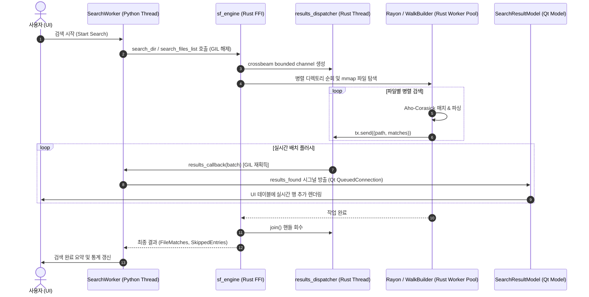

# StringFinder 개발자 가이드 (Developer Guide)

- **문서 버전:** 1.23 (StringFinder v6.0.4 기준)
- **최종 수정일:** 2026-10-03
- **대상 독자:** 코어 검색 엔진 및 UI/UX 개발자, 기여자(Maintainers & Contributors)

> Documentation baseline: **StringFinder 6.0.4** · Updated: **2026-10-04**

### 필요한 내용부터 읽기

- 처음 개발 환경을 구성한다면 **6절**의 빌드·테스트 절차부터 확인합니다.
- 변경 전에는 **3절**의 모듈 책임, **4절**의 데이터 계약, **8절**의 구조적 선택을 확인합니다.
- 기본값·현지화·기여 규칙은 **7절**에서 관리합니다. 코딩 컨벤션과 취소한 변경의 이유는 유지합니다.
- 현재 성능 기준은 [검색 성능 기준](ENGINE_PERFORMANCE_BASELINE.md), 속도 개선·보류 기록은 **9절**, 일반 변경은 [개발 이력](DEVELOPMENT_HISTORY.md), 사용 방법은 [사용자 가이드](USER_GUIDE.md)를 확인합니다.

---

## 1. 프로젝트 개요 및 기술 스택

**StringFinder**는 대규모 파일 시스템에서 문자열 검색 및 정밀한 데이터 탐색을 제공하는 데스크톱 애플리케이션입니다. 공식 배포본과 현재 릴리스 빌드 절차는 Windows를 기준으로 하며, 일부 파일·프로세스 처리 코드는 Linux/macOS도 고려합니다. **Python(PySide6)**의 UI/이벤트 오케스트레이션과 **Rust(PyO3)**의 고성능 검색 엔진을 결합한 하이브리드 아키텍처로 구축되었습니다.

### 🛠️ 기술 스택 (Tech Stack)

```
┌────────────────────────────────────────────────────────────────────────┐
│                        StringFinder 기술 스택                          │
├───────────────────┬────────────────────────────────────────────────────┤
│ UI Framework      │ Python 3.12+, PySide6 (Qt for Python 6.6+)         │
│ Theme / Styling   │ pyqtdarktheme (qdarktheme), Custom QSS             │
│ Native Core       │ Rust 1.88+ (2021 Edition), PyO3 0.23               │
│ Matching Engine   │ aho-corasick 1.1, memmap2 0.9, simdutf8 0.1       │
│ Structured Parsers│ serde_json 1.0 (Visitor Streaming), quick-xml 0.31 │
│ Spreadsheet Parser│ calamine 0.33 (Excel xlsx, xlsm, xlsb, xls)        │
│ Concurrency & I/O │ rayon 1.8, ignore 0.4, crossbeam-channel 0.5, fs2  │
│ Testing & Linting │ pytest, pytest-qt, cargo test, ruff, clippy        │
└───────────────────┴────────────────────────────────────────────────────┘
```

---

## 2. 시스템 아키텍처 및 데이터 흐름 (Architecture)

StringFinder는 검색 옵션에 따라 **이원화된 검색 엔진 파이프라인**을 제공합니다:
- **기본 검색 (Default Path):** Rust 네이티브 엔진(`sf_engine`)을 호출하여 GIL을 해제하고 Rayon 병렬 파일 순회 및 Aho-Corasick SIMD 매칭, crossbeam 채널 기반 생산자-소비자 스트리밍을 수행합니다. Python 콜백 호출이나 감시 스레드의 취소 이벤트 조회 등 Python 객체에 접근하는 구간에서는 GIL을 다시 획득합니다.
- **누락 방지 검색 (Complex/Deep Search Path):** `use_complex_search=True` 플래그 활성화 시, Python의 `GlobalExecutor(ProcessPoolExecutor)` 멀티프로세싱 워커 풀과 형식별 Python 검색기를 사용합니다. 일반 텍스트는 줄 단위 Unicode NFC 정규화(`unicodedata.normalize('NFC')`)와 `casefold()`로 비교합니다. 자동 인코딩의 일반 텍스트 검색에서 엄격한 디코딩과 재시도가 실패한 경우에만 최종 폴백으로 읽을 수 없는 문자를 치환합니다(`errors="replace"`). JSON/XML 특수 검색과 인코딩 지정 모드는 엄격하게 디코딩하며, 치환으로 손상된 문자를 복구한다는 의미는 아닙니다.

### 📊 기본 검색 데이터 흐름 다이어그램 (Rust Engine Path)


```mermaid
sequenceDiagram
    autonumber
    actor User as 사용자 (UI)
    participant Worker as SearchWorker (Python Thread)
    participant Engine as sf_engine (Rust FFI)
    participant Dispatcher as results_dispatcher (Rust Thread)
    participant Rayon as Rayon / WalkBuilder (Rust Worker Pool)
    participant Model as SearchResultModel (Qt Model)

    User->>Worker: 검색 시작 (Start Search)
    Worker->>Engine: search_dir / search_files_list 호출 (GIL 해제)
    Engine->>Dispatcher: crossbeam bounded channel 생성
    Engine->>Rayon: 병렬 디렉토리 순회 및 mmap 파일 탐색
    loop 파일별 병렬 검색
        Rayon->>Rayon: Aho-Corasick 매치 & 파싱
        Rayon->>Dispatcher: tx.send((path, matches))
    end
    loop 실시간 배치 플러시
        Dispatcher->>Worker: results_callback(batch) [GIL 재획득]
        Worker->>Model: results_found 시그널 방출 (Qt QueuedConnection)
        Model->>User: UI 테이블에 실시간 행 추가 렌더링
    end
    Rayon-->>Engine: 작업 완료
    Engine->>Dispatcher: join() 핸들 회수
    Engine-->>Worker: 최종 결과 (FileMatches, SkippedEntries)
    Worker->>User: 검색 완료 요약 및 통계 갱신
```

---

## 3. 디렉토리 구조 및 핵심 모듈 맵

```
StringFinder/
├── src/
│   ├── sf_main.py                 # 애플리케이션 진입점, 싱글톤 잠금, 경고 필터
│   ├── core/                      # Python 코어 계층
│   │   ├── search_engine.py       # Rust FFI 연동 래퍼, 검색 디스패치 및 폴백 로직
│   │   ├── excel_sparse.py        # XLSX/XLSM 실제 셀·절대 좌표 열거, 기존 Excel 행 어댑터
│   │   ├── search_query.py        # 검색어 길이 검증과 입력 오류 계약
│   │   ├── json_policy.py         # 중복 키 정책과 깊은 JSON의 Python 디코딩
│   │   ├── excel_date_formats.py  # XLSX/XLSM 1904 첫날의 날짜·시간 형식 구분
│   │   ├── skip_reason_codes.py   # 검색 경로 공통 스킵 코드 계약
│   │   ├── skip_reason_formatter.py # 내부 스킵 사유를 사용자 언어로 변환
│   │   ├── worker.py              # 백그라운드 SearchWorker, 풀 관리 및 시그널
│   │   ├── system_manager.py      # 애플리케이션 로그 보관·정리 정책
│   │   └── doctor.py              # 시스템 자가 진단 및 진단 리포트
│   ├── rust_engine/               # Rust 네이티브 크레이트 (sf_engine)
│   │   ├── Cargo.toml             # Rust 의존성 및 cdylib 라이브러리 설정
│   │   ├── sf_engine.pyd          # 컴파일된 단일 SSOT 네이티브 바이너리
│   │   └── src/
│   │       ├── lib.rs             # FFI 진입점, mmap 검색기, 결과 디스패처
│   │       ├── types.rs           # SearchMatch, SearchOptions, 비트플래그 정의
│   │       ├── utils.rs           # 인코딩 감지, 유니코드 정규화, 패턴 생성
│   │       ├── json_search.rs     # serde_json Visitor 기반 스트리밍 탐색기
│   │       ├── xml_search.rs      # quick-xml 기반 계층 경로 탐색기
│   │       ├── excel_search.rs    # calamine 기반 셀/시트 탐색 및 패닉 격리
│   │       └── excel_date_formats.rs # 모호한 1904 셀의 날짜 형식 지연 확인
│   ├── ui/                        # PySide6 GUI 계층
│   │   ├── main_window.py         # 메인 윈도우, 다중 탭 관리, 상태 표시줄 버튼
│   │   ├── search_tab.py          # 검색 탭 위젯, 도크 패널 배치, 세션 연동
│   │   ├── result_view.py         # 결과 테이블, 문맥 미리보기, 구문 강조
│   │   ├── models.py              # SearchResultModel, MatchDetailModel, 비동기 정렬
│   │   ├── panels.py              # 폴더, 확장자, 파일명, 검색 조건 도크 패널
│   │   ├── settings_dialog.py     # 일반/고급 설정과 성능 진단 UI
│   │   ├── proxies.py             # 결과 테이블 정렬·필터 프록시
│   │   ├── widgets.py             # 공통 Qt 위젯
│   │   ├── styles.py              # 앱 QSS 및 상태 색상
│   │   ├── startup.py             # 첫 Paint 이후 준비 콜백의 1회 실행
│   │   └── syntax_highlighter.py  # 미리보기 구문 강조
│   └── sf_utils/                  # 설정, 공통 자원, 로깅, 현지화 유틸리티
│       ├── settings_defaults.py   # 설정 스키마/기본값/기본값 버전
│       ├── constants.py           # 설정 키와 검색 모드·한도 계약
│       ├── config_manager.py      # 설정/세션 JSON 입출력 및 검증
│       ├── resource_guard.py      # 장치·프로세스 메모리 가드
│       ├── resource_helper.py     # 패키징 자원 경로 조회
│       ├── single_instance.py     # 단일 실행 인스턴스 잠금
│       ├── startup.py             # 초기 로그 정리 스레드의 시작·종료 관리
│       ├── logger.py              # 로그 초기화 및 공통 로거
│       ├── file_helper.py         # 외부 편집기·파일 열기 헬퍼
│       ├── app_strings.py         # 한국어 문자열 카탈로그
│       ├── english_strings.py     # 영어 문자열 카탈로그
│       └── localization.py        # UI import 전 언어 선택과 문자열 적용
├── tests/                         # pytest 단위·통합·GUI·회귀 테스트
├── tools/                         # 벤치마크, 진단, 환경 검사 도구
├── scripts/                       # 벤치마크 이력 등 보조 스크립트
├── build.py                       # Rust + PyInstaller 릴리스 빌드/스모크 테스트
├── build_rust.py                  # Rust 확장 모듈 빌드 및 안전 교체
├── build_support.py               # 배포 런타임 검증 지원
├── pyproject.toml                 # Python 메타데이터, 의존성, 도구 설정
├── README.md                      # 프로젝트 개요
└── run.py                         # 로컬 개발 실행 진입점
```

### 3.1 계층 책임과 의존 방향

변경은 가능한 한 아래 방향으로 흐르게 합니다. UI는 코어 내부 구현이나 Rust 확장 모듈을 직접 호출하지 않고 `SearchWorker`와 `core.search_engine`의 래퍼를 사용합니다.

```text
UI (src/ui)
  └─ SearchWorker / core.search_engine
       ├─ 일반 검색 ───────────────> Rust 확장 (src/rust_engine)
       └─ 누락 방지 검색 ──────────> Python 검색기 + 프로세스 풀
  └─ sf_utils (설정, 리소스, 문자열, 로깅)
```

- **UI 계층**은 검색 입력·표시·사용자 동작을 책임집니다. `SearchTab`은 탭 상태와 검색 패널을 연결하고, `ResultView`는 결과 표시·미리보기·내보내기를, `models.py`는 테이블 데이터 모델을 담당합니다. UI에서 파일 탐색이나 문서 파싱을 직접 하지 않습니다.
- **작업 오케스트레이션**은 `core/worker.py`의 `SearchWorker`가 맡습니다. 진행·결과·스킵·오류·완료를 Qt 시그널로 전달하고, 중지와 전체 결과 제한을 조정합니다. 프로세스 풀에는 GUI 객체가 아니라 경로·문자열·숫자·플래그 등 직렬화 가능한 인자만 전달합니다.
- **검색 정책/어댑터**는 `core/search_engine.py`가 맡습니다. 검색 옵션 정규화, Rust 모드 비트 변환, Rust 결과의 Python 계약 변환, 공통 파일 크기 검사, Python 검색기 및 스킵 프로토콜 연결이 여기에 모입니다. 검색 모드 분기 변경 시 Rust/Python 경로를 함께 확인해야 합니다.
- **Rust 엔진**은 파일 순회와 기본 검색 구현을 담당합니다. PyO3 진입점은 `lib.rs`, 공통 데이터 형식은 `types.rs`, 인코딩·패턴 처리는 `utils.rs`, 구조화 파서는 `json_search.rs`, `xml_search.rs`, `excel_search.rs`에 둡니다.
- **공통 유틸리티**는 UI와 코어 간 순환 의존을 만들지 않습니다. `settings_defaults.py`는 기본값과 버전, `constants.py`는 설정 키와 모드 계약, `config_manager.py`는 저장·검증·마이그레이션을 담당합니다. 현지화 카탈로그는 UI 모듈보다 먼저 적용되어야 합니다.
- **테스트**는 사용자 데이터나 실제 저장소 상태에 의존하지 않아야 합니다. 임시 경로·fixture를 사용하고, 임시 산출물이 Git에 들어가지 않는지 확인합니다.

### 3.2 검색 경로 선택과 공통 계약

| 모드 | 주 실행 경로 | 설계상 의미 |
| --- | --- | --- |
| 일반 검색 | Rust 확장 | 기본 고성능 경로. 병렬 파일 순회와 배치 결과 전달을 사용합니다. |
| 누락 방지 검색 | Python 스캐너·배치 프로세스 풀·Python 검색기 | Unicode/인코딩 처리의 보수성을 우선합니다. 별도 취소·메모리·동시성 관리가 필요합니다. |
| 존재만 확인 | 선택된 검색 경로에 존재 확인 플래그 추가 | 추가 결과 수집은 중단하지만 JSON/XML은 뒤쪽 구문과 중복 키 정책도 검증합니다. Excel 셀 수 상한은 두지 않습니다. |
| JSON/XML/Excel | 선택된 경로 안의 형식별 파서 | JSON/XML 파싱 실패는 앞부분의 결과도 폐기합니다. Excel은 정상 시트 결과를 보존하고 읽지 못한 시트를 부분 검색 안내로 보고합니다. |

두 검색 경로는 구현이 같다는 뜻이 아니라 **후보 파일 집합과 사용자에게 보이는 검색 의미가 일치해야 한다**는 뜻입니다. 도트로 시작하는 파일, 숨김 옵션, `.gitignore`/`.ignore`, 겹치는 루트, 심볼릭 링크, 빈 확장자 필터, 휴지통, 파일 크기 상한을 양쪽에서 회귀 검증합니다. 정책 변경 시 같은 fixture를 각 경로에 적용하고 의도한 차이만 허용합니다.

세션 복원은 저장된 폴더·확장자·파일명 목록과 체크 상태를 재구성합니다. 현재 전역 필터와 병합하면 대상 파일 집합이 달라지므로 병합하지 않습니다. 복원 중 패널 시그널을 차단해 다른 탭의 전역 설정에 중간 상태를 저장하지 않습니다. 필터 항목은 비어 있지 않은 문자열, 체크 상태는 bool만 허용하며 잘못된 항목은 제외합니다.

6.0.4의 입력 복원은 검색어가 문자열이 아니면 빈 문자열, 검색 방식·존재 확인 값이 bool이 아니면 일반 검색·미사용, 숨김 제외 값이 bool이 아니면 제외로 복구합니다. 결과 생성 당시의 `results_search_context`는 별도로 유지합니다. 시작 시 세션별 예외 경계에서 상세 오류를 기록하고 부분 생성된 탭을 정리하며 나머지 탭은 계속 복원합니다. 실패한 파일을 삭제하지 않고, 모든 복원이 실패하면 기존 세션 이름과 겹치지 않는 빈 탭을 만듭니다. 검증은 `tests/test_session_input_defense.py`를 참조합니다.

설정 저장은 같은 디렉터리의 고유 `.config_*.tmp` 파일에 직렬화하고 닫은 뒤 기존 설정을 교체합니다. 실패한 시도의 임시 파일만 정리하며, 기존 설정 파일과 다른 프로세스의 임시 파일은 삭제하지 않습니다. 잠겨서 삭제할 수 없는 임시 파일은 로그를 남기되 다음 저장을 막지 않습니다. 최종 설정 파일 자체가 잠기면 저장은 실패할 수 있습니다. 기본 저장 폴더 생성이 실패해 임시 폴더로 전환되면 `uses_temporary_storage`가 참이며, 메인 창에서 한글·영문 경고를 한 번 표시합니다. `APPDATA` 미설정 시의 사용자 홈 폴더 대체 경로는 임시 저장으로 취급하지 않습니다.

일반 테스트의 메모리 fixture는 유효한 16GiB 전체·8GiB 가용 수치를 제공합니다. 메모리 압박과 계측 불가 시나리오는 전용 테스트에서 명시적으로 주입합니다. Python JSON 읽기는 중복 경로 크기 조회 대신 열린 파일의 크기를 확인하고, 읽기·메모리 매핑 전에 크기 상한을 다시 검사합니다. 이 검사를 제거하는 최적화는 허용하지 않습니다.

`results_search_context`는 결과를 생성한 검색어, 언어 독립적인 검색 방식, 정확히 일치 여부, 존재 확인 여부, 파일명 강조 조건을 보존합니다. 입력창의 편집 중인 조건과 혼동하지 않아야 합니다. 이전 세션에 이 정보가 없으면 저장된 입력 조건으로 표시하며, 당시 조건을 완전히 복구할 수는 없습니다. 존재 확인 안내문은 기존 보수적 판별을 유지합니다. 관련 계약은 `tests/test_session_filter_integrity.py`에서 검증합니다.

---

## 4. Rust-Python FFI 인터페이스 & 데이터 계약 (Data Contract)

### 4.1 `SearchOptions` (Named Configuration)
파라미터 폭증을 방지하고 Python과 Rust 간 옵션을 이름으로 전달하기 위해 [`src/rust_engine/src/types.rs`](../src/rust_engine/src/types.rs)에 `SearchOptions` pyclass가 정의되어 있습니다. 이 객체는 현재 Rust 확장 모듈의 선택적 저수준 API이며, 일반 애플리케이션 코드는 `core.search_engine` 래퍼를 우선 사용해야 합니다.

```python
# Python에서의 사용 예시
from core.search_engine import sf_engine

options = sf_engine.SearchOptions(
    mode_bits=1,                    # JSON 비트플래그 (Constants.RUST_MODE_JSON 권장)
    extensions=["py", "rs"],        # 확장자 필터
    filename_filter=["test"],       # GUI 파일명 필터는 리터럴 이름 조각
    exclude_hidden=True,            # 숨김 파일 제외
    stop_event=stop_event,          # 취소 감시용 threading.Event
    results_callback=callback_fn,   # 실시간 배치 수신 콜백
    batch_size=100,                 # 디스패치 배치 크기
    flush_ms=20,                    # 플러시 주기 (ms)
    max_per_file=10000,             # 파일당 최대 검색 결과 수
    max_check_cells=500000,         # 구버전 호출 호환용(현재 Excel 검색에서 무시)
    max_json_depth=20000,           # JSON 탐색 깊이 제한
    max_json_size=1073741824,       # 공통 검색 파일 크기 제한 (1GB; legacy API 이름)
)
```

설정 화면의 파일명 필터는 `*`, `?`, `[`, `]`, `\`를 패턴 문법으로 해석하지 않고 입력 단계에서 거부합니다. 파일명 조건은 리터럴 이름 조각으로만 추가하며, 세션 복원 경로도 같은 검증을 통과해야 합니다. 이 UI 정책을 바꿀 때는 일반 검색과 누락 방지 검색의 후보 파일 집합이 같은지 회귀 테스트를 갱신합니다.

JSON 특수 검색은 `allow_duplicate_json_keys` 설정(기본 `False`)을 사용합니다. Rust 모드 비트 `MODE_ALLOW_DUPLICATE_JSON_KEYS`와 Python 검색 설정 스냅샷에 동일 정책을 전달합니다. 중복 판정은 객체별로 디코딩된 키를 비교하며, 결과를 찾았거나 결과·깊이 제한에 도달한 뒤에도 문서 검증을 계속합니다. 허용 시 Python의 `ObjectPairs`로 중복 값을 보존합니다. `core/json_policy.py`의 스택 기반 디코더는 깊은 문서에서도 Python의 NFC·casefold 비교 정책을 유지하기 위한 폴백이며, Rust 일반 검색으로 바꿔 재검색해서는 안 됩니다.

파일 순회는 `.gitignore`, `.ignore`, `.git/info/exclude`, 전역 Git 제외 규칙을 사용하지 않습니다. Python 순회의 접근 실패는 `FileScanner.skipped`로 수집해 워커의 건너뛴 목록·최종 건수에 전달합니다. Excel은 정상 시트의 결과를 보존하면서 실패한 시트를 부분 검색 안내로 보고합니다. 6.0.3부터 XLSX/XLSM은 Rust의 셀 reader로 실제 셀만 수집합니다. 누락 방지 검색에는 `SparseExcelWorkbook` → `core/excel_sparse.py`로 절대 행·열 좌표와 표시 값을 전달하고, 비교·유니코드 정규화는 Python이 수행합니다. XLS/XLSB 및 새 API가 없는 엔진의 Python 경로는 기존 calamine을 사용합니다. 해당 `iter_rows()`는 선행 빈 행을 포함하지만 열은 사용 영역부터 반환하므로 어댑터에서 `sheet.start[1]`을 더합니다. 호출부에서 이 오프셋을 다시 더하지 않습니다.

UI 모델에 별도의 100,000파일 상한을 두지 않습니다. 결과 한도는 워커의 사용자 설정 계약으로 통제하며, 오류 후 완료 신호를 받아도 검색 완료로 표기하지 않습니다. 이 계약과 XML 인접 텍스트·CDATA, UTF-8 샘플 경계, UTF-16 제외 정책은 `tests/test_search_reliability_regressions.py`로 검증합니다.

예상 밖 워커 예외는 `search_finished` 없이 `finished`만 전달될 수 있습니다. UI는 오류 여부와 요약 확정 여부를 별도로 추적하고, 이 경우 마지막 결과 버퍼를 비우기 전에 실패 요약을 확정해야 합니다. 일반 완료 경로를 중복 실행하지 않도록 확정 상태는 새 검색 시작 시 초기화합니다. 실패 주입 테스트는 오류 문구뿐 아니라 부분 결과 보존과 입력 잠금 해제도 함께 확인해야 합니다.

중복 키 검사의 성능을 유지하기 위해 Rust는 작은 객체의 키를 인라인 저장합니다. `JsonKey`의 전용 Serde visitor는 이스케이프가 없는 키를 원본 입력에서 빌리고, 해석이 필요한 키만 소유 문자열로 만듭니다. `Cow<str>` 기본 역직렬화만으로 원본 참조를 보장할 수 없으므로 전용 visitor를 유지합니다. 경로 스택과 키 집합의 참조 수명은 입력 버퍼를 넘지 않아야 합니다. 중복 비교에는 해석된 문자열 전체를 사용하며 NFC 정규화나 대소문자 변환을 적용하지 않습니다. 키가 많으면 해시 집합으로 전환하므로 대형 객체에서 이차 시간 탐색이 발생하지 않습니다.

원본 참조 키는 등록과 중복 판정을 한 번에 수행합니다. 소유 키는 값을 읽기 전에 중복 여부를 확인하고, 값을 읽은 뒤 경로 스택에서 문자열을 회수해 등록합니다. 이 경로를 무조건 사전 등록으로 바꾸면 이스케이프된 키를 추가 복사하게 되므로 주의합니다. 같은 객체의 다음 키를 읽기 전 등록이 끝나며, 자식 객체는 별도 집합을 사용합니다. 문자열 비교를 해시값 비교만으로 대체하거나 결과·깊이 상한 이후 검사를 생략해서는 안 됩니다.

위 JSON 키 처리를 수정할 때는 중복 키가 결과·깊이 상한 뒤에 나타나는 문서, 참조 키와 해석된 키의 중복, 깊은 객체 경로 및 원본 위치 회귀 테스트를 함께 실행해야 합니다.

XML은 원본 버퍼를 빌려 읽고 인접 텍스트를 실제로 합쳐야 할 때만 복사합니다. CDATA·주석·엔티티 때문에 디코딩된 값과 원본 바이트가 다르면 추정한 오프셋을 반환하지 않습니다. 이 처리를 변경할 때는 인접 텍스트·CDATA의 합성, 엔터티 변환, 속성 위치, UTF-16 입력 및 검색 결과 뒤의 구문 오류를 검증합니다.

XML은 결과 상한·존재 확인 성공 이후에도 모든 속성의 구문·엔터티를 검증합니다. 구조 경로는 시작/빈 요소 진입 시 추가하고 종료 시 이전 길이로 복원하며, 동일 이름과 비ASCII 태그의 경로를 유지합니다. 속성 위치는 해당 값의 원본 바이트 범위에서 계산합니다. 엔터티 변환으로 값이 달라지거나 UTF-16 등으로 디코딩했다면 원본 바이트 위치를 추정하지 않고 생략하며, 행 번호·구조 경로는 별도로 유지합니다.

검색 경로의 값 표현·선별 계약은 다음과 같습니다. `tests/test_search_omission_regressions.py`에서 실제 네이티브 엔진과 Python 경로를 비교합니다.

- `include_junctions` 기본값은 false입니다. Python은 `os.path.isjunction()`으로 정션을 구분하고, Rust는 Windows reparse tag로 정션과 심볼릭 링크를 구분합니다. 포함 시 실제 경로를 등록하여 순환·중복 탐색을 방어합니다. Rust 등록 집합은 병렬 순회 및 모든 검색 루트가 공유합니다. 심볼릭 링크까지 무조건 허용하는 옵션으로 바꾸지 않습니다.
- `search_encoding`은 자동/UTF-8/CP949/UTF-16 LE/BE 중 하나입니다. 필터가 아니라 디코딩 정책이며, 검색 시작 시 설정 스냅샷과 Rust SearchOptions에 전달합니다. 지정 모드에서는 다른 인코딩으로 자동 재시도하지 않습니다. Excel 바이너리 파서에는 적용하지 않습니다. 자동 UTF-16 보완은 UTF-8 및 유효 CP949와 충돌하지 않는 한글 중심 표본만 사용하며, 모호한 파일의 완전 자동 판별을 보장하지 않습니다.
- JSON 큰 정수는 serde_json의 arbitrary_precision 경로에서 자릿수를 보존합니다. synthetic Number map과 실제 같은 이름의 객체 키는 원본 문자열 참조 여부로 구별하며, 이스케이프된 키도 회귀 검사합니다. 정수 `-0`은 `0`, 실수 `-0.0`은 그대로 유지합니다. 유한 범위를 넘는 실수는 두 경로 모두 문서 오류로 반환합니다.
- 1904 날짜 체계의 serial 0 이상 1 미만은 날짜와 시간 모두 가능합니다. XLSX/XLSM의 모호한 값에서만 styles·worksheet 메타데이터를 지연 조회하여 날짜 형식 셀을 복구합니다. 일반 날짜·시간 및 다른 파일 형식은 기존 경로를 유지합니다. 조회 실패를 검색 결과 없음으로 숨기지 않습니다. `tests/test_search_encoding_junctions.py`에서 후보·숫자·디코딩·날짜 경계를 검증합니다.
- 파일명 필터는 대소문자를 무시하는 **문자 그대로의 부분 문자열**입니다. Rust의 GlobSet은 필터 문자를 `globset::escape()`로 이스케이프한 뒤 내부 구현에만 사용합니다. `{a,b}` 등을 패턴으로 해석하거나 과거 저장값을 와일드카드로 실행하지 않습니다.
- UTF-8/CP949 판정을 ASCII 접두부만으로 확정하지 않습니다. Python 텍스트 검색은 strict UTF-8 실패 시 CP949로 처음부터 재시도하여 중간 결과를 중복 누적하지 않습니다. 두 인코딩 모두 읽을 수 없는 일반 텍스트는 기존 치환 정책을 유지하며, 구조화 Python 문서는 strict 디코딩을 사용합니다. UTF-8 BOM과 UTF-16 판정은 우선합니다.
- Rust 일반 ASCII 부분 검색은 샘플 판정과 결과 문자열의 UTF-8 검증을 함께 사용합니다. 치환 문자가 포함된 결과는 전체 인코딩을 재검증하고 필요하면 결과를 다시 생성합니다. 비 ASCII 검색어·정확히 일치·구조화 검색은 전체 입력을 판정합니다. 일반 텍스트 존재 확인은 NUL 없는 ASCII 접두부에서 결과를 확실히 찾았을 때만 전체 인코딩 검사를 생략합니다. JSON/XML의 전체 구문 검증에는 이 조기 종료를 적용하지 않습니다.
- CP949/UTF-16 일반 부분 검색도 한 줄의 **각 검색 위치**를 집계합니다. 디코딩된 위치를 원본 파일 바이트 오프셋으로 오인하지 않으며, 긴 결과 문자열은 검색 위치 주변으로 제한합니다. 파일당 상한과 존재 확인의 1건 반환 계약은 유지합니다.
- JSON 실수는 Python의 해석된 숫자 표현과 동일하게 비교합니다(`1.0`, `1e+20`, `1e-05`). Rust는 `serde_json/float_roundtrip`으로 변환 정확도를 보존합니다. 원문 숫자의 표기와 해석된 표현이 다를 때 원문에 없는 검색어 위치를 추정하지 않습니다.
- Excel은 정수 값에 불필요한 `.0`을 붙이지 않고, 실수의 작은 소수부를 허용 오차로 반올림해 제거하지 않습니다. Boolean은 `true`/`false`, 날짜는 `YYYY-MM-DD`, 시간이 있는 날짜는 `YYYY-MM-DD HH:MM:SS`, 시간은 `HH:MM:SS`로 비교합니다. 밀리초가 있으면 6자리 소수부로 표현합니다. 문자열 셀의 내용은 변환하지 않습니다. 날짜의 숫자 저장·ISO 저장 및 1900/1904 날짜 체계를 구분해야 합니다.
- 완료된 배치의 건너뛴 파일 안내는 그 배치의 결과를 전체 상한에 맞춰 자르기 **전에** 전달·집계합니다. 상한에 도달했다고 이미 확보한 오류 안내를 버리지 않습니다.

중복 검사 비용은 `tools/benchmark_json_policy.py`로 분리 측정합니다. 같은 코드에서 허용·금지를 번갈아 실행하며, `--compare-engine`에 저장한 바이너리를 전달하면 두 엔진·두 정책을 번갈아 측정합니다. 준비 실행은 제외하고, 결과 내용·오프셋·길이의 지문이 같음을 검증합니다. `--backend native`는 Rust 호출, `normal`은 Python 포장·무결과 호환 경로 포함, `precise`는 Python 누락 방지 경로입니다. 서로 다른 측정 경로의 시간을 직접 비교하거나 전체 수정 전후 증가분을 중복 검사 하나의 비용으로 해석하지 않습니다.

`results_callback`을 사용하는 디렉터리/파일 목록 검색에서는 callback이 결과의 단일 전달 경로입니다. callback에는 `(path, matches)` 배치가 전달되고, 동기 반환 목록은 중복 메모리 보관을 피하기 위해 비워질 수 있습니다. callback 없이 호출하면 동기 반환 목록을 사용할 수 있습니다. callback 예외는 Rust 검색 오류로 호출자에게 전파됩니다.

파일 단위 결과 제한은 `__SF_TRUNCATED__`, JSON 깊이 제한은 `__SF_JSON_DEPTH_LIMIT__|<limit>` 메타데이터로 전달합니다. 이 신호들은 치명적 오류가 아니므로 정상 매치를 제거하지 않습니다. Python 계층은 같은 파일에서 발생한 부분 검색 사유를 하나로 합쳐 `skipped` 스트림에도 전달하며, UI는 기존 **건너뛴 파일 수** 패널과 목록 팝업을 재사용합니다. 제한만 발생해 정상 매치가 없어도 해당 파일은 `skipped` 안내에 포함되어야 합니다. Excel 존재 확인에는 셀 수 상한이 없으므로 해당 부분 검색 메타데이터를 새로 만들지 않습니다. 구버전 엔진이 남긴 `__SF_EXCEL_CELL_LIMIT__|<limit>`은 호환 파싱만 유지합니다.

### 4.2 `SearchMatch` (Structured Match Object)
검색 매치 결과를 튜플 및 속성(Property) 양방향으로 읽을 수 있는 통합 구조체입니다.

| 필드명 | 타입 | 설명 |
| :--- | :---: | :--- |
| `line` | `usize` | 1-based 라인 번호 (내부 메타데이터 마커는 0) |
| `content` | `String` | 매칭 라인 텍스트 또는 포맷된 결과 (`path\tvalue`) |
| `offset` | `Option<usize>` | 매치 시작 바이트 오프셋 |
| `length` | `Option<usize>` | 매치 바이트 길이 |
| `kind` | `String` | `"match"`, `"partial"`, `"binary"`, `"long_line"`, `"truncated"`, `"sheet_error"`, `"error"` |
| `code` | `Option<String>` | 에러/안내 코드 (`ERR_MMAP`, `ERR_JSON_SIZE_LIMIT`, `JSON_DEPTH_LIMIT` 등; `EXCEL_CELL_LIMIT`은 구버전 바이너리 호환용) |
| `detail` | `Option<String>` | 상세 메시지 |

구조 검색의 기본 `content` 직렬화 형식은 JSON/XML의 경우 `path\tvalue`, Excel의 경우 `sheet\tcell\tvalue`입니다. JSON 키에 탭이 있으면 필드를 모호하게 나누지 않도록 `JSON_FIELDS|` 접두부와 JSON 배열로 경로·값을 전달합니다. 이는 오류 마커가 아닌 정상 결과 형식입니다. Python의 `_normalize_rust_matches()`가 이 값을 UI 모델용 튜플로 변환하므로 형식 변경 시 Rust 생성부, Python 정규화 계층, UI 모델과 세션 회귀 테스트를 함께 수정해야 합니다. 구버전 세션·확장 모듈이 사용한 Excel `sheet | cell | value` 형식도 계속 읽으며, 시트 이름에 ` | `가 들어갈 수 있으므로 오른쪽의 셀·값 필드부터 분리합니다.

XML 단일 파일 결과도 같은 정규화 계층을 사용합니다. `_visible_match_count()`는 제한 메타데이터를 결과 수에 포함하지 않으며, 정상 결과와 부분 검색 안내는 별도 스트림으로 전달합니다. 관련 실패 주입·문자열 표시·XML 제한 회귀는 `tests/test_audit_integrity_fixes.py`로 확인합니다.

메모리 매핑 실패의 프로토콜 코드는 `ERR_MMAP`입니다. 정의되지 않은 코드나 잘못 표기된 코드는 다른 코드로 추정 변환하지 않습니다. 저장 세션 복원 시 형식·코드 검증에 실패한 스킵 항목과 오염된 로그 레코드는 제외하며, JSON 자체가 손상되었거나 루트 객체 형식이 아닌 세션 파일은 제거합니다.

운영체제·파서·Rust/Calamine의 원본 오류는 로그에 보존합니다. 건너뛴 파일 팝업에는 `format_skip_reason()`과 `localize_skip_reason_for_display()`로 정규화한 현재 언어의 사용자용 사유를 전달하며, 세션에서 복원한 사유도 표시 전에 다시 현지화합니다.

---

## 5. 안정성 및 고성능 설계 원칙 (Resilience & Safety)

### 1) mmap 동시 수정 크래시 방어 (`FileSnapshot`)
- **위치:** [`src/rust_engine/src/lib.rs`](../src/rust_engine/src/lib.rs)
- 검색 중 다른 프로세스가 파일을 줄이거나 변경하여 발생할 수 있는 mmap 접근 오류 위험을 줄입니다. 모든 OS 오류나 동시 수정으로부터 완전한 격리를 보장하는 장치는 아닙니다.
- `fs2::FileExt::try_lock_shared`로 공유 락을 획득하고 파일 메타데이터(크기 및 수정 시간)가 일치할 때만 `FileSnapshot::Mapped`를 사용하며, 잠금 실패 시 `FileSnapshot::Owned(Vec<u8>)` 인메모리 버퍼로 자동 격리합니다.

### 2) `serde_json Visitor` 기반 스트리밍 파싱
- **위치:** [`src/rust_engine/src/json_search.rs`](../src/rust_engine/src/json_search.rs)
- 거대한 AST 트리를 생성하지 않고 `DeserializeSeed`와 `Visitor`를 통해 JSON 스칼라 값이 들어오는 즉시 Aho-Corasick으로 검사합니다.
- `max_json_depth`를 초과한 부분은 검색 결과를 수집하지 않고 깊이 제한 안내를 남깁니다. 이후에도 같은 visitor 경로로 구문과 객체별 중복 키 정책을 검증하므로 파싱 비용 자체가 즉시 사라지는 것은 아닙니다. 결과·존재 확인 상한 뒤에도 검증을 유지합니다. 이 제한만으로 OOM 방지를 보장하지 않으며 파일 크기·메모리 가드를 함께 사용합니다.

### 3) XML 문서 상태 검증과 DTD 정책
- **위치:** [`src/rust_engine/src/xml_search.rs`](../src/rust_engine/src/xml_search.rs), [`src/core/search_engine.py`](../src/core/search_engine.py)
- Rust XML 파서는 문서를 `Prolog → Root → Epilog` 상태로 추적합니다. XML 선언은 UTF-8 BOM을 제외한 문서 시작 위치에 한 번만 허용하고, 단일 루트 요소와 루트 밖 텍스트·CDATA 금지 규칙을 문서 끝까지 검증합니다.
- 검색어가 앞부분에서 발견되어도 파싱을 조기 종료하지 않습니다. 손상된 XML은 단일 파일, 디렉터리, 파일 목록, 스마트 스캔, 존재 여부 검색 모두에서 결과가 아니라 `ERR_XML_PARSE` 스킵으로 전달되어야 합니다.
- DTD 선언과 사용자 정의 엔터티 확장은 수행하지 않습니다. Rust 경로는 `ERR_XML_UNSUPPORTED_DTD`로, Python 누락 방지 검색 경로는 동일한 사용자 메시지로 명시적으로 스킵합니다. DTD 지원을 추가하려면 엔터티 확장량·재귀 깊이·외부 엔터티 접근을 별도의 제한과 테스트로 먼저 통제해야 합니다.

### 4) 엑셀 파싱 라이브러리 패닉 격리
- **위치:** [`src/rust_engine/src/excel_search.rs`](../src/rust_engine/src/excel_search.rs)
- XLSX/XLSM/XLSB/XLS의 열기·검색 과정에서 발생하는 Rust unwind 패닉은 `std::panic::catch_unwind`로 포획합니다. 시트별 읽기 오류·패닉은 `__SF_EXCEL_SHEET_ERR__|` 메타데이터로 전달해 정상 시트 결과를 보존합니다. 파일 수준 열기 실패는 `ERR_EXCEL_PROCESS`, 파일 수준 패닉은 `ERR_EXCEL_PANIC`으로 해당 파일을 건너뜁니다. OOM·OS 예외·abort처럼 unwind가 아닌 종료까지 포획한다는 의미는 아닙니다.
- Excel 존재 확인은 셀 수 상한 없이 시트를 순회하고, 첫 매치를 찾으면 해당 파일의 검사를 즉시 끝냅니다. 과거 Rust 호출 호환을 위해 `max_check_cells` 인자는 남아 있지만 현재 검색 결과에는 영향을 주지 않습니다.
- `python-calamine`의 `total_height`/`total_width`는 0 기반 마지막 인덱스이므로 값이 0이라고 빈 시트로 판단하지 않습니다. `start is None`을 우선 사용하여 실제 빈 시트의 `iter_rows()` 패닉만 회피합니다.

### 5) 파일 크기 제한과 시스템 메모리 압력의 분리

- 공통 파일 크기 상한 초과는 Rust에서 `ERR_TOO_LARGE|<actual bytes>`로 전달하며, 해당 파일만 `skipped`에 추가합니다. 포맷별 파서에 진입하기 전에 검사하고, 이 사유로 전체 검색을 중단하거나 메모리 부족 팝업을 표시해서는 안 됩니다. `ERR_JSON_SIZE_LIMIT`은 구버전 엔진/로그 해석을 위한 레거시 사유입니다.
- `resource_guard.py`의 장치별 한도는 `reserve = clamp(total RAM × 5%, 512MB, 2GB)`, `process_limit = min(total RAM × 60%, 8GB)`로 계산합니다. 단순 시스템 사용률(`system_percent`)은 로그 진단값일 뿐 판정 조건이 아닙니다.
- 현재 `available < reserve`이거나 StringFinder 프로세스 트리 `RSS >= process_limit`이면 실제 시스템 압력으로 간주하여 전체 검색을 한 번만 중단합니다. 메모리 계측값이 없거나 유효하지 않으면 가드 자체가 검색 실패를 만들지 않도록 계속 진행합니다.
- 개별 구조 문서 파싱 전에는 파일 크기를 기준으로 추가 작업 메모리를 보수적으로 예상합니다. Rust JSON/XML은 `2.5 × size + 64MB`, Python XML은 `4 × size + 64MB`, Python JSON은 `6 × size + 128MB`를 사용합니다. 예상 사용 후 `reserve` 또는 `process_limit`을 침범하면 `ERR_RESOURCE_BUDGET` 파일 스킵으로 반환하고 전체 검색은 유지합니다.
- Rust 디렉터리·파일 목록·스마트 스캔은 `SearchOptions.structured_memory_budget`으로 한 호출 안의 구조 파일 예산을 공유합니다. 8MiB 이상 구조 파일은 `StructuredMemoryLimiter`에서 예상량을 예약하고, 합계가 예산을 넘으면 취소 가능한 대기를 수행합니다. 개별 예상량 자체가 예산보다 크면 해당 파일을 스킵하며, permit 해제 시 대기 작업을 깨웁니다. Rust JSON/XML 예상량은 `2.5 × size + 64MiB`, Excel은 `8 × size + 128MiB`입니다.
- 이 예약은 원본 파일 크기에 기초한 추정이지 실제 할당량의 하드 캡이 아닙니다. 특히 압축 XLSX는 디스크 크기가 8MiB 미만이어도 펼친 셀 데이터가 클 수 있어 예약 대상에서 제외될 수 있습니다. 여러 독립 검색 호출 사이의 전역 예약도 아니며, 부모 워커의 실제 RSS 감시는 계속 필요합니다.
- `SearchWorker._is_memory_skip()`의 판정 범위를 넓힐 때는 파일 단위 제한 코드가 섞이지 않도록 반드시 혼합 파일 회귀 테스트를 추가합니다.

### 6) 누락 방지 일반 텍스트 검색의 무결성과 상한

- `max_small_file_size` 기준의 양쪽 경로는 모두 `search_engine._search_text_stream()`을 사용합니다. 파일 크기에 따라 인코딩 감지와 준비 경로는 달라질 수 있지만, 각 줄의 Unicode NFC 정규화·casefold·정확히 일치 판단은 동일해야 합니다.
- ASCII 줄은 이미 NFC이므로 정규화 할당을 생략하고, 검색 모드 분기는 줄 반복문 밖에서 결정합니다. 설정값은 파일마다 한 번만 읽으며 매치 반복문 안에서 `ConfigManager`를 다시 호출하지 않습니다.
- 비UTF-8 텍스트의 개행 검색은 새로 디코딩한 구간부터 재개하고 처리한 접두부는 청크당 한 번 제거합니다. 취소는 입력 청크마다 확인하되 이미 수집한 결과를 보존합니다. 긴 한 줄의 버퍼링과 파일 스냅샷 I/O까지 즉시 중단되는 것은 아닙니다.
- 일반 텍스트는 `max_per_file + 1`번째 매치를 확인해 truncation 마커를 추가한 즉시 나머지 입력 소비를 중단합니다. 반환 카운트와 사용자 표시 결과는 상한과 마커 계약을 유지합니다.
- JSON/XML은 결과 상한이나 존재 확인 매치가 발생해도 후반부 구문 오류를 놓치지 않도록 문서 검증을 끝까지 수행합니다. 일반 텍스트의 조기 중단 최적화를 구조 파서에 그대로 적용해서는 안 됩니다.

---

## 6. 개발 환경 설정 및 빌드/테스트 가이드

### 6.1 필수 요구사항
- Python 3.12 이상
- Rust 1.88 이상 (`rustc`, `cargo`). 현재 `Cargo.lock`의 `psm 0.1.32`와 `ar_archive_writer 0.5.3`이 1.88을 요구합니다. 의존성 갱신 시 최소 도구 버전도 다시 확인합니다.
- 공식 릴리스·패키징 검증: Windows 10/11 64-bit
- 소스 실행: Python/Rust 의존성과 플랫폼별 빌드 조정이 필요하며, Linux/macOS는 별도 CI 검증이 필요

### 6.2 환경 구성 및 의존성 설치
```bash
# 가상환경 생성 및 활성화
python -m venv .venv
source .venv/bin/activate  # Windows: .venv\Scripts\activate

# Python 런타임 및 개발 의존성 설치
python -m pip install -e ".[dev]"
```

### 6.3 Rust 엔진 릴리스 빌드
Windows 환경에서 `.pyd`를 단일 경로에 배포하는 통합 스크립트를 사용합니다. 새 바이너리를 대상 폴더의 임시 파일에 복사한 뒤 교체하며, 잠금으로 교체에 실패하면 기존 파일을 보존하고 오류로 종료합니다. 다른 프로세스를 강제 종료하지 않으므로 엔진을 사용 중인 앱을 직접 닫은 후 재시도하세요.
```bash
python build_rust.py
```

### 6.4 기본 테스트와 정적 검사

기본 `pytest`는 `pyproject.toml`의 설정에 따라 stress·chaos를 제외합니다. 전체 Python 검증과 릴리스 추가 검증 명령은 **7.5절**을 따릅니다. Rust 변경에는 같은 절의 포맷·Clippy 검사도 포함합니다.

테스트는 제품 코드의 결과나 상태를 검증해야 합니다. 실패 조건이 없는 검사와 제품 구현을 호출하지 않는 자체 시뮬레이션은 회귀 방어로 계산하지 않습니다. Rust 감시 스레드 반복 호출 검증은 별도 프로세스에서 실제 검색 결과와 종료 후 스레드 수를 확인하고, 시간 초과 시 실패시킵니다. 검색 예외를 출력만 하고 통과시키지 않습니다. Qt 창 종료 대기와 공통 스레드·이벤트·GC 정리는 테스트 간 격리를 위해 유지합니다.
```bash
# 1. Rust 엔진 네이티브 단위 테스트
cargo test --manifest-path src/rust_engine/Cargo.toml

# 2. Python 통합 및 UI 테스트
pytest

# 3. 정적 코드 분석
ruff check src tests tools
```

XML 파서 변경 시에는 최소한 다음 회귀 조건도 확인합니다.

- `"<root><v>needle</root>"`처럼 매치 뒤에 구문 오류가 있는 문서는 `results=[]`, `skipped=[...]`이어야 합니다.
- 루트 뒤 DOCTYPE, 중복 DOCTYPE, 루트 뒤 XML 선언은 모두 스킵되어야 합니다.
- 내부 DTD 엔터티가 있는 문서는 엔터티를 확장하지 않고 `ERR_XML_UNSUPPORTED_DTD`로 스킵되어야 합니다.
- XML 선언·주석·처리 지시문이 올바른 위치에 있는 정상 문서는 기존과 같이 검색되어야 합니다.

### 6.5 성능 벤치마크 실행

대표 경로·Excel·공식 A–J의 명령과 기록 위치는 **7.5절**에 모았습니다. 측정값과 비교 조건은 [현재 검색 성능 기준](ENGINE_PERFORMANCE_BASELINE.md)을 따릅니다.

개발 환경을 처음 구성했거나 빌드 오류 원인을 확인할 때는 다음 사전 점검을 실행합니다.

```bash
python tools/check_dev_environment.py
```

모든 항목의 `[OK]`는 사전 확인 조건이지 빌드 성공 보장이 아닙니다. 이 도구는 Python 버전, Cargo/Rustc 실행 파일과 PySide6/PyInstaller 모듈의 존재를 검사하며 Rust 버전이나 모든 의존성의 적합성은 검사하지 않습니다. `rustc --version`으로 요구 버전을 별도 확인하고 Pillow 등 `.[dev]` 의존성을 설치합니다.

### 6.6 Windows 배포본 빌드

`build.py`는 `pyproject.toml`의 버전을 읽고 Rust 엔진을 다시 빌드한 뒤 PyInstaller 단일 실행 파일을 생성합니다. 결과물은 `dist/StringFinder.exe`입니다. 현재 이 절차는 Windows 배포를 기준으로 합니다.

실행 파일은 먼저 `build/release`에 생성한 뒤 성공 시 `dist/StringFinder.exe`를 교체합니다. 빌드·복사·교체 실패 시 기존 배포 실행 파일을 먼저 삭제하지 않습니다. Rust 개발용 `.pyd`는 앞 단계에서 갱신될 수 있으므로 EXE 빌드 실패가 소스와 개발 엔진까지 되돌린다는 의미는 아닙니다.

패키징 단계의 PATH는 Windows 및 현재 Python 경로로 제한합니다. 외부 도구(예: Poppler)의 동명 ICU DLL이 Qt 의존성으로 포함되는 것을 방지하기 위한 조치입니다. 배포 교체 전 `build_support.py`가 포함된 ICU의 Qt 요구 심볼을 검사하고, 완성된 EXE의 `--smoke-test`를 실행합니다. 이 모드는 사용자 세션을 열지 않고 Qt 플랫폼·테마·UI 모듈 로드 및 Python/Rust 버전 일치를 확인한 뒤 종료합니다. 실패 또는 45초 초과 시 배포 파일을 교체하지 않습니다. 이는 수동 UI 흐름이나 Python 미설치 장비 검증을 대체하지 않습니다.

```powershell
python build.py
```

빌드·정리 경로는 `build_support.py`로 실제 경로를 검사합니다. 다른 프로젝트를 포함할 수 있는 문자열 접두사 비교 대신 경로 포함 관계를 확인하고, 정션·심볼릭 링크와 프로젝트 밖 삭제를 차단합니다. EXE의 Rust 엔진은 `rust_engine/sf_engine.pyd` 한 곳에만 포함하며 `verify_project_payload()`로 프로젝트 모듈·진입점의 실행 코드와 현재 소스, 엔진 바이트를 비교합니다. 불일치나 엔진 중복이 있으면 배포본을 교체하지 않습니다. Python/Qt 등 제삼자 의존성을 설치된 Python 경로에서 수집하는 것은 정상입니다.

패키징 코드 변조·정션·실패 주입 검증은 `tests/test_audit_integrity_fixes.py`와 `tests/test_packaging_guards.py`를 참조합니다.

---


## 7. 코딩 컨벤션 및 기여 가이드

1. **에러 핸들링:** Rust 내부의 파일 접근·메타데이터·매핑·크기 제한 오류는 `SkippedEntries`로 기록하고, 검색 파이프라인 전체가 중단되지 않도록 작성합니다. 숨김·바이너리·빈 파일처럼 의도적으로 제외한 항목은 오류 스킵으로 보고되지 않을 수 있습니다.
2. **사용자 대면 문자열:** 기본 문자열은 `src/sf_utils/app_strings.py`, 영어 번역은 `src/sf_utils/english_strings.py`에 같은 상수명으로 추가합니다. 두 언어의 `{}` 자리표시자 이름·순서·서식은 반드시 같아야 합니다. 코드 내부 식별자와 기술 주석은 기존 모듈의 언어·스타일을 일관되게 따릅니다.
3. **버전 관리:** `pyproject.toml`을 Python 프로젝트 버전의 기준으로 삼습니다. `build.py`가 이 값을 읽어 `src/sf_utils/_version.py`를 생성하며, Rust의 `CARGO_PKG_VERSION`은 `src/rust_engine/Cargo.toml`의 버전에서 나오므로 릴리스 시 두 선언을 함께 확인해야 합니다.

### 7.1 변경 시 함께 확인할 계약

이 절은 계약의 찾아보기입니다. 같은 규칙을 여러 곳에서 별도로 갱신하지 않도록 상세 정의는 아래 위치에서 관리합니다.

| 변경 대상 | 상세 정의·검증 위치 |
| --- | --- |
| Rust 옵션·결과 직렬화·메타데이터 | **4절** |
| 파서 무결성·깊이 제한·메모리 가드 | **5절**, 경계 조건은 **8.6절** |
| 설정 기본값·범위·마이그레이션·검색 스냅샷 | **7.2절** |
| 경로별 옵션·취소·오류·전체 결과 상한 | **7.4절** |
| 비동기 정렬·실제 값 보존·세션·안전한 저장 | **8.4절** |
| 현지화 | **7절의 사용자 대면 문자열 규칙**, **8.4절** |
| 변경별 최소 검증 | **8.5절**, 릴리스 절차는 **7.5절** |

### 7.2 설정 기본값 및 버전 관리

설정 기본값은 `src/sf_utils/settings_defaults.py`에서 관리합니다. 고급 설정의 키별 기본값은 `DEFAULTS`, 각 기본값의 변경 이력은 `DEFAULT_VERSIONS`에 기록하며, 전체 설정 구조 버전은 `CONFIG_SCHEMA_VERSION`으로 관리합니다. `Constants.ADVANCED_SETTING_SPECS`는 이 값을 UI 입력 범위와 검색 엔진에 연결하는 단일 계약입니다.

기본값을 변경할 때는 다음 순서를 지킵니다.

1. `settings_defaults.py`의 해당 `DEFAULTS` 값을 변경합니다.
2. 실제 출하 기본값이 변경된 항목의 `DEFAULT_VERSIONS` 숫자를 1 증가시킵니다.
3. 설정 구조·키 자체가 변경된 경우 `CONFIG_SCHEMA_VERSION`을 증가시키고 `_migrate_config()`에 구조 마이그레이션을 추가합니다.
4. `ConfigManager` 테스트에 기존 설정 파일의 갱신·보존 동작을 추가합니다.
5. 사용자 가이드의 기본값과 설정 UI 설명을 함께 갱신합니다.

앱 시작 시 저장된 항목별 기본값 버전이 현재 버전보다 낮으면 해당 설정만 새 기본값으로 재설정합니다. 사용자가 변경한 다른 설정은 유지합니다. 버전 메타데이터가 없는 기존 설정은 버전 1로 간주하므로, 이후 버전에서 변경된 기본값만 자동 갱신됩니다. 고급 숫자 설정과 로그 보관 숫자 설정은 JSON 정수형과 항목별 허용 범위를 검증하며, 타입이 잘못되거나 범위를 벗어나면 경계값으로 자르지 않고 해당 항목의 기본값으로 복구합니다. 언어·불리언·문맥 줄 수·표 열 너비 등 UI 입력 전 필요한 저장값도 로딩 시 검증해 손상 항목만 기본값으로 되돌립니다.

각 `SearchWorker`는 검색을 시작할 때 고급 검색 설정을 한 번 읽어 해당 작업의 스냅샷으로 보관합니다. 파일별 처리와 배치 작업은 이 스냅샷을 사용하므로 검색 도중 설정을 바꿔도 현재 검색의 제한·정책이 중간에 바뀌지 않고, 변경값은 다음 검색부터 적용됩니다. 새 설정을 사용할 때는 UI·Rust 경로·누락 방지 배치 경로가 같은 스냅샷을 참조하는지 확인하고, 파일별 반복에서 설정 파일을 다시 읽지 않는 회귀 테스트를 추가합니다.

새 숫자 설정의 범위를 UI에 중복 정의하지 않습니다. `ConfigManager`와 설정 UI는 같은 `Constants.ADVANCED_SETTING_SPECS`를 사용합니다. 구조 마이그레이션은 현재 `CONFIG_SCHEMA_VERSION`과 `_migrate_config()`를 기준으로 추가하고 과거 번호를 현재 규칙처럼 고정하지 않습니다. 고급 설정 초기화는 메모리 변경 후 저장을 예약해야 합니다.

### 7.3 실무 성능 진단

설정 UI의 **시스템 자가 진단**과 **성능 진단** 실행 버튼은 고급 탭의 **진단 도구** 그룹에 있습니다.

시스템 자가 진단 대기 창은 닫을 수 있지만 Python 진단 스레드를 강제로 중단하지 않습니다. 버튼·Esc·창 닫기를 모두 처리하며, 완료 전 중복 실행을 막습니다. 창을 닫은 뒤 완료되면 버튼 상태만 복구하고 완료 팝업은 다시 띄우지 않습니다. 설정 창이 파괴된 뒤 도착한 시그널은 안전하게 무시합니다.

파일 열기 실패는 UI에서 반환값을 확인해 현지화된 상태 표시줄 안내와 로그로 보고합니다. 실행 위험 확인에서 사용자가 취소한 경우는 실패로 보고하지 않으며, 실행 가능 파일의 편집기 열기에서 시스템 실행 폴백 금지 정책은 유지합니다. 명시적으로 지정한 정션 루트의 제외 사유는 일반·누락 방지 검색 모두 건너뛴 목록에 보존합니다. 파일명 입력의 와일드카드 거부는 인라인 안내를 사용하며 검색 정책을 확장하지 않습니다. 회귀 검증은 `tests/test_review_ux_feedback.py`를 참조합니다.

실무 폴더의 병목을 확인하려면 GUI의 **성능 진단** 또는 다음 명령을 사용합니다.

```powershell
python tools/diagnostic_benchmark.py <폴더> --repeats 5
```

**측정 방식**

- 일반/누락 방지 × 전체 검색/존재만 확인의 네 조합을 측정하고 JSON 상세 보고서와 Markdown 해설을 만듭니다.
- 전체 시간 예산을 네 시나리오에 나눕니다. 파일 순서는 보고서마다 무작위화하되 해당 실행의 시나리오·반복에서는 같게 유지합니다.
- 검색어는 실행별 192비트 난수 토큰입니다. 원문은 저장하지 않으며, 우연한 검색 결과가 나오면 해당 시나리오는 기준 판정에 사용하지 않습니다.
- 유효 설정, 표본 커버리지, 30초 간격 자원 표본, 형식·크기별 통계, `ERR_UNKNOWN` 원인 범주, 1GiB 초과 파일 수를 기록합니다. 원인 단서가 없으면 `unclassified`로 남깁니다.

기본 전체 시간 예산은 `DEFAULT_MAX_SECONDS = 7200`이며 파일 열거 이후의 측정에 적용합니다. CLI의 `--max-seconds`로 변경하고 `0`으로 제한을 해제할 수 있습니다. GUI의 기본 실행과 예산을 다르게 설정한 CLI 기록을 같은 조건으로 비교하지 않습니다.

**해석 시 주의**

- 파일별 순차 `search_in_file` 측정은 앱의 병렬 폴더 검색 전체 시간과 다릅니다. 리포트별 난수 검색어도 동일하지 않습니다.
- 진단 호출은 `special_mode`를 지정하지 않습니다. JSON/XML은 일반 텍스트 검색이며 Excel은 확장자에 따른 전용 파서로 처리됩니다. JSON/XML 특수 검색의 파싱 비용을 평가하려면 별도 형식별 측정이 필요합니다.
- `nominal_mb_per_second`는 입력 크기 합계로 계산한 명목치이며 실제 읽은 바이트 수가 아닙니다. 조기 종료·캐시·존재 확인·건너뛴 파일의 영향을 구분합니다.
- 예외·건너뛴 파일이 있으면 원인부터 확인합니다. 커버리지 100% 미만의 완료 반복만으로 전체 실행시간을 추정하지 않습니다.
- 자원 표본은 파일 호출 반환 후 수집되므로 단일 장기 처리의 순간 피크를 놓칠 수 있습니다. 취소·시간 예산도 호출 경계에서 확인해 즉시 중단을 보장하지 않습니다.
- 시작 시 가용 메모리 경고를 해석에 반영합니다. 파일 경로·이름·본문·검색어·난수 시드는 보고서에서 제외하지만 컴퓨터 정보와 정확한 크기·자원량은 포함될 수 있으므로 공유 전에 검토합니다.

### 7.4 검색 정책·오류·취소 계약

- `max_small_file_size`, `json_mmap_threshold`, `timeout_worker_hang`는 **누락 방지 검색의 Python 처리 경로 전용**입니다. 앞의 두 값은 각각 일반 텍스트의 소형 파일 처리 경로와 JSON mmap 읽기 전환 크기입니다. 소형 파일 기준 양쪽은 동일한 `_search_text_stream()` 매칭 정책을 사용해야 하며, 임계값 변경으로 검색 결과가 달라져서는 안 됩니다. mmap 경로도 최종 JSON 분석은 전체 문서를 대상으로 하므로 스트리밍 파서라고 설명하지 않습니다. 타임아웃은 파일별 실행 시간이 아니라 완료된 배치가 없는 대기 시간이며, 초과 시 전체 Python 작업 풀을 종료합니다. 세 값은 Rust 기본 검색 옵션으로 전달하지 않습니다.
- 설정 UI의 검색 파일 크기 제한은 모든 파일 형식과 검색 방식에 적용되는 입력 파일 크기 상한이며 최대 1GiB입니다. 저장된 `max_json_dom_size` 키와 Rust API의 `max_json_size` 인자는 기존 설정·확장 모듈 호환성을 위해 이름을 유지하지만, 현재 의미는 공통 파일 크기 상한입니다. 이 값은 메모리 사용량 추정치가 아니며, 별도의 메모리 가드와 함께 동작합니다. 의미가 JSON/XML 전용에서 전체 파일 공통으로 확대되었으므로 설정 기본값 버전을 올려 기존 사용자 지정값은 새 기본값으로 한 번 초기화합니다.
- `__SF_TRUNCATED__`, `__SF_JSON_DEPTH_LIMIT__|<limit>`는 현재 부분 검색 안내입니다. 과거 바이너리의 `__SF_EXCEL_CELL_LIMIT__|<limit>`은 호환을 위해 읽을 수 있지만 새 엔진은 생성하지 않습니다. 정규화 시 사용자 결과 행에서는 메타데이터를 제거하되, 해당 파일을 현지화된 `skipped` 안내에 추가하고 기존 정상 결과는 보존합니다. 여러 제한이 같은 파일에서 발생하면 파일 수가 중복 증가하지 않도록 사유를 한 항목으로 병합합니다.
- 오류 코드는 `ERR_*|detail` 형식을 사용하며 메모리 매핑 실패는 `ERR_MMAP`으로 생성해야 합니다. 저장 세션의 미등록 오류 코드는 호환 별칭으로 해석하지 않고 해당 항목을 폐기합니다. Excel 직렬화는 탭 구분 형식을 생성하고, Python 정규화 계층은 구버전 파이프 구분 형식까지 읽어야 합니다.
- 결과 callback은 검색 중 UI로 전달되는 스트림입니다. callback을 추가·변경할 때는 중복 전달, callback 예외 전파, 중지 시 이미 큐에 들어온 배치 처리 여부를 테스트합니다.
- Excel 미리보기는 검색 결과에 포함된 시트·셀·값만 사용하고 원본 통합 문서를 다시 열지 않습니다. Excel 모드에서는 위·아래 문맥 설정을 숨깁니다. Excel 내보내기 경로는 모든 셀을 `_append_excel_row()`로 전달하여 수식 접두 문자가 있는 사용자 데이터를 일반 텍스트로 저장해야 합니다.
- Python 일반 텍스트 검색의 취소는 이미 확보한 결과와 `-2` 부분 검색 안내를 반환합니다. 강제 종료된 프로세스의 미전달 결과까지 복구하는 것은 아닙니다. JSON/XML 특수 검색은 구문 검증 전 결과를 확정하지 않습니다.
- Rust 취소·진행 감시 스레드는 100ms 폴링 주기로 실행 중 취소를 확인하되, 검색 완료 시 완료 채널로 즉시 깨워야 합니다. 완료 경로에서 단순 `sleep` 종료를 기다리면 짧은 검색마다 약 100ms의 지연이 추가되므로 다시 도입하지 않습니다.
- Python 취소 이벤트를 확인하는 감시 스레드의 `join()`은 반드시 `py.allow_threads` 내부(GIL 해제 상태)에서 수행합니다. GIL을 재획득한 뒤 종료를 기다리면 감시 스레드의 GIL 획득과 교착될 수 있습니다. 정상 반환과 오류 반환 모두 이 규칙을 지키며, `tests/test_rust_single_file_shutdown.py`에서 별도 프로세스와 제한 시간으로 회귀를 검증합니다.
- 여러 검색 루트의 존재 여부 확인은 모든 루트를 하나의 `WalkBuilder`에 등록해 단일 병렬 워커 풀로 순회합니다. 루트 바깥쪽에 Rayon 병렬 반복을 다시 추가하면 루트 수만큼 파일 워커 풀이 중첩되므로 금지합니다.
- Rust 파일 순회의 `WalkBuilder`는 `.gitignore` 및 `.ignore` 규칙을 검색 제외 조건으로 적용하지 않습니다. 두 ignore 파일 자체도 일반 파일 후보로 취급하며, 숨김 파일/폴더 제외는 별도 설정으로만 제어합니다. Python 누락 방지 경로와 Rust 일반 검색의 후보 집합이 이 동작에서 일치해야 합니다.
- 검색 루트 목록에서 중복·하위 루트는 Rust 호출 전에 실제 경로 기준으로 제거합니다. 검색 루트가 겹쳐도 같은 파일 결과가 중복되지 않아야 합니다. Python `FileScanner`는 루트 내부의 심볼릭 링크를 따라가지 않으며, 확장자 필터가 비어 있으면 확장자 유무와 관계없이 파일을 후보로 취급합니다.
- Python과 Rust 경로는 설정된 공통 파일 크기 상한(최대 1GiB)을 모든 파일 형식에 적용합니다. 상한 초과는 포맷별 파서에 전달하기 전에 동일한 `ERR_TOO_LARGE` 스킵 사유로 보고합니다.
- 전체 결과 상한에 도달한 경우 Worker는 파일 단위 건너뛰기와 구분되는 전용 제한 이벤트를 전달합니다. UI는 검색 종료 후 설정 상한 건수를 별도 안내 상자에 표시하며, 이 안내와 건너뛴 파일 안내는 동시에 나타날 수 있습니다. 일반 검색 요약에 중복·모호한 “일부 상세 결과 제한” 문구를 추가하지 않습니다.
- 검색 결과의 실행 가능 파일은 UI에서 사용자 확인을 거친 뒤 시스템 연결 프로그램으로 전달합니다. 명시적으로 선택한 외부 텍스트 편집기가 실패한 경우 실행 가능 파일을 시스템 연결 프로그램으로 자동 폴백하지 않습니다. `open_file()`과 `open_in_external_editor()` 사이의 상호 호출로 재귀 경로를 만들지 않습니다.
- 시스템 진단서는 `sf_doctor_*.md` 형식의 고유 임시 파일로 생성합니다. 고정 파일명을 다시 사용하지 않으며, 7일이 지난 StringFinder 소유 진단서만 정리합니다.

### 7.5 벤치마크와 릴리스 검증

대표 엔진 경로는 다음 명령으로 측정합니다. 현재 기준값·판정 규칙은 [검색 성능 기준](ENGINE_PERFORMANCE_BASELINE.md)에, 최적화 시도·채택 여부·과거 비교 근거는 이 문서의 **9절**에, A–J 실행별 원본은 [벤치마크 히스토리](benchmark_history.md)에 기록합니다. 일반 기능 변경·QA 결과·배포 검증은 [개발 이력](DEVELOPMENT_HISTORY.md)에서 관리합니다.

```bash
python tools/benchmark_engine.py
```

대량 문자열 셀을 가진 Excel의 일반·존재 확인 경로는 다음 전용 benchmark로 측정합니다. 파싱 비용과 셀 매칭 비용이 함께 포함되므로 여러 번 교차 측정하고, 결과가 일관되지 않으면 최적화를 유지하지 않습니다.

```bash
python tools/benchmark_excel.py
```

Set A–J 통합 benchmark와 이력 누적은 다음 명령으로 수행합니다.

```bash
python scripts/benchmark_performance.py
```

릴리스 전에는 Python/Rust 테스트와 정적 검사를 수행하고 **6.6절**의 `python build.py`로 배포본을 생성합니다. `dist/StringFinder.exe`와 `src/rust_engine/sf_engine.pyd`의 버전·포함 코드 일치를 확인합니다. 빌드가 엔진을 다시 생성하므로 최종 엔진을 사용하는 회귀 테스트도 확인합니다.

```powershell
cargo fmt --manifest-path src/rust_engine/Cargo.toml -- --check
cargo clippy --release --manifest-path src/rust_engine/Cargo.toml -- -D warnings
```

기본 pytest 실행은 stress·chaos를 제외합니다. 릴리스 추가 검증에서는 다음처럼 명시적으로 실행하고, 결과 수뿐 아니라 테스트의 실제 단언 범위를 확인합니다.

```powershell
python -m pytest -m "stress or chaos" -p no:cacheprovider --basetemp .qa_release_stress
python -m pytest -o addopts= -q -p no:cacheprovider --basetemp .qa_release_all
python tools/validate_parallel_resources.py
```

`--basetemp`는 pytest가 내용을 정리하는 전용 임시 경로여야 합니다. 생성된 fixture와 실행 로그를 Git에 추가하지 않습니다. 리소스 검증 도구는 생성한 파일만 검색하고 자체 자식 프로세스만 시간·메모리 한도로 종료합니다. 결과를 전체 장비/입력의 OOM 방지 보장으로 해석하지 않습니다.

### 7.6 검색 계약 회귀 검증

Rust 기본 검색과 Python 누락 방지 검색은 구현을 분리하되, 다음 계약을 공통 테스트로 고정합니다.

- 검색 결과의 파일 경로·검색 결과 수·구조화 데이터 직렬화 형식
- `max_per_file`, 존재 여부 확인, 취소 시 이미 수집된 결과 보존
- JSON/XML/Excel 오류와 `skipped` 사유의 정규화
- XML·JSON 손상 입력의 결과 폐기 및 스킵 처리
- 검색 프로필의 세션 저장·복원

새 엔진 옵션이나 파서 변경은 동일 fixture를 두 경로에 적용하고, 의도된 차이만 허용해야 합니다. 결과 계약을 바꾸는 경우 Rust 생성부, Python 정규화 계층, UI 모델과 회귀 테스트를 함께 수정합니다.

배포 EXE 검증은 개발 소스 테스트와 별도로 수행합니다. 전용 검색 탭과 시험 폴더에서 검색 → 정렬/미리보기 → 중지/재검색 → 내보내기 → 종료/세션 복원을 확인하고, 가능하면 Python 미설치 Windows에서 반복합니다. 미실행 항목은 통과로 기록하지 않습니다.

### 7.7 결과 화면과 표시 밀도

검색 결과는 `SearchTab`의 결과 영역에 직접 배치하며 별도 결과 탭을 만들지 않습니다. 로그는 `QDialog` 독립 창으로 분리하고 `MainWindow` 상태 표시줄의 로그 버튼으로 엽니다. 상태 표시줄에는 스킵 건수를 표시하지 않고, 스킵 상세는 결과 요약과 파일 목록 팝업에서 제공합니다. 설정 버튼은 상태 표시줄의 가장 오른쪽에 둡니다.

`compact_result_rows`는 기본값이 `true`인 표시 설정이며 기존 저장값은 존중합니다. 설정 → 일반 → 화면에서 변경하면 `SettingsDialog.display_density_changed`를 통해 열린 검색 탭에 즉시 반영합니다. `ResultView`는 결과·상세 표의 행 높이와 `HtmlDelegate` 문서 여백을 조절합니다. `DenseFilterPanel`은 왼쪽 세 필터 패널의 바깥 여백 및 기존/신규 항목의 여백을 통일합니다. 폰트, 문맥 미리보기, 분할 비율, 페이지 크기 및 검색 데이터는 변경하지 않습니다. 검색/중지 버튼은 검색어와 같은 행에 배치합니다. 회귀 테스트는 `tests/test_compact_layout.py`에 있으며, 실제 FHD 화면의 100%/125% 배율과 한글/영문 배치는 별도 시각 검증 대상입니다.
### 7.8 최적화 기록과 미채택 후보

적용한 최적화, 취소·보류한 후보와 과거 측정 한계는 이 문서의 **9절**에서 관리합니다. [검색 성능 기준](ENGINE_PERFORMANCE_BASELINE.md)은 현재 기준선과 비교·판정 규칙에 집중합니다. 후보를 다시 검토할 때는 같은 데이터의 결과·위치·메모리·취소·손상 입력을 함께 검증하고, 채택 근거 없이 실행 코드나 배포 바이너리에 포함하지 않습니다.

---

## 8. 구조적 선택과 실수하기 쉬운 변경

이 절은 코드의 구현 세부를 다시 나열하기보다, 유지보수 중 쉽게 깨뜨릴 수 있는 계약과 그 배경을 기록합니다. 기능을 바꿀 때 관련 테스트 파일을 함께 확인하고, 문서와 코드가 다르면 현재 코드 및 테스트를 기준으로 문서를 갱신합니다.

### 8.1 검색 결과의 신뢰성 우선 규칙

1. **두 검색 경로의 후보 집합을 맞춥니다.** Rust `WalkBuilder`는 `.gitignore`와 `.ignore` 규칙을 적용하지 않습니다. 이 규칙을 일반 검색에 다시 켜면 누락 방지 검색과 파일 목록이 달라질 수 있습니다. 점(`.`)으로 시작하는 이름의 숨김 판정은 OS 숨김 속성과 별도이며, `exclude_hidden` 옵션에 따라 양쪽 경로가 동일하게 처리해야 합니다.
2. **검색 상한과 파일 제외를 혼동하지 않습니다.** 전체 결과 상한은 검색 전체를 멈추는 상태이고, 파일당 매치 상한은 해당 파일의 세부 결과가 부분적임을 알리는 상태입니다. 전체 결과 상한 안내와 건너뛴 파일 안내는 UI에서 별도 패널/표시로 유지합니다.
3. **구조화 문서는 끝까지 유효성을 확인합니다.** JSON/XML은 매치를 일찍 찾았더라도 문서 후반 파싱을 중단하지 않습니다. 손상 문서에서 나온 일부 매치를 정상 결과로 남기지 말고 파일 전체를 스킵합니다. 존재 확인은 “유효한 문서 내 매치 존재” 의미를 유지해야 합니다.
4. **Excel 존재 확인은 셀 개수로 잘라내지 않습니다.** 첫 매치가 나오기 전에 임의의 셀 상한을 두면 실제 존재하는 매치를 놓칠 수 있습니다. 셀을 순회하되 첫 매치 즉시 그 파일을 끝냅니다. 과거 `max_check_cells` Rust 인자는 호환 목적으로 남아 있을 수 있지만 사용자 설정이나 새 스킵 사유로 되살리지 않습니다.
5. **파일 크기와 메모리 예산은 서로 다른 안전장치입니다.** `검색 파일 크기 제한`은 모든 포맷과 검색 경로에 공통 적용되는 입력 파일 상한(최대 1GiB)입니다. 저장 키 `max_json_dom_size` 및 Rust 인자 `max_json_size`는 역사적 이름이며 현재는 공통 상한을 나타냅니다. 별도의 메모리 가드와 구조 파서 메모리 예산은 실제 장치 여유와 동시 실행 부담을 다룹니다. 하나를 다른 하나의 대체물로 취급하지 않습니다.

### 8.2 성능 선택의 적용 범위

- **일반 검색 경로를 불필요하게 Python으로 옮기지 않습니다.** 기본 경로의 파일 순회와 검색은 Rust에서 수행합니다. 공통 전처리·후처리가 무거워지면 전체 검색에 영향을 줄 수 있으므로, 변경 전후 동일한 공식 벤치마크와 결과 수를 비교합니다.
- **누락 방지 검색은 다른 트레이드오프를 가집니다.** 이 경로의 파일 후보 선별·배치·프로세스 풀은 `worker.py`, 매치 정책과 포맷별 Python 처리는 `search_engine.py`에 있습니다. `max_small_file_size`, `json_mmap_threshold`, 작업자 대기 시간은 이 경로의 설정입니다. 이 값을 Rust 기본 검색에도 적용된다고 문서화하거나 가정하지 않습니다.
- **Excel 동시성 설정의 대상은 누락 방지 검색 배치입니다.** Excel 처리 시 Python 프로세스 풀의 동시 배치 수 및 큰 파일 직렬화 기준을 조절합니다. Rust 기본 검색에는 해당 설정이 전달되지 않습니다. 이 설정을 Rust 경로까지 확장하려면 별도 설계·계측·UI 설명 변경이 필요합니다.
- **대형 파일 크기 상한을 성능 옵션으로 설명하지 않습니다.** 상한은 지원 범위와 자원 보호를 위한 선택입니다. 상한을 키우면 특정 파일이 처리될 수 있지만 검색 지연과 메모리 사용량이 증가할 수 있습니다. 변경은 기본값·설정 범위·Rust와 Python 양쪽 제한·스킵 메시지·테스트를 함께 확인합니다.
- **동시성은 중첩하지 않습니다.** Rust의 여러 루트는 하나의 `WalkBuilder`에 넣어 하나의 병렬 순회 풀에서 처리합니다. 바깥에 루트별 Rayon 풀을 추가하면 워커가 중첩되어 CPU 및 메모리 사용량이 급증할 수 있습니다. Python 배치 크기와 in-flight 제한을 바꿀 때도 Excel과 구조화 문서 메모리 영향을 별도로 검증합니다.

### 8.3 FFI, 스트리밍, 취소의 함정

- **일반 앱 호출은 래퍼를 거칩니다.** 검색 엔트리포인트·옵션·결과 callback을 Rust에 직접 연결하면 크기 제한, 검색 모드 비트, 구형 확장 모듈 폴백, 스킵 변환 중 일부를 건너뛸 수 있습니다. `core.search_engine` 공개 래퍼를 우선 사용합니다.
- **callback과 동기 반환을 중복 집계하지 않습니다.** 전달 계약은 **4.1절**을 따릅니다. 결과 수는 단순 튜플 수가 아니라 binary/existence/partial marker를 구분해 집계합니다.
- **callback은 UI 스레드에서 직접 위젯을 변경하지 않습니다.** Worker에서 Qt 시그널을 방출하고 queued delivery를 통해 모델을 갱신합니다. 중지 직후 Rust dispatcher가 이미 큐에 전달한 결과는 보존해야 합니다.
- **감시 스레드 종료는 GIL 계약을 지킵니다.** `join()` 위치와 완료 채널 규칙은 **7.4절**을 따릅니다. monitor나 종료 절차 변경 시 정상·오류·취소 반환을 모두 시험합니다.
- **빠른 중지는 파일 처리 경계와 구분합니다.** 취소 확인은 청크·파일·배치 경계에서 수행됩니다. OS 파일 I/O 한 번이나 개별 파서 호출이 실행 중인 순간의 즉시 중단을 보장하지 않습니다. UI 상태만 먼저 바뀌고 worker가 남지 않는지 별도 timeout 테스트로 확인합니다.
- **직렬화 형식은 4.2절을 기준으로 변경합니다.** JSON의 명시적 필드 형식과 Excel의 구형 형식을 포함해 구분자·시트명·값·과거 저장 세션을 테스트합니다. 미리보기·내보내기까지 같은 의미로 전달되는지 확인합니다.

### 8.4 설정, 현지화, UI 모델의 함정

- **설정 기본값의 단일 출처를 유지합니다.** 값은 `settings_defaults.py`, 허용 범위와 설정 키 연결은 `Constants.ADVANCED_SETTING_SPECS`에서 관리합니다. 설정 UI에 별도 숫자 범위를 중복 작성하지 않습니다. JSON을 직접 편집해도 잘못된 타입·범위가 검색에 흘러들지 않는지 `ConfigManager` 테스트를 추가합니다.
- **기본값 변경은 사용자 값에 영향을 줍니다.** 설정 키별 `DEFAULT_VERSIONS`를 올리면 해당 항목의 기존 사용자 지정값이 새 기본값으로 초기화됩니다. 단순 코드 리팩터링에는 버전을 올리지 말고, 출하 기본값을 실제로 바꿀 때만 올립니다. 설정 구조·키 마이그레이션은 별도로 `CONFIG_SCHEMA_VERSION`과 `_migrate_config()`를 검토합니다.
- **과거 이름의 저장 키를 성급히 개명하지 않습니다.** `max_json_dom_size`는 공통 검색 파일 크기 상한으로 의미가 넓어졌지만 사용자 설정과 기존 Rust 호출 호환을 위해 저장/API 이름이 남아 있습니다. UI 라벨과 설명은 현재 의미를 정확히 말하고, 키 제거는 명시적인 마이그레이션 없이는 하지 않습니다.
- **현지화는 카탈로그 계약입니다.** 사용자 노출 문자열은 `app_strings.py`와 `english_strings.py`에 같은 상수로 추가하고 자리표시자·개행·버튼 문구를 양쪽에서 검증합니다. 설정 언어는 UI 모듈을 import하기 전에 적용합니다. 런타임에 언어를 바꾸는 코드에서 이미 만들어진 위젯 문자열도 갱신되는지 확인합니다.
- **저장 데이터와 현재 입력 옵션을 섞지 않습니다.** 세션 복원은 검색 당시 프로필·결과 메타데이터를 사용해야 합니다. 복원 시점의 현재 체크박스 값을 과거 검색 결과에 적용하면 결과 내용을 잘못 변환할 수 있습니다. 손상·구형 세션의 모호한 실제 매치 문자열은 보존을 우선합니다.
- **설정 저장 실패로 기존 파일을 잃지 않습니다.** `os.replace()` 실패 시 기존 파일을 이동하지 않고 재시도합니다. 원래 파일이 없고 이전 `.old` 백업만 남아 있으면 일반 로딩과 같은 타입·설정 검증을 거칩니다.
- **실제 내용과 빈 값은 구분합니다.** 화면 모델은 실제 `None`만 빈 값으로 처리하며 문자열 `"None"`은 보존합니다. `casefold()` 위치는 원문 위치와 다를 수 있으므로 긴 줄 미리보기에서 환산합니다. 파일의 BOM 처리와 검색어의 문자 보존도 구분합니다.
- **비동기 정렬은 데이터 리비전을 확인합니다.** 결과 추가·초기화가 정렬 도중 일어날 수 있습니다. 이전 스냅샷의 정렬 결과가 최신 데이터를 덮지 않도록 `models.py`의 요청 번호와 `_data_revision` 계약을 지킵니다. 정렬 예외도 기존 행 데이터를 비우는 계기가 되어서는 안 됩니다. 정렬 중 접수된 최신 요청은 현재 데이터로 다시 실행합니다.
- **미리보기와 내보내기 경로를 동일시하지 않습니다.** Excel 미리보기는 검색 결과의 저장된 셀 정보로 구성하며 원본 문서를 다시 여는 비용을 피합니다. 내보내기는 별도 안전 경로이며 수식처럼 해석될 수 있는 사용자 값을 일반 텍스트로 저장하고, 실패 시 기존 대상 파일을 보존해야 합니다.

### 8.5 변경 유형별 최소 검증

| 변경 | 최소 함께 확인할 테스트/검증 |
| --- | --- |
| 파일 후보 필터·순회 | Rust/Python 동일 fixture, 숨김·dotfile·ignore 파일·루트 중복·symlink·빈 확장자 |
| JSON/XML/Excel 파서 | 형식별 Rust/Python 경로, 잘못된 입력, 제한 marker, 존재 확인, 매치 위치/미리보기 |
| 결과 callback·중지 | callback/동기 반환 차이, 중지 시 queued 결과 보존, total/per-file 제한 구분 |
| 설정 키·기본값 | 기본값/허용 범위, 수동 손상 JSON, default-version 초기화, schema migration |
| 메모리 가드·예상량 계수 | 4/8/16/32/64/128GB 장치별 한도, 정확한 경계값, 유효하지 않은 계측값, 파일 단위 스킵/전체 중단 분리; `system_percent`는 판정에 사용하지 않음 |
| 사용자 문자열 | 한글·영문 리소스 계약, UI 콜백 최종 문구, skip reason 현지화 |
| GUI 테이블·정렬 | 결과 추가 중 정렬, 검색 초기화, 리비전 변경, FHD 100%/125% 시각 확인 |
| 배포/의존성 | Rust 테스트·Clippy, Python 테스트·Ruff, Rust 바이너리 교체, PyInstaller smoke test, Python/Rust/EXE 버전 일치 |

변경 위험이 있는 테스트에는 의도된 사양을 직접 단언합니다. 테스트 수가 통과했더라도 해당 경계 조건을 실제로 검증하지 않는다면 회귀 방어가 된 것으로 간주하지 않습니다.

### 8.6 구조화 문서 무결성 및 부분 실패 계약

검색어 상한은 `Constants.MAX_SEARCH_QUERY_LENGTH`의 1,000자입니다. `core/search_query.py`를 UI·워커·Python 검색 진입점에서 공유합니다. Rust의 같은 상한은 모듈 상수로 공개하며 `tests/test_search_query_limit.py`로 값과 경계 동작을 함께 검증합니다. 길이는 Unicode 코드 포인트 기준이며 정규화 이전 원문을 검사합니다. 입력창의 `maxLength`로 1,000자에서 자동 절단하지 않습니다. 복원된 긴 검색어는 유지하되 재검색을 차단하고, 거절된 검색 때문에 기존 결과를 지우지 않습니다. 배치 파일별 실패와 달리 검색어 초과는 검색 자체의 입력 오류로 보고합니다.

- JSON/XML 특수 검색은 선택·감지한 인코딩으로 엄격하게 디코딩합니다. 손상 바이트를 대체 문자로 바꾼 뒤 정상 결과로 보고하지 않습니다. 디코딩 실패는 `ERR_DECODING`으로 전달하고 파일 전체를 건너뜁니다. 일반 텍스트의 기존 대체 문자 정책은 유지합니다. BOM 없는 파일의 인코딩은 본질적으로 모호하므로 자동 감지만으로 모든 저장 방식을 확정할 수는 없습니다.
- 4,300자리보다 긴 JSON 정수도 검색 대상으로 지원합니다. `json_policy.py`의 `JsonInteger`는 파서가 검증한 십진수 원문을 보관합니다. 이를 계산용 정수라고 가정하거나 프로세스 전체의 `sys.set_int_max_str_digits()` 제한을 해제하지 않습니다. 반복형 파서에도 같은 숫자 정책을 적용합니다.
- Excel은 시트별 실패를 격리합니다. 정상 시트 결과를 유지하고 실패 시트가 포함된 파일을 건너뛴 파일 패널에 **부분 검색**으로 안내합니다. 오류 메타데이터는 파일당 결과 상한에 포함하지 않습니다. 존재만 확인은 첫 검색 결과에서 종료하지만 그 전에 확인된 시트 오류는 보존합니다. 첫 결과 이후의 시트까지 검증했다는 의미는 아닙니다.
- Excel 1904년 첫날의 날짜/시간 판별용 메타데이터는 필요한 시트만 읽고 시트별로 캐시합니다. 다른 손상 시트를 읽다가 정상 시트까지 실패 처리하지 않도록 유지합니다.
- JSON 키에 탭이 있는 경우는 **4.2절**의 명시적 필드 형식으로 전달합니다. 일반 탭 구분 방식으로 바꾸면 키와 실제 값이 뒤섞이므로 관련 복원·표시 회귀를 유지합니다.
- XML 속성의 실제 탭·줄바꿈은 XML 규칙에 따라 공백으로 바꾼 **후** 문자 참조를 해석합니다. `&#xA;` 같은 참조까지 공백으로 바꾸지 않습니다. 변환으로 원문 위치가 달라지면 임의의 정확한 바이트 오프셋을 만들지 않습니다.
- Python 파일 탐색은 반복형 작업 목록을 사용합니다. 깊은 폴더에서 재귀 제한으로 탐색이 중단되지 않도록 하며, 정션의 실제 경로 중복·순환 방어와 중지·탐색 오류 안내는 유지합니다.

이 계약의 회귀 테스트는 `tests/test_review_search_integrity.py`에서 단일 파일·폴더·파일 목록·후보 선별·워커 전달 경로를 함께 검증합니다.

Rust 배치 검색이 예외로 종료되더라도 콜백으로 이미 전달한 결과와 건너뛴 파일 집계를 보존합니다. 종료 시그널에 집계를 0으로 덮어쓰거나 정상 검색 완료 로그를 출력하지 않습니다. 화면과 로그는 결과 불완전을 명시하며, 아직 탐색하지 못한 파일 수를 추정하지 않습니다. `tests/test_failed_search_completion.py`는 폴더·파일 목록 경로, 결과 없음·부분 결과, 한글·영문에서 이 계약을 검증합니다.

### 8.7 검색어 기록 저장 계약

검색어 기록은 `ConfigManager.add_history()`/`get_history()`로 관리하며 최근 20개의 고유 검색어를 최신순으로 유지합니다. `SearchTab.start_search()`는 입력·폴더 검증 및 워커 전달 성공 후에만 기록합니다. 검색 결과가 없는 경우에도 시작한 검색어는 기록하되, 입력 거절·워커 전달 실패·성능 진단 검색어는 기록하지 않습니다. 저장 오류는 검색을 중단시키지 않고 로그로 남깁니다.

`SearchInputComboBox`는 Qt의 자동 삽입을 끄고 저장된 기록만 보여줍니다. 기록을 다시 읽을 때 입력 중인 문장을 보존하고 콤보박스 신호를 차단합니다. 목록을 열 때 공유 기록을 갱신하므로 다른 탭에서 사용한 검색어도 선택할 수 있습니다. 파일명 필터 기록은 복원하지 않습니다. 저장·재실행·중복·입력 거절·탭 간 갱신 계약은 `tests/test_search_history.py`로 검증합니다.

### 8.8 시작 화면 표시 및 초기 로그 정리

6.0.1에서 진단용 시작 시간 계측과 한글·영문 로그 리소스를 제거하고 최종 배포본에도 반영했습니다. 일반 실행에서는 초기화 구간 소요 시간이나 첫 Paint 시간을 출력하지 않습니다. 앱 시작·엔진 로딩·오류 등 운영 로그는 유지합니다.

`ui/startup.py`의 `FirstPaintObserver`는 메인 창의 첫 Paint 이벤트 이후 이벤트 루프로 돌아오면 준비 콜백을 한 번 호출합니다. 시간 계측을 위한 객체가 아니라, 초기 로그 정리가 첫 화면 그리기를 막지 않도록 순서를 보장하는 객체입니다. 이는 모든 OS 화면 합성이 완료됐다는 보장이 아닙니다.

- 메인 창은 저장된 테마를 한 번 적용합니다. 창 생성 전에 기본 테마를 먼저 적용하면 위젯 생성 비용과 스타일 재적용 비용이 늘어날 수 있으므로 이중 적용을 복구하지 않습니다.
- 시작 시 로그 정리는 첫 Paint 이벤트 이후 `StartupLogCleanup`의 별도 스레드에서 한 번 실행합니다. 보관 정책은 메인 스레드에서 복사해 전달하며 작업 스레드는 설정 관리자나 UI를 변경하지 않습니다. 단순 `QTimer` 콜백에서 파일 정리를 동기 실행하면 표시 직후 UI가 다시 멈출 수 있습니다.
- 종료 시 정리 스레드를 기다린 뒤 종료 로그 정리와 로그 핸들 종료를 수행합니다. 첫 화면 표시 전에 종료되면 예약된 시작 정리는 실행하지 않습니다. 보관 규칙·현재 로그 파일 보호는 기존 `SystemManager.cleanup_logs()`를 그대로 사용합니다.
- 저장된 세션은 기존처럼 모두 복원합니다. 지연 복원은 활성 탭 선택·결과 보존·저장·종료 계약에 영향을 줄 수 있으므로 세션 복원이 실제 병목으로 확인될 때만 별도 설계합니다. 엔진 무결성 확인과 단일 인스턴스 검사는 유지합니다.

과거 시작 계측 검증에서는 새 프로세스·빈 세션·offscreen Qt·소스 실행으로 수정 전 진입점과 수정 후 진입점을 번갈아 3회 실행했습니다. 첫 Paint 이벤트까지 수정 전 0.881~0.901초(중앙값 0.884초), 수정 후 0.579~0.664초(중앙값 0.607초)였습니다. 로그 정리에 0.5초를 주입한 별도 검증에서도 수정 후 첫 Paint는 정리를 기다리지 않았습니다. 이 측정은 재부팅 후 최초 실행, 실제 사용자 세션, 배포 EXE 압축 해제 시간을 포함하지 않으며 검색 속도 개선 수치가 아닙니다. 계측 코드를 제거한 후의 새 측정값으로 해석하지 않습니다.

회귀 테스트는 `tests/test_startup.py`에서 첫 Paint 이후 호출, 정리 실패, 중복 시작 방지, 종료 전 시작 방지, 정리 스레드 회수 및 실제 진입점의 테마 1회 적용·계측 로그 미출력을 확인합니다.

### 8.9 폴더 탐색 오류의 경로와 건수

Rust의 `walk_error_entries()`는 `ignore::Error`의 경로·깊이·행 번호 래퍼와 복합 오류를 구조적으로 풀어 실제 경로별 `ERR_WALK`를 반환합니다. 출력 문자열에서 경로를 추측하지 않습니다. 순환 연결은 child 경로를 사용하며 경로 없는 오류는 `__SF_WALK_UNKNOWN__|` 접두부의 고유 이벤트 식별자로 전달합니다. UI는 식별자를 표시하지 않고 실패 경로를 알 수 없다는 현지화 안내를 표시합니다. Windows 오류 코드는 접근 거부·파일/경로 없음·사용 중·경로 길이 초과로 구분하고 원본 원인은 DEBUG 로그에 남깁니다.

구형 엔진의 `walker error` 항목은 정규화 시 각각 식별자를 부여합니다. 이미 부여된 식별자는 재정규화·세션 복원에서 유지해 같은 항목을 중복 집계하지 않습니다. 이 처리를 경로 문자열 하나로 합치면 여러 오류가 한 건이 되고 나머지가 상세 정보 없는 파일로 잘못 표시됩니다. 실제 경로가 있는 중복 파일 안내를 합치는 기존 정책은 유지합니다.

탐색 오류가 섞인 목록은 **처리하지 못한 항목**으로 표시하고 폴더 탐색 오류와 파일 처리·부분 검색 안내를 구분합니다. 탐색 실패는 해당 폴더의 파일을 읽었다는 뜻이 아니며, 오류 건수로 그 안의 미검색 파일 수를 추정하지 않습니다. `tests/test_walk_error_reporting.py`는 두 Rust 탐색 API, 경로 없는 오류 27건 보존, 세션 재정규화, 두 언어의 목록·복사 및 배너 전환을 검증합니다.

## 9. 검색 성능 개선과 회귀 검토 이력

이 절은 이전 성능 기준 문서에서 옮긴 과거 기록입니다. 재검토에 필요한 구현 선택·채택 여부·검증 수치·측정 한계를 보존합니다. **현재 비교 기준은 [6.0.1 검색 성능 기준](ENGINE_PERFORMANCE_BASELINE.md)**이며, 아래 과거 수치를 현재 보장이나 동일 조건의 연속 개선율로 해석하지 않습니다. 원본 태그·엔진 해시는 당시 값을 유지합니다.

### 9.1 과거 기준선과 측정 조건

<details>
<summary>5.9.21 기준선 및 5.9.29 단회·반복 측정 기록</summary>

#### 당시 A–J 기준선과 작업본 확인

당시에는 v5.9.21을 비교 기준선으로 사용했습니다. 앞의 두 기록은 각각 한 번의 실행이며, 당시 5.9.29 P3 작업본 열은 준비 실행을 제외한 5회 중앙값입니다. 현재 비교 기준선은 별도 성능 기준 문서의 6.0.1입니다.

| 항목 | 당시 기준선 `v5.9.21` | `v5.9.29-final` | 당시 작업본 `v5.9.29-p3-r1`~`r5` |
| --- | ---: | ---: | ---: |
| 결과 수 / 건너뛴 파일 | 159 / 0 | 159 / 0 | 매회 159 / 0 |
| 최대 세트 시간 (Set A) | 0.849초 | 0.748초 | 0.698초 |
| 최대 첫 결과 지연 (Set E) | 0.169초 | 0.118초 | 0.077초 |
| 최대 RSS (Set E) | 155.4MB | 157.1MB | 157.2MB |
| 공식 임계값 판정 | 통과 | 통과 | 5회 모두 통과 |

`v5.9.25` 첫 실행은 패키징과 병행되어 Set A가 1.018초였습니다. 패키징 종료 후의 `v5.9.25-standalone`도 회귀 테스트 종료 처리와 일부 겹쳤으므로 완전히 격리된 측정은 아닙니다. 이 두 기록으로 버전 전체의 개선율을 계산하지 않습니다.

5.9.28의 최초 실행은 빌드·테스트와 병행했고 `standalone` 실행도 빌드 후 정리와 일부 겹쳤습니다. 해당 버전의 `final` 기록은 모두 종료된 뒤 실행했습니다. 위 표의 5.9.29 `final` 역시 빌드·테스트 종료 후 별도 설정 디렉터리로 실행한 기록입니다. Set A는 이전 `final`의 0.601초보다 높게 측정됐지만 단회 실행과 파일 캐시·시스템 부하의 영향을 받으므로 이 차이만으로 코드 회귀나 전체 속도 향상을 확정하지 않습니다. 시작 화면 계측은 검색 벤치마크와 별개이며 개발자 가이드에서 관리합니다.

A–J의 세트별 결과 수는 `100, 1, 50, 1, 1, 1, 1, 1, 1, 2`입니다. 과거 문서의 합계 160건은 측정 행 합계에 맞춰 159건으로 정정했습니다. **F/G는 JSON/XML 파일의 일반 텍스트 검색**이므로 구조화 파서의 성능 판정을 대신하지 않습니다.

#### 5.9.29 P3 수정 작업본 재측정

공식 `scripts/benchmark_performance.py`를 별도 프로세스에서 준비 1회와 측정 5회 실행했습니다. Windows 11·논리 CPU 20개·RAM 31.84GiB·Python 3.12.9 환경이며, 별도 `APPDATA` 디렉터리의 기본 설정을 사용했습니다. 정리된 A–J 데이터셋은 공식 생성기로 다시 만들었으며 사용자 표본은 변경하지 않았습니다. 다른 빌드·테스트를 병행하지 않았습니다. 기존 배포 EXE가 아닌 당시 Python 작업본과 프로젝트의 Rust 엔진을 측정했습니다. Rust 엔진 SHA-256은 `c993ee4b569dd6f777fbb422d899fbcb243e5e6fd21cdad3517984d6825b9131`로 당시 배포 시 기록과 같습니다.

원본은 히스토리의 `v5.9.29-p3-warmup`, `v5.9.29-p3-r1`~`r5` 60행입니다. 준비 실행은 데이터 생성과 같은 프로세스에서 수행했으므로 아래 집계에서 제외했습니다. 수치는 히스토리에 저장된 소수점 셋째 자리 기준입니다.

| 세트 | 이전 단회(s) | 당시 작업본 중앙값(s) | 당시 작업본 최소~최대(s) | 관측 시간 변화 |
| --- | ---: | ---: | ---: | ---: |
| A · 소형 파일 다수 | 0.748 | 0.698 | 0.643~0.720 | -6.7% |
| B · 크기 혼합 | 0.080 | 0.049 | 0.049~0.051 | -38.8% |
| C · 바이너리 혼합 | 0.125 | 0.118 | 0.116~0.124 | -5.6% |
| D · 존재 확인 조기 종료 | 0.022 | 0.020 | 0.019~0.020 | -9.1% |
| E · ASCII 대형 파일 | 0.119 | 0.078 | 0.075~0.079 | -34.5% |
| F · JSON 일반 검색 | 0.032 | 0.033 | 0.031~0.041 | +3.1% |
| G · XML 일반 검색 | 0.041 | 0.040 | 0.039~0.043 | -2.4% |
| H · 뒤쪽 적중 대형 파일 | 0.108 | 0.054 | 0.052~0.058 | -50.0% |
| I · 줄바꿈 없는 대형 파일 | 0.069 | 0.043 | 0.043~0.048 | -37.7% |
| J · Excel 특수 검색 | 0.032 | 0.031 | 0.029~0.032 | -3.1% |

- 매회 세트별 결과 수가 기존 기대값과 같고, 건너뛴 파일은 0건입니다. 모든 실행이 시간·지연·메모리 임계값을 통과했습니다. 이는 결과 **건수** 확인이며 반환 내용·위치 전체의 동일성 검증을 대체하지 않습니다.
- 각 실행의 A–J 검색 시간 합계는 `1.119, 1.144, 1.174, 1.186, 1.179`초입니다. 이 합계의 중앙값은 1.174초로 이전 1.376초보다 14.7% 낮습니다. 데이터 생성·프로세스 시작·히스토리 저장 시간은 포함하지 않습니다.
- Set A가 당시 작업본의 세트별 중앙값 합계의 약 60%를 차지합니다. 작은 파일 10,000개를 탐색·처리하는 작업이 이 표본의 시간 대부분을 차지한다는 뜻이며, 이것만으로 구체적인 최적화 지점을 확정하지 않습니다.
- Set F의 증가는 1ms이고 이전 0.032초가 당시 작업본의 반복 범위 안에 있습니다. Set E의 최대 관측 RSS는 157.3MB로 이전 157.1MB와 비슷합니다. 이 측정 범위에서 지속적인 시간·메모리 회귀 근거는 발견하지 못했습니다.
- **개선율로 해석하지 않습니다.** 비교 대상은 과거 단회 기록이며 이번 변경은 실패 종료 집계·안내 수정입니다. 파일 캐시·시스템 부하·데이터 재생성의 영향을 분리하지 않았으므로 낮아진 시간을 코드 최적화 효과로 귀속하지 않습니다. 5회 측정으로 안정적인 P95를 확정하지도 않습니다.
- A–J는 누락 방지 검색, JSON/XML 특수 검색, 실제 결과 목록·미리보기 렌더링이나 시작 화면 지연을 측정하지 않습니다. 해당 경로 전체의 성능·무결성을 보장하는 자료로 확대하지 않습니다.

</details>

### 9.2 적용한 최적화와 정확성 보완 비용

#### 5.9.25 후속 작업본 — 인코딩 판정 비용 억제

인코딩 판정 수정의 첫 후보는 모든 UTF-8 입력을 먼저 검사했습니다. 이 후보의 `5.9.25-after-reliability-fixes` 측정에서 Set D가 0.395초·541.1MB로 메모리 임계값을 초과했으므로 그대로 채택하지 않았습니다. 파일 앞부분에서 찾고 끝내는 존재 확인 경로가 파일 끝까지 접근한 것이 원인이었습니다.

최종 작업본은 일반 ASCII 부분 검색의 샘플 판정과 결과 문자열 검증을 결합하고, 디코딩 이상이 발견되면 전체 인코딩을 재확인합니다. 비 ASCII·정확히 일치·구조화 검색은 전체 입력을 판정합니다. 존재 확인은 NUL 없는 ASCII 접두부에서 검색 결과를 증명할 수 있을 때만 조기 종료합니다. CP949 검증도 전체 문자열을 만들지 않고 고정 크기 버퍼를 사용합니다.

저장한 5.9.25 엔진과 최종 작업본을 별도 프로세스에서 번갈아 실행했습니다. 준비 실행 1회는 제외하고 각 엔진 5회의 중앙값을 비교했습니다. Python 포장 코드는 동일하므로 아래 비교는 주로 Rust 변경의 영향을 측정합니다. 모든 실행은 결과 159건·건너뛴 파일 0건입니다.

| 세트 | 이전 엔진(ms) | 최종 작업본(ms) | 시간 변화 |
| --- | ---: | ---: | ---: |
| A | 770.75 | 769.83 | -0.1% |
| B | 48.59 | 47.10 | -3.1% |
| C | 123.43 | 120.05 | -2.7% |
| D | 19.77 | 20.10 | +1.7% |
| E | 79.35 | 79.46 | +0.1% |
| F | 34.19 | 33.01 | -3.5% |
| G | 41.90 | 40.07 | -4.4% |
| H | 58.07 | 58.73 | +1.1% |
| I | 45.25 | 44.67 | -1.3% |
| J | 31.15 | 31.38 | +0.7% |

공식 단독 실행 `5.9.25-reliability-final`과 ISO 날짜 표현 보완 후의 `5.9.25-reliability-verified` 모두 임계값을 통과했습니다. 당시 최종 확인의 Set D는 0.020초·52.8MB로 돌아왔습니다. A–J의 범위에서는 뚜렷한 속도 회귀를 관찰하지 않았으며, 이 수치를 모든 인코딩·검색어에 대한 보장으로 확대하지 않습니다.

JSON 특수 검색은 `tools/benchmark_json_policy.py --backend native --compare-engine … --repeats 12`로 별도 교차 측정했습니다. 여섯 표본의 결과·위치 지문은 이전 엔진과 같았습니다. 기본 중복 키 금지 정책에서 반복 적중은 19.21→20.40ms, 마지막 적중은 24.59→24.98ms, 존재 확인은 26.81→27.60ms, 무결과는 44.41→45.12ms, 이스케이프 키는 12.23→12.64ms, 넓은 객체는 4.84→4.70ms였습니다. 일부 표본에서 전체 인코딩 검증 등의 추가 비용이 관측되므로 JSON 특수 검색까지 비용 증가가 전혀 없다고 표현하지 않습니다. 이 표본의 동일 결과 검증은 숫자 표현 계약이 바뀐 새 회귀 표본을 대신하지 않습니다.

#### 5.9.21 — 검색 설정 스냅샷

- **목적:** 파일별 처리 중 설정을 반복 조회하는 비용을 줄이고, 검색 도중 정책이 바뀌지 않게 합니다.
- **적용:** 검색 시작 시 고급 설정을 작업별 스냅샷으로 고정하고 Rust 콜백·파일 처리·누락 방지 배치에 전달합니다.
- **확인:** `settings-snapshot-final`, `v5.9.21`의 A–J 기록이 남아 있습니다.
- **한계:** 이 기록만으로 설정 조회 비용만 분리한 개선율은 확정하지 않습니다. 설정 변경은 다음 검색부터 적용됩니다.

#### 5.9.25 — JSON 중복 키 검증 비용 최적화

**배경:** 신뢰도 수정 초기에는 일반 JSON 특수 검색이 느려졌습니다. 수정 전 소스·엔진과 작업본을 교차 실행하고, 준비 실행 후 조합별 총 18회 중앙값을 비교했습니다. 표본은 1MiB/32MiB 텍스트와 120,000개 항목 JSON/XML입니다. 결과 있음/없음·반환 건수·건너뛴 여부는 같았으나 이 초기 비교에서 상세 문자열의 바이트 단위 동일성까지 검증한 것은 아닙니다.

<details>
<summary>최적화 전 신뢰도 수정의 경로별 측정값</summary>

| 경로 | 표본 | 수정 전(ms) | 수정본(ms) | 변화 |
| --- | --- | ---: | ---: | ---: |
| 일반 | 텍스트 1MiB | 16.65 | 16.86 | +1.2% |
| 일반 | 텍스트 1MiB·취소 감시 | 17.71 | 17.79 | +0.5% |
| 일반 | 텍스트 32MiB·상한 도달 | 17.03 | 17.30 | +1.6% |
| 일반·JSON 특수 | 반복 적중 | 54.96 | 81.40 | +48.1% |
| 일반·JSON 특수 | 마지막 항목 적중 | 37.98 | 68.11 | +79.3% |
| 일반·JSON 특수 | 존재만 확인 | 29.30 | 58.32 | +99.1% |
| 일반·JSON 특수 | 결과 없음·호환 경로 포함 | 251.28 | 291.05 | +15.8% |
| 일반·XML 특수 | 반복 적중 | 103.47 | 105.56 | +2.0% |
| 누락 방지 | 텍스트 1MiB | 9.97 | 10.02 | +0.5% |
| 누락 방지 | 텍스트 1MiB·취소 감시 | 10.71 | 10.91 | +1.9% |
| 누락 방지 | 텍스트 32MiB·상한 도달 | 10.50 | 10.79 | +2.7% |
| 누락 방지·JSON 특수 | 반복 적중 | 230.12 | 256.24 | +11.4% |
| 누락 방지·JSON 특수 | 마지막 항목 적중 | 217.41 | 249.93 | +15.0% |
| 누락 방지·JSON 특수 | 존재만 확인 | 219.80 | 252.45 | +14.9% |
| 누락 방지·JSON 특수 | 결과 없음 | 214.00 | 248.48 | +16.1% |
| 누락 방지·XML 특수 | 반복 적중 | 289.55 | 284.74 | -1.7% |

</details>

여러 신뢰도 수정을 포함한 비교이므로 증가분 전체를 중복 키 검사 탓으로 단정할 수 없습니다. 공식 기준선 통과와 모든 경로에서 속도 저하 없음은 구분합니다.

**적용한 변경:** 중복 키 금지 기본값과 문서 전체 검증은 유지합니다. 이스케이프 없는 키는 입력 문자열에서 빌려 쓰고, 작은 객체는 8칸의 키 저장 공간을 사용한 뒤 큰 객체에서 해시 집합으로 전환합니다. 이스케이프 키는 해석된 문자열을 소유하되 경로에서 키 집합으로 이동해 불필요한 복제를 피합니다. 중복 판정은 객체별 해석된 키 전체를 대소문자 구분해 비교합니다.

**검증 방식:** 최적화 직전·직후 엔진을 같은 프로세스에 로드하고 두 엔진 × 허용·금지를 번갈아 실행했습니다. 조합별 준비 1회 후 18회를 측정했습니다. 중복 키가 없는 표본에서 결과 내용·위치·길이 지문이 같았으며, 중복 문서의 허용·거부는 별도 회귀 테스트로 확인했습니다. 버전 변경 전 작업본 측정이므로 원래 `v5.9.24-*` 태그는 유지합니다. 적용 릴리스는 5.9.25입니다.

##### 효과 요약

작은 객체 표본의 Rust 직접 호출은 금지 정책을 유지하면서 **14.1~33.4%**, 일반 검색 포장 경로의 적중 표본은 **38.4~61.6%** 감소했습니다. 이스케이프 키 중심 문서의 효과는 작았습니다. 이는 표본별 측정이지 프로그램 전체의 개선율이 아닙니다.

<details>
<summary>Rust 직접 호출·일반 검색 포장·이전 엔진 비교 상세</summary>

| 표본 | Rust 호출: 최적화 전 금지 | Rust 호출: 최적화 후 금지 | Rust 호출: 최적화 후 허용 | 금지 정책의 최적화 효과 |
| --- | ---: | ---: | ---: | ---: |
| 작은 객체 12만 개·반복 적중 | 27.007 | 19.640 | 18.488 | -27.3% |
| 작은 객체 12만 개·마지막 항목 적중 | 30.451 | 26.172 | 24.687 | -14.1% |
| 작은 객체 12만 개·존재만 확인 | 21.856 | 14.559 | 13.524 | -33.4% |
| 작은 객체 12만 개·결과 없음 | 29.840 | 25.634 | 24.142 | -14.1% |
| 이스케이프 키 포함 객체 2만 개 | 7.230 | 7.187 | 6.923 | -0.6% |
| 키 2만 개의 단일 객체 | 3.327 | 2.506 | 1.453 | -24.7% |

Python 포장과 결과 변환을 포함한 일반 JSON 특수 검색도 같은 방식으로 측정했습니다. 결과가 없으면 Python 호환 검색이 추가될 수 있으므로 Rust 호출 표와 직접 비교하지 않습니다.

| 표본 | 일반 JSON 특수: 최적화 전 금지 | 일반 JSON 특수: 최적화 후 금지 | 최적화 후 허용 | 금지 정책의 최적화 효과 |
| --- | ---: | ---: | ---: | ---: |
| 작은 객체·반복 적중 | 73.145 | 45.049 | 44.119 | -38.4% |
| 작은 객체·마지막 항목 적중 | 88.324 | 33.914 | 32.493 | -61.6% |
| 작은 객체·존재만 확인 | 52.213 | 21.967 | 20.931 | -57.9% |
| 작은 객체·결과 없음 | 285.080 | 279.147 | 314.922 | -2.1% |
| 이스케이프 키 포함 객체 | 30.246 | 29.647 | 29.404 | -2.0% |
| 키 2만 개의 단일 객체 | 10.657 | 9.562 | 8.830 | -10.3% |

최적화 후 Rust 호출에서 금지·허용 차이는 위 표본에 대해 약 0.3~1.5ms였습니다. 이는 같은 코드의 검사 활성화에 따른 증분이며, 키 관리 구조를 도입한 전체 비용을 뜻하지 않습니다. 포장 경로의 무결과 측정에서 허용이 더 느린 것은 두 정책의 Python 문서 보존 방식 등도 포함되기 때문입니다. 따라서 허용하면 모든 경로가 반드시 빨라진다고 일반화하지 않습니다.

키 최적화 후 일반 JSON 경로를 수정 전 HEAD 바이너리와 추가 비교한 값은 다음과 같습니다. Python 포장 코드는 양쪽에 같은 현재 코드를 사용했습니다. 이전 바이너리는 중복키 금지 계약을 구현하지 않았으므로, 이는 동일 계약 최적화 비교가 아닌 기존 속도 대비 참고치입니다.

| 표본 | 수정 전 HEAD 엔진(ms) | 최적화 후 금지(ms) |
| --- | ---: | ---: |
| 작은 객체·반복 적중 | 117.299 | 45.020 |
| 작은 객체·마지막 항목 적중 | 65.268 | 34.431 |
| 작은 객체·존재만 확인 | 97.492 | 22.891 |
| 작은 객체·결과 없음 | 284.034 | 280.059 |
| 이스케이프 키 포함 객체 | 29.535 | 29.753 |
| 키 2만 개의 단일 객체 | 9.212 | 9.871 |

표본과 시스템 상태에 따라 값이 달라집니다. 특히 큰 단일 객체는 검사하지 않았던 HEAD보다 약 0.66ms(+7.2%) 증가했으므로 모든 표본에서 원래 속도를 회복했다고 선언하지 않습니다. Python 누락 방지 파서는 이번 키 최적화에서 변경하지 않았습니다.

최적화 후 공식 A–J는 `v5.9.24-json-key-opt`, `v5.9.24-json-key-opt-2`로 기록했습니다. 두 실행 모두 159건·건너뛴 파일 0건이며 임계값을 통과했습니다. 이 공식 세트만으로 위 JSON 특수 검색 비교를 대체할 수는 없습니다.

</details>

#### 5.9.26 — 숫자 보존 보완 이후의 비용 확인

큰 JSON 정수를 손실 없이 검색하기 위해 `arbitrary_precision`을 활성화했습니다. 일반 크기의 숫자는 원본 위치 커서가 유효한 결과 수집 경로에서 할당을 줄이는 숫자 진입점을 사용합니다. 존재 확인·결과 상한 이후에는 이 추측 경로를 사용하지 않습니다.

메모리 여유 약 14.5GiB에서 재측정한 변경 전후 A–J 교대 비교(준비 실행 후 각각 5회)는 모든 실행에서 검색 결과 159건·건너뛴 파일 0건을 유지했습니다. 시나리오별 중앙값 합계는 약 1.129초에서 1.131초로 약 0.16% 증가했습니다. 개별 변화는 약 -6.8%~+2.6%입니다. 직전 비교의 약 2% 증가와 함께 보면 일반 경로의 일관된 속도 저하 근거는 확인되지 않지만, 무회귀를 보장하는 수치는 아닙니다. 공식 재측정도 모든 임계값을 통과했으며 `v5.9.25-junction-encoding-memory-recheck`로 기록했습니다.

별도 JSON 특수 검색의 Rust 직접 호출 6개 표본(18회 교대 비교) 재측정은 약 3.2%~32.8% 증가했습니다. 절대 증가는 표본별 약 0.15~9.25ms이며, 존재 확인 표본은 약 28.19ms에서 37.44ms였습니다. 직전 비교에서도 비용 증가가 확인됐으므로 메모리 부족만으로 설명하지 않습니다. 숫자 정확도 보완의 비용이므로 일반 텍스트 검색 수치와 섞어 평가하지 않습니다. 비교 엔진은 이번 설정·숫자 보존 보완 직전 빌드이며, 시스템 상태와 표본에 따라 값이 달라집니다.

Python 포장까지 포함한 일반 JSON 특수 검색도 18회 교대 비교했습니다. 두 엔진 및 중복키 정책 간 결과 내용·위치 지문은 동일했습니다. 아래는 중복키 금지 정책의 중앙값이며, 무결과 표본에는 Python 호환 검색 비용도 포함됩니다.

| JSON 표본 | 보완 전(ms) | 보완 후(ms) | 변화 |
| --- | ---: | ---: | ---: |
| 작은 객체·반복 적중 | 43.25 | 46.11 | +6.6% |
| 작은 객체·마지막 항목 적중 | 62.38 | 69.99 | +12.2% |
| 작은 객체·존재만 확인 | 42.44 | 51.63 | +21.7% |
| 작은 객체·결과 없음 | 520.76 | 524.33 | +0.7% |
| 이스케이프 키 포함 객체 | 59.22 | 57.41 | -3.1% |
| 키 2만 개의 단일 객체 | 18.62 | 18.10 | -2.8% |

숫자가 많은 표본의 증가는 실제 호출 경로에서도 남습니다. A–J 통과만으로 JSON 구조 파서의 속도 회귀까지 없다고 결론내리지 않습니다. 이 비교는 기존 작은 숫자 표본의 비용 평가이며, 큰 정수의 수정 전후 결과가 동일하다는 의미는 아닙니다.

#### 5.9.27 — 큰 정수 지원 비용 억제

5.9.27에 포함되는 구조화 문서 무결성 보완을 버전 변경 전 **5.9.26 후속 작업본** 상태에서 수정 전 5.9.26 엔진과 비교했습니다. 아래 수치와 벤치마크 히스토리의 작업본 태그는 당시 측정 기록을 유지합니다. 기능 변경의 상세 내용은 개발자 가이드에서 관리하며, 여기에는 성능 검증만 기록합니다.

- **병목과 변경:** 큰 JSON 정수 지원을 위해 모든 정수에 Python 변환 함수를 적용한 첫 구현은 숫자 12만 개 표본의 파싱을 59.4ms → 73.7ms로 약 24% 늦췄습니다. 이 구현은 채택하지 않았습니다. 일반 정수는 기존 C 변환 경로를 유지하고, 자릿수 제한으로 실패한 문서만 원문 보존 파서로 재처리합니다. 전역 정수 안전 제한은 변경하지 않습니다.
- **최종 Python 파싱 비교:** 동일 표본·교대 18회 중앙값 61.59ms → 61.31ms(-0.4%). 큰 정수가 없는 문서의 추가 비용은 이번 측정에서 확인되지 않았습니다. 매우 긴 정수가 있는 문서는 재처리 비용이 있으며 기존 버전의 실패 시간과 속도를 직접 비교하지 않습니다.
- **일반 검색 A–J 비교:** 워밍업 후 교대 5회 중앙값, 세트별 -5.7%~+3.9%. 모든 실행에서 결과 159건·건너뛴 파일 0건을 유지했습니다. 측정 변동을 속도 향상으로 단정하지 않습니다. 최종 공식 단회 측정은 Set A 0.655초이며 전체 임계값을 통과했습니다.
- **Rust JSON 특수 검색:** 중복 키 허용 안 함, 6종 표본·교대 18회 중앙값 -2.7%~+3.2%. 정상 입력의 내용·위치 지문도 동일했습니다.
- **XML 특수 검색:** 속성 1만 개 표본에서 UTF-8 6.63ms → 6.85ms(+3.4%), UTF-16 11.06ms → 11.41ms(+3.2%). 엄격한 문자 검증·속성 정규화에 작은 추가 비용이 있습니다. 일반 XML 텍스트 검색의 회귀나 모든 XML 데이터의 고정 비용을 뜻하지 않습니다.

이 검증의 목적은 결과 무결성 보완 때문에 유의미한 성능 저하를 만들지 않는 것입니다. 실제 손상 입력의 결과는 의도적으로 달라지므로, 정상 입력의 비교와 분리합니다. 최종 A–J 원본은 벤치마크 히스토리의 작업본 기록으로 남겼습니다.

#### 5.9.28 — Python 텍스트 비교값 재사용

- **대상·병목:** `_search_text_stream()`은 같은 줄에 `casefold()`를 적용한 뒤 결과 수 계산에서 같은 변환을 반복했습니다.
- **적용:** 이미 계산한 비교 문자열을 재사용합니다. 정확히 일치하는 경로의 결과 수는 1로 직접 계산합니다. JSON/XML 무검색 결과의 Python 재파싱은 누락 방지 역할이 있으므로 유지합니다.
- **측정:** 수정 전 Git 소스와 수정 후 함수를 같은 프로세스에서 비교했습니다. 3,000개 긴 줄·21회 중앙값은 ASCII 4.530ms → 3.734ms(-17.6%), 한글 27.862ms → 19.906ms(-28.6%)입니다. 무검색 결과 표본은 0.168ms → 0.164ms로 작은 변동입니다.
- **무결성·한계:** 비교한 함수 반환값은 동일합니다. 합성 표본의 Python 함수 시간이며 전체 앱이나 Rust 일반 검색의 개선율이 아닙니다. 배포 크기·기능 수정 내역은 개발 이력에서 관리합니다.

### 9.3 미채택·보류한 검토

| 후보 | 현재 상태와 재검토 시 주의점 |
| --- | --- |
| XLSX 압축 파일 메모리 예산·네이티브 후보 | 과거 실험 기록이며 제품 기본 최적화로 채택되지 않았습니다. 속도뿐 아니라 메모리·손상 입력·취소를 함께 비교해야 합니다. |
| 동일 파일 핸들 재사용·Calamine 입력 경로 | 검토 기록은 있지만 확인 가능한 채택 근거·개선 수치가 없어 효과를 단정하지 않습니다. |
| 소형 XML 묶음 처리 | XML 특수 검색의 파일별 반복 비용을 줄일 후보로 논의했으나 최적화 작업을 중단했습니다. 일반 텍스트 검색과 혼동하지 않으며 적용 완료로 기록하지 않습니다. |

스킵 사유 모듈 분리와 리소스·손상 파일 QA는 유지보수·신뢰도 작업입니다. 측정을 수행했다는 이유만으로 검색 속도 최적화로 분류하지 않습니다. 관련 일반 변경은 개발 이력과 개발자 가이드에서 확인합니다.

### 9.4 이후 최적화 기록 방법

새 기록은 **대상 경로 → 병목 근거 → 변경 → 적용/보류 판정 → 동일 조건 측정 → 결과 무결성 → 한계** 순서로 이 절에 남깁니다. 적용 버전과 측정 당시 작업본 버전이 다르면 구분합니다. 실행별 원본 수치는 벤치마크 히스토리에, 현재 기준값·판정 규칙은 성능 기준 문서에 기록합니다. 일반 기능 변경·전체 테스트 수·배포 로그는 개발 이력에서 관리합니다.

```powershell
# JSON 구조 파서와 일반 검색 포장 경로를 구분해 측정
python tools/benchmark_json_policy.py --backend native --repeats 18
python tools/benchmark_json_policy.py --compare-engine C:/bench/before/sf_engine.pyd --backend normal --repeats 18
```

공식 기준 통과와 특정 구조화 검색의 비용 증가를 구분합니다. 손상 문서, 존재 확인, 제한 안내 등 신뢰도 계약을 바꾸어 얻은 속도는 같은 조건의 개선으로 인정하지 않습니다.

### 9.5 v6.0.2: Excel 빈 셀 비교 비용 감소

누락 방지 Excel 검색에서 calamine이 빈 영역을 채운 빈 문자열은 검색어 정규화 결과가 비어 있지 않을 때 변환·정규화·비교를 생략합니다. 한 셀의 `casefold()` 결과도 재사용합니다. 셀 범위나 좌표를 줄이지 않으며 숫자 0, False, 공백 문자열, 날짜·시간, 취소 및 결과 제한은 유지합니다. 정규화된 검색어가 빈 경우의 기존 함수 계약도 보존합니다.

변경 전후 함수를 같은 프로세스에서 비교한 합성 표본에서 넓은 빈 영역의 누락 방지 검색 중앙값은 약 2.17~2.42초에서 0.49~0.56초로 약 77% 감소했습니다. 10만 값의 밀집 표본은 준비 조건을 맞춘 25회 비교에서 약 -3%~+2.5% 범위였습니다. 최종 실제 파일 비교 364회에서 함수 반환값·개수·좌표가 일치했습니다. 이는 Python 함수의 합성 표본 측정이며 전체 앱이나 Rust 일반 검색의 개선율이 아닙니다. 로컬 원본은 `samples/excel_formula_hypotheses_261003/OPTIMIZATION_SUMMARY.md`에 있습니다.

이 변경은 파서의 시트 직사각형 배열 할당을 제거하지 않습니다. 셀 단위 읽기는 6.0.2 제품에는 포함하지 않았으며, 조사 후 6.0.3에 적용한 내용과 한계는 다음 절에 기록합니다. 현재 A–J 성능 비교 기준은 기존 6.0.1 측정값을 유지합니다.

### 9.6 v6.0.3: XLSX/XLSM 빈 영역 배열 할당 제거

XLSX/XLSM 시트를 `worksheet_cells_reader()`로 한 번 읽고 실제 셀만 저장합니다. 추가 ZIP/XML 사전 검사를 하지 않으며 `<dimension>`이나 파일 크기로 검색 영역을 자르지 않습니다. 일반 검색과 존재 확인은 같은 셀 수집을 사용합니다. 누락 방지 검색은 읽기만 Rust에 맡기고 Python의 기존 비교 정책을 유지합니다.

중복·뒤섞인 좌표는 행·열순으로 정리하며 마지막 비어 있지 않은 셀이 이깁니다. 셀값이 빈 문자열인 항목과 값 없는 항목을 혼동하지 않습니다. 시트 전체 파싱이 성공한 뒤 검색하므로 손상 시트를 완전한 결과로 반환하지 않습니다. 파일당 상세 상한을 넘은 누락 방지 검색도 이후 시트를 읽어 시트 오류 안내를 보존합니다. 정규화된 검색어가 빈 경우에는 이전 빈 셀 계약을 필요한 범위에서 지연 생성합니다.

#### 병목 근거와 미채택 방식

calamine 0.33.0의 기존 XLSX `worksheet_range()`는 실제 셀을 수집한 뒤 `Range::from_sparse()`에서 최소·최대 좌표 사이의 직사각형 전체를 할당합니다. 실제 값이 두 개뿐인 작은 파일도 넓은 범위 때문에 메모리를 수백 MiB 이상 사용할 수 있습니다. Python의 python-calamine 0.6.2 역시 `get_sheet_by_name()` 단계에서 배열을 만들므로 이후 `iter_rows()`만 최적화해서는 할당을 막지 못합니다.

전체 파일을 별도 ZIP/XML 파서로 먼저 검사하는 방식은 추가 읽기 비용 때문에 채택하지 않았습니다. 파일 크기나 `<dimension>`만으로 위험 파일을 가르는 혼합 경로도 정확성을 보장할 수 없어 채택하지 않았습니다. 설치된 Cargo 캐시나 Python 패키지를 수정하지 않고 기존 공개 셀 읽기 API를 사용합니다.

#### 검색 계약과 구조적 선택

Rust `SheetReader`는 XLSX/XLSM에 실제 셀 벡터를 사용하고 XLS/XLSB에는 기존 `Range`를 사용합니다. 이미 순서대로 유일한 좌표는 정렬을 생략하고, 그 외에는 안정 정렬·중복 제거로 마지막 비어 있지 않은 값과 행·열순 계약을 보존합니다. 시트 전체 파싱 후 결과를 비교하므로 존재 확인이나 상세 결과 제한이 손상 시트 검증을 생략하지 않습니다.

Python 누락 방지 검색은 `SparseExcelWorkbook.read_sheet()`에서 시트 단위의 실제 셀·절대 좌표를 받고 `core/excel_sparse.py`로 열거합니다. 셀별 FFI 호출은 하지 않으며 정규화·casefold·정확 일치 정책을 그대로 유지합니다. 날짜·시간·기간·1904 날짜 체계, 오류 셀, 빈 문자열과 값 없는 셀을 기존 경로와 비교했습니다. 절대 좌표에 열 시작 오프셋을 다시 더하면 안 됩니다. 정규화된 빈 검색어의 기존 함수 계약은 가상 빈 셀의 지연 생성으로 유지하고, 상세 상한 이후에는 열거를 중단하되 이후 시트 파싱은 유지합니다.

6.0.3 배포 후 추가 검수에서 날짜 변환의 누락 방지 표현 회귀를 확인했습니다. 후속 수정 작업본은 `precise_cell_text()`에서 python-calamine 0.6.2와 같은 calamine/chrono 날짜 변환 API를 사용하며, 수동 날짜 경계 보정은 제거했습니다. ISO 값은 파싱할 수 있을 때만 변환하고 시간대·잘못된 날짜 등 파싱되지 않는 값은 원문을 보존합니다. Python과 동일하게 나노초를 마이크로초로 절삭하고 윤초를 제외하며, 자정이면 날짜만 표시합니다. 숫자 날짜는 전체 날짜 체계의 반올림을 사용합니다. 1904 날짜 서식의 0 이상 1 미만 값 보정과 날짜 범위 밖의 숫자 폴백도 유지합니다. 일반 검색의 기존 변환 함수는 바꾸지 않습니다. 이 문단은 배포된 6.0.3 EXE에 후속 수정이 이미 포함됐다는 의미가 아닙니다.

위 후속 날짜 수정은 **6.0.4 배포에 포함**합니다. 6.0.3의 원래 배포 기록과 이후 수정의 적용 버전을 구분합니다.

이는 **실제 셀 수에 비례하는 저장**이지 상수 메모리 스트리밍이 아닙니다. 공유 문자열·서식 초기 로딩, 실제 값이 아주 많은 문서 및 XLS/XLSB의 메모리 부족을 모두 해결하지 않습니다. 새 API가 없는 엔진의 Python 호환 경로는 기존 calamine 배열을 사용하므로 같은 개선을 보장하지 않습니다.

후속 날짜 수정에서는 [python-calamine 0.6.2의 변환 규칙](https://github.com/dimastbk/python-calamine/blob/v0.6.2/src/types/cell.rs)을 확인하고 1,875개 변환 표본의 기존 경로와 차이가 0건임을 재검증했습니다. 결과 제한·손상 시트 조합 96개도 일치했습니다. 10만 셀의 누락 방지 부재 검색을 준비 실행 제외 12회 교대 측정한 중앙값은 날짜 표본 0.2287 → 0.2255초, 텍스트 표본 0.1797 → 0.1586초였습니다. 이 두 표본에서는 지속적인 비용 증가가 관측되지 않았지만 텍스트 표본의 실행 중 시간대별 변동이 커서 수치를 최적화 효과로 주장하지 않습니다. 로컬 원본은 `.qa_review_603_values/chrono_performance.log`이며 모든 Excel 문서의 무회귀 보장은 아닙니다.

#### 측정과 결과 무결성

초기 독립 파서 실험은 11개 합성 표본에서 133회 실행했으며 직접 비교 가능한 8개 표본의 값·좌표·개수 지문이 같았습니다. 1,000만 셀 범위의 두 값은 배열 방식 0.1711초·310.1MiB에서 셀 reader 0.00044초·5.0MiB로 바뀌었습니다. 이 값은 정렬·해시를 포함한 독립 파서 결과이며 GUI 검색 개선율이 아닙니다. 10만 값 표본에서 약 1.2~4.6% 비용 증가가 관측되어 실제 검색 경로를 추가 검증했습니다.

6.0.2 기준 함수·엔진과 적용 후보를 Windows 768MiB 프로세스 커밋 제한에서 비교했습니다. 일반/누락 방지 × 존재 확인 on/off, 부재·첫 값·마지막 값 검색을 합쳐 760회 실행했습니다. 비교 가능한 반환 내용·개수·좌표는 같았습니다. 기존 할당 실패가 확인된 2,500만~1억 셀 표본은 후보만 실행했습니다.

| 표본 | 일반 검색 기존 → 수정 | 누락 방지 기존 → 수정 | 최대 RSS 기존 → 수정 |
| --- | ---: | ---: | ---: |
| 1,000만 셀, 실제 값 2개 | 0.1824 → 0.0008초 | 0.6387 → 0.0007초 | 347.2 → 35.8MiB |
| 빈 결과 수식 다수·넓은 범위 | 0.1880 → 0.0275초 | 0.7360 → 0.0253초 | 원시 기록 참조 |
| 1억 셀, 실제 값 2개 | 기존 미실행 → 0.0008초 | 기존 미실행 → 0.0009초 | 수정본 35.7MiB |

RSS는 Python과 엔진 로딩까지 포함하며 기준 실험에는 두 DLL의 기본 비용이 포함됩니다. 전체 차이를 배열 제거량으로 해석하지 않습니다. 별도 독립 파서 결과와 **256MiB 제한에서 1억 셀 범위의 첫/마지막·부재 검색을 네 모드 모두 통과한 회귀 테스트**를 함께 근거로 사용합니다. 메모리 제한 설정에 실패하면 테스트도 실패하며 무제한 재시도하지 않습니다.

정상 밀집 표본은 같은 프로세스에서 순서를 바꾸어 준비 실행 제외 25회 비교했습니다. 다음은 시간 변화율이며 양수는 비용 증가입니다.

| 10만 실제 값 표본 | 일반 검색 | 일반+존재 확인 | 누락 방지 | 누락 방지+존재 확인 |
| --- | ---: | ---: | ---: | ---: |
| 고정 값 | +2.7% | +2.8% | -5.3% | -14.6% |
| 짧은 수식 결과 | +5.1% | -1.7% | -15.7% | -13.4% |
| 긴 수식 결과 | -0.7% | +3.5% | -3.8% | -12.3% |

일반 검색은 일부 조건에서 최대 약 4.2ms/파일의 추가 비용이 남습니다. 많은 파일에서는 누적될 수 있으므로 속도 저하가 없다고 단정하지 않습니다. 빈 수식 표본에는 계산 결과 캐시가 없는 수식도 포함되며 모든 실무 수식을 대표하지 않습니다.

공식 A–J의 변경 전후 교대 측정은 준비 실행 제외 각 5회 합계 중앙값 1.455 → 1.456초(+0.07%), Set J 0.039 → 0.040초였으며 매회 결과 159건·건너뛴 파일 0건으로 공식 임계값을 통과했습니다. 태그 `v6.0.2-xlsx-sparse-before/after-run1~5`는 릴리스 전 작업본 비교이며 배포된 6.0.2의 변경으로 소급하지 않습니다.

최종 작업본의 추가 5회 합계는 1.128, 1.138, 1.103, 1.094, 1.111초(중앙값 1.111초)입니다. 6.0.1 기록의 1.249초보다 11.0% 작지만 감소의 약 80%는 Excel과 무관한 Set A입니다. 과거 기록과의 비교이며 6.0.1을 같은 시점에 교차 실행하지 않았으므로 이번 Excel 개선 효과로 해석하지 않습니다. 원본 태그는 `v6.0.2-xlsx-sparse-v601-compare-r1~5`입니다. 공식 A–J는 누락 방지 검색과 거대 빈 셀 표본을 포함하지 않습니다. 기존 6.0.1 성능 기준은 유지합니다.

상세 로컬 원본은 무시 대상 `.qa_excel_sparse/results.json`, `dense_pairs.json`, 실행 로그 및 `samples/excel_range_memory_261003/stream_probe_results.json`에 있습니다. 저장소의 공식 실행별 수치는 [벤치마크 히스토리](benchmark_history.md)에 보존합니다. 합성 표본·캐시 준비 조건의 수치로 외부 실무 개선율을 보장하지 않습니다.

#### 검증 중 미확정 사항

전체 테스트의 한 실행은 Qt `QSyntaxHighlighter` 생성 중 Windows 접근 위반으로 종료됐습니다. 해당 테스트 8개와 전체 재실행(876개 통과·2개 건너뜀)은 통과했지만 Excel 변경과의 인과관계나 기존 문제 여부는 미확정입니다. 이 간헐 오류가 해결됐다고 주장하지 않으며 배포 환경에서 다시 확인해야 합니다. 자동 격리 실행 검증은 실제 화면의 수동 사용성 검증을 대신하지 않습니다.
